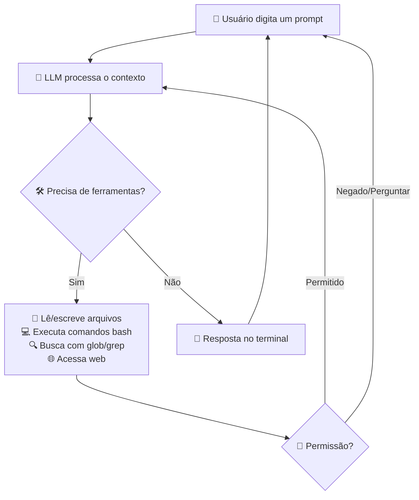
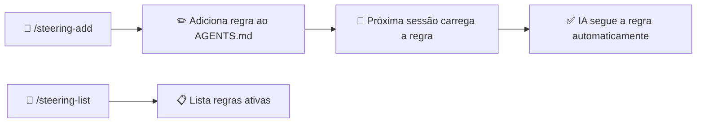
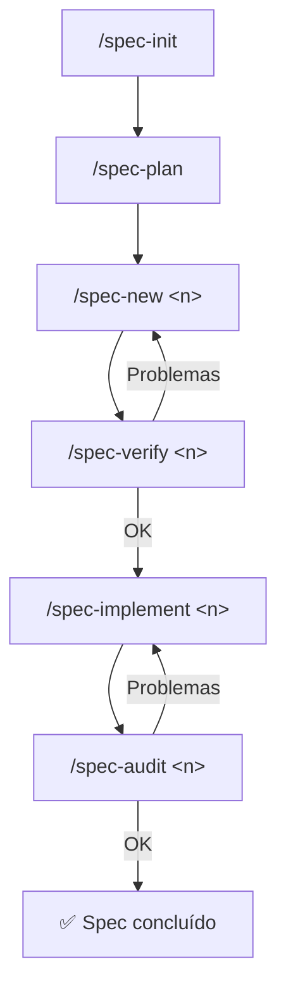

<div align="center">

**🌐 Idioma:** Português | [English](docs/i18n/README.en.md) | [Español](docs/i18n/README.es.md) | [简体中文](docs/i18n/README.zh-Hans.md) | [हिन्दी](docs/i18n/README.hi.md)

</div>

<br/>

<div align="center">
<br/>
<br/>
<p align="center">
  
</p>
<h1>DsCode</h1>

[![][github-license-shield]][github-license-link]

**Assistente de programação com IA no seu terminal.**

<br/>
</div>

O **DsCode** é um assistente de programação que roda direto no terminal. Você conversa com um modelo de IA (como o DeepSeek V4) e ele analisa, sugere, revisa e escreve código no seu projeto. Funciona em Windows, Linux e macOS.

O DsCode deriva do [DeepCode (lessweb/deepcode-cli)](https://github.com/lessweb/deepcode-cli), mas tem evolução própria e é mantido por [André Campos](https://github.com/andrelncampos).

---

## Como o DsCode funciona



O DsCode funciona em **sessões**. Cada sessão é uma conversa contínua. A IA usa **ferramentas** (ler arquivos, executar comandos, editar código, buscar na web) para realizar tarefas. Você pode **confirmar, negar ou configurar permissões** para cada tipo de ação.

---

## Para quem é o DsCode

- **Desenvolvedoras e desenvolvedores** que querem ajuda da IA para tarefas do dia a dia.
- **Tech leads** que precisam revisar ou entender bases de código rapidamente.
- **Quem já usa IA para programar** e quer um fluxo rápido, integrado ao terminal.
- **Equipes que querem padronizar** o uso de prompts, skills, agentes e steering.
- **Pessoas que usam DeepSeek V4** e querem tirar proveito de thinking mode, reasoning effort e KV Cache.

---

## Instalação

### Via npm (recomendado)

```bash
npm install -g @andrelncampos/dscode
```

**Pré-requisito**: [Node.js](https://nodejs.org) versão **22** ou superior.

```bash
dscode --version   # verifica instalação
npm update -g @andrelncampos/dscode   # atualiza
npm uninstall -g @andrelncampos/dscode   # desinstala
```

### Via binário (futuro)

> ⚠️ **Ainda não há releases publicadas.** As instruções abaixo mostram o formato quando a primeira release for publicada.

| Sistema | Arquivo |
|---|---|
| Windows (x64) | `dscode-windows-x64.zip` |
| Linux (x64) | `dscode-linux-x64.tar.gz` |
| macOS (Intel x64) | `dscode-macos-x64.tar.gz` |
| macOS (Apple Silicon) | `dscode-macos-arm64.tar.gz` |

Cada release inclui `checksums.txt` com hashes SHA256.

### A partir do código-fonte

```bash
git clone https://github.com/andrelncampos/dscode.git
cd dscode
npm ci
npm run build
npm link
dscode --version
```

---

## Configuração inicial

O DsCode lê configurações de `~/.dscode/settings.json` (usuário) e `.dscode/settings.json` (projeto). Variáveis de ambiente com prefixo `DEEPCODE_` também são reconhecidas.

### Exemplo mínimo

```json
{
  "env": {
    "MODEL": "deepseek-v4-pro",
    "BASE_URL": "https://api.deepseek.com",
    "API_KEY": "sua-chave-aqui"
  },
  "thinkingEnabled": true,
  "reasoningEffort": "max"
}
```

### Onde conseguir a chave de API

| Provedor | Link |
|---|---|
| **DeepSeek** | [platform.deepseek.com](https://platform.deepseek.com) → API Keys |
| **OpenAI** | [platform.openai.com](https://platform.openai.com) → API Keys |
| **Anthropic** | [console.anthropic.com](https://console.anthropic.com) → API Keys |

### Opções de configuração

| Campo | Tipo | Descrição | Padrão |
|---|---|---|---|
| `env.MODEL` | string | Modelo de IA | `deepseek-v4-pro` |
| `env.BASE_URL` | string | URL base da API | `https://api.deepseek.com` |
| `env.API_KEY` | string | Chave de API | *(obrigatório)* |
| `thinkingEnabled` | boolean | Modo de raciocínio | `true` (DeepSeek) |
| `reasoningEffort` | string | `"high"` ou `"max"` | `"max"` (V4 Pro) |
| `temperature` | number | Criatividade (0–2) | *(provedor)* |
| `maxTokens` | number | Limite de tokens/resposta | 65536 (Pro) / 32768 (Flash) |
| `debugLogEnabled` | boolean | Logs em `~/.dscode/logs/` | `false` |
| `telemetryEnabled` | boolean | Estatísticas anônimas | `false` |
| `permissions` | object | Controle fino de permissões | *(tudo permitido)* |
| `mcpServers` | object | Servidores MCP | *(nenhum)* |
| `notify` | string | Script pós-tarefa | *(nenhum)* |
| `webSearchTool` | string | Script de busca web | *(built-in)* |

---

## Arquivos e estrutura

O DsCode organiza seus dados em diretórios `.dscode/` no projeto e no home do usuário:

```
meu-projeto/
├── .dscode/                   # Config e dados do projeto
│   ├── settings.json          # Configurações locais (opcional)
│   ├── AGENTS.md              # Instruções e regras de steering
│   ├── sessions-index.json    # Índice de sessões
│   ├── <session-id>.jsonl     # Mensagens de cada sessão
│   └── specs/                 # Documentos SDD
│       ├── vision.md          # Visão do produto
│       ├── arch.md            # Arquitetura
│       ├── roadmap.md         # Roadmap com status dos specs
│       ├── adr.md             # Decisões de arquitetura
│       └── lessons.md         # Lições aprendidas
│
~/.dscode/                     # Config do usuário
├── settings.json              # Chave de API, modelo padrão
└── logs/debug.log             # Logs de depuração

~/.agents/skills/<skill>/SKILL.md    # Skills do usuário
./.agents/skills/<skill>/SKILL.md    # Skills do projeto
```

⚠️ **Segurança**: Nunca comite `settings.json` (contém a chave de API). O `.gitignore` já o exclui.

---

## Primeiro uso

```bash
# 1. Instale
npm install -g @andrelncampos/dscode

# 2. Configure a chave
mkdir -p ~/.dscode
# Crie ~/.dscode/settings.json com API_KEY e MODEL (veja seção acima)

# 3. Abra um projeto
cd /caminho/do/seu/projeto

# 4. Inicie
dscode
```

Digite `@` para mencionar arquivos, `/` para ver comandos, `Ctrl+O` para expandir output.

---

## Todos os comandos slash

Digite `/` no prompt para abrir o menu. São **20 comandos built-in** + skills dinâmicos (`/<skill-name>`):

### Sessão

| Comando | Descrição |
|---|---|
| `/new` | Nova conversa — zera o contexto |
| `/resume` | Retomar uma conversa anterior |
| `/continue` | Continuar a conversa ativa (ou retomar se vazia) |
| `/undo` | Restaurar código e/ou conversa para um checkpoint anterior |

### Modelo e exibição

| Comando | Descrição |
|---|---|
| `/model` | Selecionar modelo, thinking mode e reasoning effort |
| `/raw` | Alternar modo de exibição: `lite` (resumido), `normal` (completo), `raw-scrollback` (scroll) |

### Skills e agentes

| Comando | Descrição |
|---|---|
| `/skills` | Listar todas as skills disponíveis (built-in + custom) |
| `/<skill-name>` | Executar uma skill específica pelo nome |
| `/init` | Criar `AGENTS.md` com instruções para a IA no projeto |
| `/steering-add` | Adicionar regra de steering na seção STEERINGS do `AGENTS.md` |
| `/steering-list` | Listar todas as regras de steering do `AGENTS.md` |

### SDD (Spec-Driven Development)

| Comando | Descrição |
|---|---|
| `/spec-init` | Inicializar estrutura SDD: `vision.md`, `arch.md`, `roadmap.md`, `adr.md`, `lessons.md` |
| `/spec-plan` | Planejar specs a partir de brainstorm, alinhar com visão e atualizar roadmap |
| `/spec-new <n>` | Criar novo spec com requisitos, design e tarefas |
| `/spec-verify <n>` | Verificar completude e alinhamento com a visão |
| `/spec-implement <n>` | Implementar todas as tarefas do spec sequencialmente |
| `/spec-audit <n>` | Auditar qualidade e corretude da implementação |
| `/spec-list` | Listar todos os specs com status do roadmap |
| `/spec-status [n]` | Mostrar status detalhado de um spec específico ou de todos |

### Ferramentas externas

| Comando | Descrição |
|---|---|
| `/mcp` | Mostrar status dos servidores MCP e ferramentas disponíveis |

### Sistema

| Comando | Descrição |
|---|---|
| `/exit` | Sair do DsCode |

---

## Sistema de Steering

O **steering** permite definir regras persistentes que a IA segue em **todas as sessões** do projeto. As regras ficam na seção `STEERINGS` do arquivo `.dscode/AGENTS.md`.



**Exemplo:**
```
/steering-add sempre use português para responder
/steering-add nunca faça push sem autorização explícita
```

---

## SDD — Spec-Driven Development

O DsCode implementa um ciclo completo de desenvolvimento orientado a especificações. Todos os arquivos ficam em `.dscode/specs/`.



| Arquivo | Conteúdo |
|---|---|
| `vision.md` | Visão do produto, público-alvo, proposta de valor |
| `arch.md` | Decisões de arquitetura, stack, padrões |
| `roadmap.md` | Lista de specs com status (planned/in-progress/done) |
| `adr.md` | Architecture Decision Records |
| `lessons.md` | Lições aprendidas ao longo do desenvolvimento |

---

## Skills

Skills são guias em Markdown que ensinam a IA a trabalhar de um jeito específico. O DsCode carrega skills de 3 fontes:

| Local | Uso |
|---|---|
| `templates/skills/` (built-in) | 3 skills sempre carregadas |
| `~/.agents/skills/<nome>/SKILL.md` | Skills pessoais do usuário |
| `./.agents/skills/<nome>/SKILL.md` | Skills do projeto |

### Skills built-in

| Skill | Função |
|---|---|
| **agent-drift-guard** | Detecta e corrige desvios de execução |
| **karpathy-guidelines** | Boas práticas para reduzir erros comuns de LLM |
| **plan-and-execute** | Planejamento estruturado com tracking de progresso |

---

## Atalhos de teclado

| Atalho | Ação |
|---|---|
| `Enter` | Enviar prompt |
| `Shift+Enter` | Inserir quebra de linha |
| `@` | Buscar e mencionar arquivos do projeto |
| `Tab` | Autocompletar comandos e menções |
| `/` | Abrir menu de comandos |
| `?` | Tela de ajuda com todos os atalhos |
| `Ctrl+O` | Expandir output / ver processos |
| `Ctrl+V` | Colar imagem do clipboard |
| `Ctrl+X` | Limpar imagens coladas |
| `Ctrl+C` | Cancelar / interromper IA |
| `Esc` | Fechar modais / interromper |
| `Ctrl+Z` / `Ctrl+Shift+Z` | Desfazer / refazer no prompt |
| `Ctrl+W` | Apagar palavra anterior |
| `Ctrl+A` / `Ctrl+E` | Início / fim da linha |
| `Ctrl+K` | Apagar até o fim da linha |
| `Alt+←/→` | Navegar por palavra |
| `↑/↓` | Histórico (prompt vazio) ou menus |
| `PageUp/PageDown` | Rolar mensagens |

---

## Conceitos essenciais

| Conceito | Descrição |
|---|---|
| **Sessão** | Conversa contínua. `/new` inicia uma limpa. |
| **Contexto** | Histórico completo que a IA "lembra". `/new` reseta. |
| **Skills** | Guias Markdown que ensinam a IA a seguir regras. |
| **Tools** | `bash`, `read`, `write`, `edit`, `glob`, `grep`, `WebSearch`, `WebFetch`, `AskUserQuestion`, `UpdatePlan` |
| **Menções `@`** | Digite `@` para buscar e referenciar arquivos. |
| **Steering** | Regras permanentes no `AGENTS.md` que a IA segue sempre. |
| **SDD** | Spec-Driven Development — ciclo de specs em `.dscode/specs/`. |
| **Thinking mode** | IA "pensa" antes de responder. |
| **Reasoning effort** | `"max"` (profundo) ou `"high"` (equilibrado). |
| **KV Cache** | Cache automático de contexto repetido (economia). |
| **MCP** | Protocolo para conectar bancos, navegadores, APIs. |
| **Permissões** | Controle por escopo: `read-in-cwd`, `write-in-cwd`, `network`, etc. |
| **Workspace** | Pasta raiz do projeto. IA só vê arquivos dentro dela. |
| **Compactação** | Resume histórico automaticamente quando longo. |
| **Logs** | `~/.dscode/logs/debug.log` para diagnóstico. |

---

## Como usar com DeepSeek

O DsCode é otimizado para DeepSeek V4.

| Modelo | Melhor para | Velocidade | Custo |
|---|---|---|---|
| `deepseek-v4-pro` | Arquitetura, debug, raciocínio profundo | Normal | Maior |
| `deepseek-v4-flash` | Refatoração, revisão, tarefas rotineiras | Rápido | Menor |

### Thinking mode
- **Usar**: Tarefas complexas (debug, arquitetura, design)
- **Desativar**: Tarefas rápidas e simples
- **Exibição**: `/raw` alterna entre completo/resumido/oculto

### KV Cache — o DeepSeek **não cobra** tokens repetidos. Mantenha o system prompt estável.

---

## Como usar com OpenAI

DsCode funciona com qualquer modelo da OpenAI compatível com a API Chat Completions.

### Configuração para OpenAI

```json
{
  "env": {
    "MODEL": "gpt-4o",
    "BASE_URL": "https://api.openai.com/v1",
    "API_KEY": "sk-sua-chave-openai"
  },
  "thinkingEnabled": false
}
```

### O que muda em relação ao DeepSeek

| Funcionalidade | Com OpenAI |
|---|---|
| **Thinking mode** | ⚠️ Deve estar `false`. O reasoning effort é proprietário do DeepSeek |
| **WebSearch built-in** | ❌ Não disponível. Use `webSearchTool` com script externo |
| **KV Cache** | ❌ Não disponível (exclusivo do DeepSeek) |
| **Imagens (Ctrl+V)** | ✅ Funciona com modelos multimodais (`gpt-4o`, `gpt-4-turbo`) |
| **Modelos suportados** | `gpt-4o`, `gpt-4-turbo`, `gpt-4`, `gpt-3.5-turbo` e qualquer OpenAI-compatible |

### Exemplo com modelo mais barato

```json
{
  "env": {
    "MODEL": "gpt-4o-mini",
    "BASE_URL": "https://api.openai.com/v1",
    "API_KEY": "sk-sua-chave-openai"
  },
  "thinkingEnabled": false
}
```

---

## Boas práticas

### Segurança
- 🔐 Nunca comite `settings.json` nem cole API keys em issues
- 👀 Revise comandos shell antes de permitir (`rm`, `sudo`, rede)
- 📝 Faça commit antes de tarefas grandes (`git reset --hard` desfaz)
- 🔍 Revise todo diff antes de aceitar

### Economia de tokens
- 📊 Peça análise antes de implementação
- 🎯 Seja específico: "Melhore a função X em src/utils.ts"
- 📁 Informe os arquivos: "Analise apenas src/api/"
- ⚡ Use Flash para tarefas simples, Pro para complexas
- 🔄 Use `/new` para tarefas novas (sessões longas acumulam contexto)

---

## Troubleshooting

| Problema | Solução |
|---|---|
| `dscode: comando não encontrado` | Reabra o terminal. Verifique PATH (`%APPDATA%\npm` no Windows) |
| Erro 401 | Confira `API_KEY` em `~/.dscode/settings.json` |
| Erro 429 | Aguarde. Verifique seu plano na plataforma do provedor |
| Resposta truncada | Aumente `maxTokens` ou digite "continue" |
| Timeout | Troque temporariamente para Flash |
| Logs não aparecem | Ative `"debugLogEnabled": true` |
| Consumo alto de tokens | Use `/new`, seja específico sobre arquivos |

---

## Canais oficiais

| Canal | Link |
|---|---|
| **GitHub** | [github.com/andrelncampos/dscode](https://github.com/andrelncampos/dscode) |
| **npm** | `npm install -g @andrelncampos/dscode` |
| **Issues** | [github.com/andrelncampos/dscode/issues](https://github.com/andrelncampos/dscode/issues) |

---

## Licença

MIT © [André Campos](https://github.com/andrelncampos). Derivado de [DeepCode (lessweb/deepcode-cli)](https://github.com/lessweb/deepcode-cli).

<!-- LINK GROUP -->

[github-license-link]: https://github.com/andrelncampos/dscode/blob/main/LICENSE
[github-license-shield]: https://img.shields.io/github/license/andrelncampos/dscode?color=4d6BFE&labelColor=black&style=flat-square&cacheSeconds=1800
