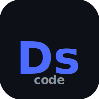
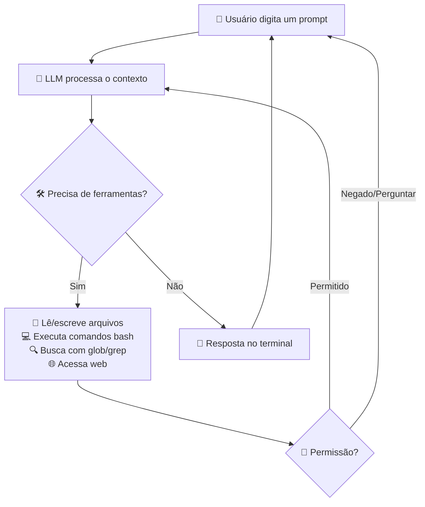
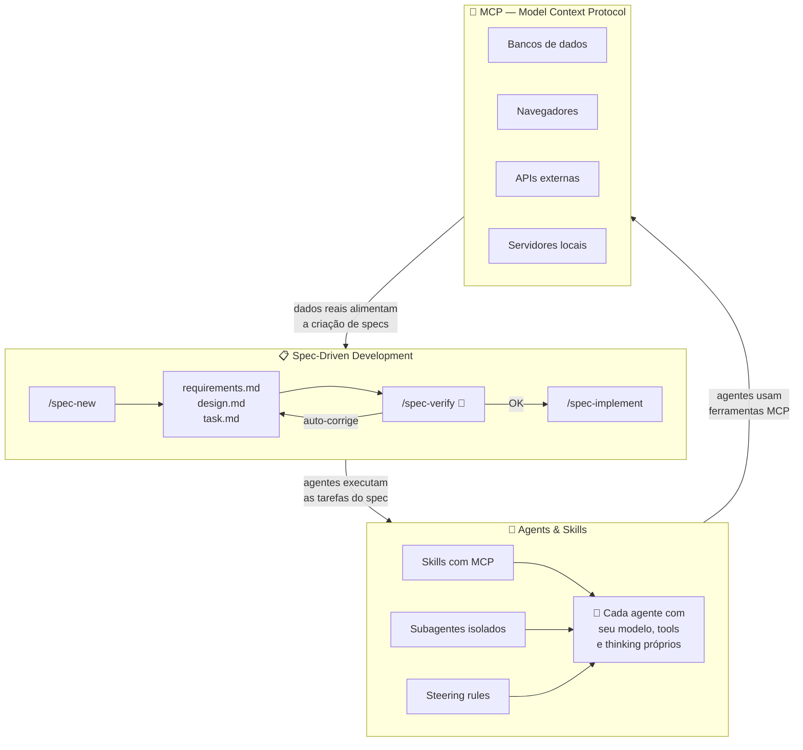
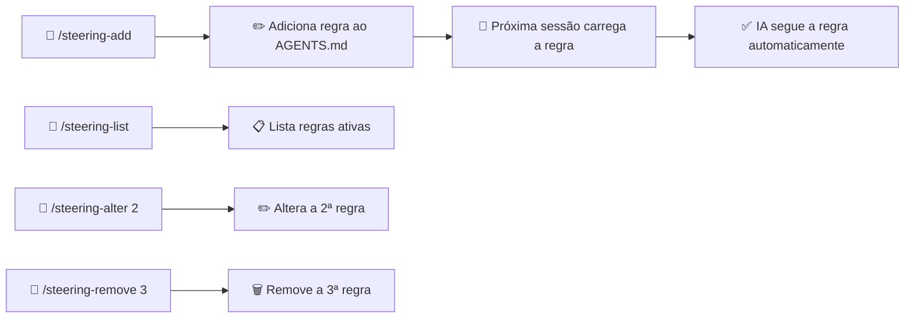
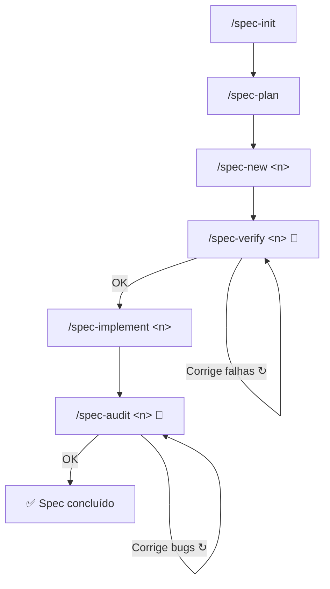

<div align="center">

[](https://www.npmjs.com/package/@andrelncampos/dscode)
[](https://www.npmjs.com/package/@andrelncampos/dscode)
[](https://nodejs.org)
[]()

<br/>

**🌐 Idioma:** Português | [English](docs/i18n/README.en.md) | [Español](docs/i18n/README.es.md) | [简体中文](docs/i18n/README.zh-Hans.md) | [हिन्दी](docs/i18n/README.hi.md)

</div>

<br/>

<div align="center">
<br/>
<br/>
<p align="center">
  
</p>
<h1>DsCode</h1>

**Assistente de programação com IA no seu terminal. Grátis. Privado. Poderoso.**

```
npm install -g @andrelncampos/dscode && dscode
```

<br/>
</div>

O **DsCode** é um assistente de programação que roda direto no terminal. Você conversa com um modelo de IA — **16 modelos entre DeepSeek V4, OpenAI GPT-5.x, Anthropic Claude, Google Gemini ou qualquer API compatível com OpenAI** — e ele analisa, sugere, revisa e escreve código no seu projeto. Funciona em Windows, Linux e macOS. Sua arquitetura possui uma **camada LLM agnóstica de provedor**, permitindo alternar entre provedores sem alterar o código.

O DsCode deriva do [DeepCode (lessweb/deepcode-cli)](https://github.com/lessweb/deepcode-cli), mas tem evolução própria e é mantido por [André Campos](https://github.com/andrelncampos).

---

## Como o DsCode funciona



O DsCode funciona em **sessões**. Cada sessão é uma conversa contínua. A IA usa **ferramentas** (ler arquivos, executar comandos, editar código, buscar na web) para realizar tarefas. Você pode **confirmar, negar ou configurar permissões** para cada tipo de ação.

---

## Para quem é o DsCode

- **Desenvolvedoras e desenvolvedores** que querem ajuda da IA para tarefas do dia a dia.
- **Tech leads** que precisam revisar ou entender bases de código rapidamente.
- **Quem já usa IA para programar** e quer um fluxo rápido, integrado ao terminal.
- **Equipes que querem padronizar** o uso de prompts, skills, agentes e steering.
- **Usuários de qualquer provedor LLM** — DeepSeek V4, OpenAI, Anthropic, Google Gemini ou APIs compatíveis. A camada agnóstica de provedor permite alternar sem esforço.

---

## O que o DsCode ajuda a fazer

| Tarefa | Como o DsCode ajuda |
|---|---|
| **Analisar uma base de código** | Pergunte "Explique a arquitetura deste projeto" e a IA lê os arquivos e responde. |
| **Revisar código** | Pergunte "Revise as alterações deste diff antes de commitar". |
| **Implementar funcionalidades** | Descreva o que você precisa e a IA gera ou edita arquivos. |
| **Refatorar** | Peça "Simplifique esta função sem mudar o comportamento". |
| **Investigar bugs** | Cole um stack trace e peça ajuda para encontrar a causa. |
| **Criar ou usar skills** | Skills são guias que ensinam a IA a trabalhar de um jeito específico. | 
| **Explorar código com subagentes** | Delegue buscas e análises ao subagente Explore — ele vasculha o código isoladamente e traz só o resumo, sem poluir o contexto. |
| **Trabalhar com Git** | A IA sugere branches, mensagens de commit e faz alterações versionadas. |
| **Configurar raciocínio** | Ative o *thinking mode* para tarefas difíceis — a IA "pensa" antes de responder. |
| **Integrar ferramentas externas** | Com MCP, conecte bancos de dados, navegadores, APIs e outras ferramentas. |

---

## Comparação com outras ferramentas

**16 modelos. 4 provedores. Zero dependência de vendor.**

|  | DsCode | GitHub Copilot | Cursor | Claude Code | Amazon Kiro |
|---|---|---|---|---|---|
| **Roda no terminal** | ✅ TUI nativa | ❌ Só IDE | ❌ Só IDE | ✅ CLI | ⚠️ IDE + CLI |
| **Liberdade de provedor** | ✅ DeepSeek + OpenAI + Anthropic + Gemini + qualquer compatível | ❌ Só GitHub | ⚠️ Limitado | ⚠️ Só Anthropic | ⚠️ Só Amazon Bedrock |
| **Thinking mode por provedor** | ✅ max/high/medium/low nativo | ❌ | ❌ | ⚠️ Claude only | ⚠️ Via Bedrock |
| **MCP completo** | ✅ Skills + SDD + TUI | ❌ | ⚠️ Parcial | ⚠️ Parcial | ✅ IDE-based |
| **Spec-Driven Development** | ✅ Ciclo built-in + auto-correção | ❌ | ❌ | ❌ | ✅ IDE-based |
| **Skills/Powers** | ✅ Markdown, modo agente, MCP por skill | ❌ | ⚠️ Rules only | ⚠️ Hooks | ✅ Powers |
| **Steering** | ✅ Regras persistentes por projeto | ❌ | ❌ | ❌ | ✅ Arquivos Markdown |
| **Grátis para uso** | ✅ Sem custo | ⚠️ Plano grátis limitado | ⚠️ Plano grátis limitado | ⚠️ Créditos | ⚠️ Custo do Bedrock |

> O **Amazon Kiro** é o concorrente mais próximo do DsCode — ambos têm Spec-Driven Development, Steering, MCP e Skills/Powers. A diferença fundamental: o DsCode é **terminal-nativo, multi-provedor e totalmente gratuito**; o Kiro é **IDE-first, preso ao Amazon Bedrock e cobra pelo uso dos modelos**.

---

## A tríade DsCode: Spec + SDD + Agent

O DsCode é o **único** assistente de IA que combina três capacidades em um ciclo integrado:



| Peça | O que faz | Por que é único |
|---|---|---|
| **Spec** | Define o que construir, com requisitos, design e tarefas em documentos versionados | Ciclo completo com auto-correção em 2 checkpoints (verify + audit) |
| **Agent** | Skills executam como subagentes isolados com modelo, tools e thinking independentes | Agentes usam MCP, seguem steering rules, e não poluem o contexto principal |
| **MCP** | Conecta a IA a bancos de dados, APIs, navegadores e servidores locais | Integrado nas 3 camadas: skills carregam MCP, specs declaram MCP, TUI inspeciona MCP |

O resultado: você define **o que** quer (spec), a IA decide **como** fazer (agent) usando **ferramentas reais** (MCP), com qualidade garantida por checkpoints automáticos. **Nenhum outro produto entrega esse ciclo.**

---

## Instalação

### Via npm (recomendado)

```bash
npm install -g @andrelncampos/dscode
```

Requer [Node.js 24+](https://nodejs.org). Após instalar, execute `dscode` no terminal.

### Binários standalone

Baixe o binário para o seu sistema operacional na **[página de releases](https://github.com/andrelncampos/dscode-public/releases)**.  
**Nenhum pré-requisito** — o binário é autocontido, não requer Node.js nem nenhuma dependência.

| Sistema | Arquivo |
|---|---|
| Windows (x64) | `dscode-windows-x64.zip` |
| Linux (x64) | `dscode-linux-x64.tar.gz` |
| macOS (Intel x64) | `dscode-macos-x64.tar.gz` |
| macOS (Apple Silicon) | `dscode-macos-arm64.tar.gz` |

Cada release inclui `checksums.txt` com hashes **SHA256** para verificar a integridade do download.
Após baixar, extraia o arquivo e execute `./dscode` no terminal.

## Atualização

O DsCode verifica automaticamente por novas versões ao iniciar. Se houver uma atualização disponível, você será notificado e poderá instalá-la com um comando.

Para verificar manualmente:

```bash
dscode --update
```

Se houver uma versão mais recente, o DsCode perguntará se você deseja instalá-la. Caso contrário, exibirá "DsCode is up to date."

---

## Configuração inicial

O DsCode lê configurações de `~/.dscode/settings.json` (usuário) e `.dscode/settings.json` (projeto). Variáveis de ambiente com prefixo `DEEPCODE_` também são reconhecidas.

### Exemplo mínimo

```json
{
  "env": {
    "MODEL": "deepseek-v4-pro",
    "BASE_URL": "https://api.deepseek.com",
    "API_KEY": "sua-chave-aqui"
  },
  "thinkingEnabled": true,
  "reasoningEffort": "max"
}
```

### Onde conseguir a chave de API

| Provedor | Link |
|---|---|
| **DeepSeek** | [platform.deepseek.com](https://platform.deepseek.com) → API Keys |
| **OpenAI** | [platform.openai.com](https://platform.openai.com) → API Keys |
| **Anthropic** | [console.anthropic.com](https://console.anthropic.com) → API Keys |
| **Google Gemini** | [aistudio.google.com](https://aistudio.google.com) → API Keys |

### Opções de configuração

| Campo | Tipo | Descrição | Padrão |
|---|---|---|---|
| `env.MODEL` | string | Modelo de IA | `deepseek-v4-pro` |
| `env.BASE_URL` | string | URL base da API | `https://api.deepseek.com` |
| `env.API_KEY` | string | Chave de API | *(obrigatório)* |
| `thinkingEnabled` | boolean | Modo de raciocínio | `true` (DeepSeek) |
| `reasoningEffort` | string | Esforço de raciocínio: `"xhigh"`, `"high"`, `"medium"`, `"low"`, `"max"` ou `"none"` (varia por provedor) | `"max"` (DeepSeek V4 Pro) |
| `temperature` | number | Criatividade (0–2) | `0.3` |
| `maxTokens` | number | Limite de tokens/resposta | 65536 (Pro) / 32768 (Flash) |
| `debugLogEnabled` | boolean | Logs em `~/.dscode/logs/` | `false` |
| `telemetryEnabled` | boolean | Estatísticas anônimas | `false` |
| `permissions` | object | Controle fino de permissões | *(tudo permitido)* |
| `mcpServers` | object | Servidores MCP | *(nenhum)* |
| `notify` | string | Script pós-tarefa | *(nenhum)* |
| `engines` | object | Configuração por provedor (ex: `engines.openai.apiKey`) | `{}` |
| `modelPricing` | object | Preços customizados por modelo | *(preços padrão DeepSeek V4)* |
| `repositoryVisibility` | `"public"` \| `"private"` | Visibilidade do repositório. `"public"` adiciona `/management/` e `/.agents/` ao `.gitignore` automaticamente | `"private"` |

### Preços de modelo (`modelPricing`)

O DsCode calcula o custo estimado da sessão com base nos tokens usados. Os preços padrão são:

| Modelo | Input (1M tokens) | Output (1M tokens) | Cache Read (1M tokens) |
|---|---|---|---|
| `deepseek-v4-pro` | $0.435 | $0.87 | $0.003625 |
| `deepseek-v4-flash` | $0.14 | $0.28 | $0.0028 |
| `gpt-5.4` | $1.25 | $10.00 | $0.625 |
| `gpt-5.4-mini` | $0.15 | $0.60 | $0.075 |
| `claude-opus-4-8` | $15.00 | $75.00 | $7.50 |
| `claude-sonnet-4-6` | $3.00 | $15.00 | $1.50 |
| `claude-haiku-4-5` | $0.80 | $4.00 | $0.40 |
| `claude-fable-5` | $10.00 | $50.00 | $1.00 |
| `claude-mythos-5` | $10.00 | $50.00 | $1.00 |
| `gemini-3.5-flash` | $1.50 | $9.00 | $0.15 |
| `gemini-3.1-flash-lite` | $0.25 | $1.50 | $0.025 |
| `gemini-2.5-pro` | $2.50 | $15.00 | $0.25 |
| `gemini-2.5-flash` | $0.50 | $3.00 | $0.05 |

Para usar preços customizados (ou adicionar um modelo não suportado):

```json
{
  "modelPricing": {
    "meu-modelo": {
      "inputPrice": 0.50,
      "outputPrice": 1.00,
      "cacheReadPrice": 0.05
    }
  }
}
```

O custo aparece no canto superior direito durante a sessão: `⚡ 42.3K 💰 $0.15`.

---

## Arquivos e estrutura

O DsCode organiza seus dados em `.dscode/` (configurações privadas) e `management/` (documentação do projeto versionada no git):

```
meu-projeto/
├── management/                  # Documentação de gestão (versionada)
│   ├── vision.md                # Visão do produto
│   ├── arch.md                  # Arquitetura
│   ├── roadmap.md               # Roadmap com status dos specs
│   ├── adr.md                   # Decisões de arquitetura
│   ├── lessons.md               # Lições aprendidas
│   └── specs/                   # Especificações detalhadas
│       ├── 10-exemplo/          # Spec #10
│       │   ├── requirements.md
│       │   ├── design.md
│       │   └── task.md
│       └── ...
│
├── .dscode/                     # Config e dados privados (não versionado)
│   ├── settings.json            # Configurações locais (opcional)
│   ├── AGENTS.md                # Instruções e regras de steering
│   ├── sessions-index.json      # Índice de sessões
│   ├── budget.md                # Custo acumulado do projeto (local)
│   └── <session-id>.jsonl       # Mensagens de cada sessão
│
~/.dscode/                       # Config do usuário
├── settings.json                # Chave de API (criptografada), modelo padrão
├── .credential-key              # Chave de criptografia AES-256 (permissões 0600)
└── logs/debug.log               # Logs de depuração

~/.agents/skills/<skill>/SKILL.md    # Skills do usuário
./.agents/skills/<skill>/SKILL.md    # Skills do projeto
```

⚠️ **Segurança**: Nunca comite `settings.json` (contém a chave de API). O `.gitignore` já o exclui.

---

## Primeiro uso em 5 minutos

### Passo 1: Instale

```bash
npm install -g @andrelncampos/dscode
```

### Passo 2: Configure sua chave

Crie `~/.dscode/settings.json` com sua chave de API e modelo preferido (veja a seção de Configuração acima).

### Passo 3: Abra uma pasta de projeto

```bash
cd /caminho/do/seu/projeto
```

Pode ser qualquer projeto: um repositório Git, um projeto pessoal, até uma pasta vazia.

### Passo 4: Inicie o DsCode

```bash
dscode
```

Você verá uma tela de boas-vindas com um campo de texto. O assistente está pronto.

**Dica:** Digite `@` para buscar e mencionar arquivos do projeto — a IA pode ler e editar os arquivos que você referenciar.

### Passo 5: Pergunte algo simples

Digite no campo de prompt:

```
Explique a estrutura deste projeto em 3 frases.
```

Pressione **Enter**. A IA analisará os arquivos do projeto e responderá.

### Passo 6: Peça uma análise útil

```
Analise o código-fonte e aponte possíveis melhorias, sem alterar nada.
```

A IA examinará o código e sugerirá melhorias. Use `Ctrl+O` para expandir o output ou ver processos em execução.

### Passo 7: Revise e faça commit

Quando a IA fizer alterações em arquivos, **revise cada diff** antes de commitar. O DsCode mostra o que foi alterado e você decide se aceita.

> 💡 **Dica**: Faça um commit (`git commit`) antes de pedir tarefas grandes. Se algo der errado, você pode desfazer com `git reset --hard`.

---

## Todos os comandos slash

Digite `/` no prompt para abrir o menu. São **28 comandos built-in** + skills dinâmicos (`/<skill-name>`):

### Sessão

| Comando | Descrição |
|---|---|
| `/new` | Nova conversa — zera o contexto |
| `/resume` | Retomar uma conversa anterior |
| `/continue` | Continuar a conversa ativa (ou retomar se vazia) |
| `/undo` | Restaurar código e/ou conversa para um checkpoint anterior |

### Modelo e exibição

| Comando | Descrição |
|---|---|
| `/model` | Selecionar entre 16 modelos de 4 provedores, com thinking mode e reasoning effort por provedor |
| `/raw` | Alternar modo de exibição: `lite` (resumido), `normal` (completo), `raw-scrollback` (scroll) |

### Provider e modelo

| Comando | Descrição |
|---|---|
| `/model-list` | Listar todos os provedores configurados com status, modelos e preços |
| `/model-add <provider>` | Adicionar um novo provedor LLM com wizard guiado (API key + base URL) |
| `/model-remove <provider>` | Remover um provedor da configuração |
| `/model-info <id>` | Mostrar detalhes de um modelo: capacidades, preço, thinking, contexto |
| `/model-key <provider>` | Atualizar a API key de um provedor (sobrescreve a anterior) |
| `/model-default <id>` | Definir o modelo padrão |
| `/model-params` | Editor interativo de parâmetros de geração: temperature, max_tokens, top_p |
| `/model-thinking <id>` | Configurar thinking budget para modelos com extended thinking |

> 💡 **Chaves criptografadas**: As API keys são armazenadas criptografadas (AES-256-GCM) no `settings.json`. A migração de chaves plaintext é automática no primeiro uso. Use `/model-key` para atualizar.

### Skills e agentes

| Comando | Descrição |
|---|---|
| `/skills` | Listar todas as skills disponíveis (built-in + custom) |
| `/<skill-name>` | Executar uma skill específica pelo nome |
| `/init` | Criar `AGENTS.md` com instruções para a IA no projeto |
| `/steering-add` | Adicionar regra de steering na seção STEERINGS do `AGENTS.md` |
| `/steering-list` | Listar todas as regras de steering do `AGENTS.md` |
| `/steering-remove <N>` | Remover a N-ésima regra de steering do `AGENTS.md` |
| `/steering-alter <N>` | Alterar a N-ésima regra de steering do `AGENTS.md` |

### SDD (Spec-Driven Development)

| Comando | Descrição |
|---|---|
| `/spec-init` | Inicializar estrutura SDD: `vision.md`, `arch.md`, `roadmap.md`, `adr.md`, `lessons.md` |
| `/spec-plan` | Planejar specs a partir de brainstorm, alinhar com visão e atualizar roadmap |
| `/spec-new <n>` | Criar novo spec com requisitos, design e tarefas |
| `/spec-verify <n>` | Verificar completude e alinhamento com a visão — **corrige automaticamente** as falhas encontradas (idempotente: rode quantas vezes quiser) |
| `/spec-implement <n>` | Implementar todas as tarefas do spec sequencialmente |
| `/spec-audit <n>` | Auditar qualidade e corretude da implementação — **corrige automaticamente** bugs, testes e desvios de design (idempotente: cada passagem melhora sem degradar) |
| `/spec-list` | Listar todos os specs com status do roadmap |
| `/spec-status [n]` | Mostrar status detalhado de um spec específico ou de todos |

### Ferramentas externas

| Comando | Descrição |
|---|---|
| `/mcp` | Mostrar status dos servidores MCP e ferramentas disponíveis |

### Sistema

| Comando | Descrição |
|---|---|
| `/exit` | Sair do DsCode |

---

## Sistema de Steering

O **steering** permite definir regras persistentes que a IA segue em **todas as sessões** do projeto. As regras ficam na seção `## Steering` do arquivo `.dscode/AGENTS.md`. O ciclo completo de gestão inclui adicionar, listar, alterar e remover regras por posição.



**Exemplo:**
```
/steering-add sempre use português para responder
/steering-add nunca faça push sem autorização explícita
/steering-list
/steering-alter 2 nunca faça push ou merge sem autorização
/steering-remove 1
```

---

## SDD — Spec-Driven Development

O DsCode implementa um ciclo completo de desenvolvimento orientado a especificações. Todos os arquivos ficam em `management/`.

Os dois checkpoints de qualidade — **spec-verify** e **spec-audit** — não apenas reportam problemas: eles **corrigem-nos automaticamente**. Ambos são **idempotentes**: pode executá-los várias vezes seguidas que cada passagem melhora a qualidade sem degradar o que já estava correto.



| Arquivo | Conteúdo |
|---|---|
| `vision.md` | Visão do produto, público-alvo, proposta de valor |
| `arch.md` | Decisões de arquitetura, stack, padrões |
| `roadmap.md` | Lista de specs com status (planned/in-progress/done) |
| `adr.md` | Architecture Decision Records |
| `lessons.md` | Lições aprendidas ao longo do desenvolvimento |

### SDD na prática — um exemplo completo

Imagine que você quer adicionar **suporte a OpenAI** no DsCode. O fluxo real:

```
/spec-plan
  ↓  Você digita: "quero suporte nativo a OpenAI com thinking mode"
  ↓  A IA analisa a visão, cria a spec 40, atualiza o roadmap
/spec-new 40
  ↓  A IA gera requirements.md, design.md e task.md completos
/spec-verify 40
  ↓  A IA encontra 3 falhas de rastreabilidade e CORRIGE automaticamente
  ↓  Rode de novo. Se der OK → próximo passo
/spec-implement 40
  ↓  A IA cria openai-provider.ts, openai-converter.ts, testes...
  ↓  Cada tarefa é executada em ordem. Typecheck e testes a cada passo
/spec-audit 40
  ↓  A IA encontra 1 bug e 1 teste desatualizado e CORRIGE
  ↓  Rode de novo. Se der OK → spec concluído ✅
```

> 💡 **Dica**: `spec-verify` e `spec-audit` são seus aliados. Rode-os até dizerem "0 issues found". Cada passagem melhora a qualidade sem risco de regressão.

---

## MCP — Model Context Protocol

O DsCode integra o **Model Context Protocol (MCP)**, permitindo que a IA se conecte a ferramentas externas como bancos de dados, navegadores, APIs e servidores locais. O suporte cobre o ciclo completo: skills, SDD e TUI.

### Skills com MCP

Skills podem incluir um arquivo `mcp.json` que declara servidores MCP. Quando a skill é ativada (via palavra-chave ou `#skill-name`), os servidores iniciam automaticamente. Quando a conversa muda de tópico, eles são suspensos — sem poluir o catálogo global de ferramentas.

Exemplo: uma skill `postgres-dba` traz ferramentas como `query`, `list_tables` e `describe`, além de regras de segurança (`MCP: deny drop_table`). Tudo em um pacote instalável.

### SDD + MCP

O ciclo SDD se integra ao MCP em três níveis:
- **Specs declaram dependências MCP** no frontmatter YAML, definindo servidores e ferramentas relevantes para aquela spec.
- **Criação assistida**: durante `/spec-new`, a IA consulta fontes reais (GitHub issues, bancos de dados, documentação) para produzir requisitos baseados em dados concretos.
- **Escopo controlado**: cada spec define um allowlist temporário de ferramentas, mantendo a IA focada no que realmente importa.

### Inspeção e ações via TUI

O comando `/mcp` abre um painel completo de gerenciamento:
- **Lista de servidores** com status, escopo (`[global]`, `[project]`, `[skill: ...]`, `[spec: N]`) e resumo de políticas.
- **Detalhes** com badges de política (`auto-allow`, `ask`, `deny`) para cada ferramenta.
- **Histórico de execuções** e **log de erros** para diagnóstico.
- **Atalhos de teclado**: `A` aprovar, `D` negar, `R` resetar política, `X` desabilitar servidor, `Ctrl+R` reconectar.

### Onde configurar servidores MCP

| Nível | Local | Escopo |
|---|---|---|
| Global | `~/.dscode/settings.json` → `mcpServers` | Todas as sessões |
| Projeto | `.dscode/mcp.json` | Sessões naquele diretório |
| Skill | `<skill>/mcp.json` | Quando a skill está ativa |
| Spec | Frontmatter YAML do spec | Durante `/spec-implement` |

---

## Skills

Skills são guias em Markdown que ensinam a IA a trabalhar de um jeito específico. O DsCode carrega skills de 3 fontes:

| Local | Uso |
|---|---|
| `templates/skills/` (built-in) | 3 skills sempre carregadas |
| `~/.agents/skills/<nome>/SKILL.md` | Skills pessoais do usuário |
| `./.agents/skills/<nome>/SKILL.md` | Skills do projeto |

### Skills built-in

| Skill | Função |
|---|---|
| **agent-drift-guard** | Detecta e corrige desvios de execução |
| **karpathy-guidelines** | Boas práticas para reduzir erros comuns de LLM |
| **plan-and-execute** | Planejamento estruturado com tracking de progresso |

### Modos de inclusão

Cada `SKILL.md` pode declarar como a skill é carregada através do campo opcional `inclusion` no frontmatter YAML:

| Modo | Comportamento |
|------|--------------|
| `auto` (padrão) | Carregada automaticamente por palavras-chave no prompt e disponível no menu `/skills` |
| `manual` | **Nunca** carregada automaticamente. Ativada apenas com `#skill-name` no prompt ou pelo menu `/skills` |

**Exemplo de SKILL.md com `inclusion: manual`:**
```markdown
---
name: meu-deploy
description: Faz deploy em produção
inclusion: manual
---

# Deploy

Antes de fazer deploy, verifique...
```

Para ativar uma skill manual, digite `#meu-deploy` no início do prompt — o prefixo `#` é removido e a skill é carregada.

### Skills como agentes autônomos

Além do campo `inclusion`, cada `SKILL.md` pode declarar um `mode` de execução:

| Modo | Comportamento |
|------|--------------|
| `prompt` (padrão) | O conteúdo da skill é injetado no contexto da conversa como um guia. |
| `agent` | A skill executa como um **subagente isolado** — com seu próprio modelo, tools e thinking — e devolve apenas o resultado. |

Skills `mode: agent` são registradas como ferramentas no toolkit do LLM. O agente principal pode delegar trabalho a elas chamando a ferramenta com o nome da skill. Isso mantém o contexto principal limpo e permite que cada skill tenha configurações independentes de modelo, temperatura, tools, max turns e timeout.

**Exemplo de SKILL.md com `mode: agent`:**
```markdown
---
name: code-reviewer
description: Revisa código em busca de bugs e melhorias
mode: agent
model: deepseek-v4-flash
thinking: false
tools: [Read, Grep, Glob, Bash]
---
```

Quando o agente principal precisa de uma revisão, ele chama a ferramenta `code-reviewer` e recebe apenas o resultado final — o raciocínio intermediário do subagente não polui o contexto principal.

---

## Atalhos de teclado

| Atalho | Ação |
|---|---|
| `Enter` | Enviar prompt |
| `Shift+Enter` | Inserir quebra de linha |
| `@` | Buscar e mencionar arquivos do projeto |
| `Tab` | Autocompletar comandos e menções |
| `/` | Abrir menu de comandos |
| `?` | Tela de ajuda com todos os atalhos |
| `Ctrl+O` | Expandir output / ver processos |
| `Ctrl+V` | Colar imagem do clipboard |
| `Ctrl+X` | Limpar imagens coladas |
| `Ctrl+C` | Cancelar / interromper IA |
| `Esc` | Fechar modais / interromper |
| `Ctrl+Z` / `Ctrl+Shift+Z` | Desfazer / refazer no prompt |
| `Ctrl+W` | Apagar palavra anterior |
| `Ctrl+A` / `Ctrl+E` | Início / fim da linha |
| `Ctrl+K` | Apagar até o fim da linha |
| `Alt+←/→` | Navegar por palavra |
| `↑/↓` | Histórico (prompt vazio) ou menus |
| `PageUp/PageDown` | Rolar mensagens |

---

## Exemplos práticos de uso

Cada exemplo abaixo é algo que você pode digitar no campo de prompt do DsCode.

| Tarefa | O que digitar |
|---|---|
| **Entender a arquitetura** | "Explique a arquitetura deste projeto, quais são os módulos principais e como se comunicam." |
| **Encontrar bugs** | "Analise src/ em busca de possíveis bugs. Apenas aponte, não altere nada." |
| **Sugerir melhorias** | "Sugira melhorias de desempenho e legibilidade para o código em src/." |
| **Implementar uma feature** | "Adicione validação de email ao formulário de cadastro em src/form.ts." |
| **Refatorar** | "Refatore a função processData() em src/utils.ts para ficar mais clara, sem mudar o comportamento." |
| **Revisar um diff** | "Revise as alterações do último commit e aponte problemas." |
| **Criar testes** | "Crie testes unitários para a função validateUser() em src/validators.ts." |
| **Usar uma skill** | "Use a skill de revisão de segurança para auditar este código." |
| **Inicializar AGENTS.md** | Digite `/init` para criar um arquivo com instruções que a IA seguirá no projeto. |

O DsCode funciona de forma **conversacional**: você digita o que precisa, a IA responde e usa ferramentas. Você pode confirmar ou rejeitar cada ação.

---

## Conceitos essenciais

| Conceito | O que é | Quando importa |
|---|---|---|
| **Sessão** | Uma conversa contínua entre você e a IA. Cada `/new` inicia uma sessão limpa. | Comece uma nova sessão ao mudar de tarefa para evitar misturar contextos. |
| **Contexto** | Todo o histórico da conversa que a IA "lembra". Inclui suas mensagens, respostas e arquivos lidos. | Contextos longos gastam mais tokens. Use `/new` para resetar. |
| **Skills** | Guias em Markdown que ensinam a IA a seguir regras específicas. | Crie uma skill para padronizar revisões, estilo de código ou processos da equipe. |
| **Tools** | Ferramentas que a IA usa: `bash` (shell), `read`/`write`/`edit` (arquivos), `glob`/`grep` (busca), `Explore` (subagente), `WebSearch`/`WebFetch` (web), `AskUserQuestion` (perguntas), `UpdatePlan` (tarefas). | A IA decide quais usar. Você pode bloquear as perigosas via `permissions`. |
| **Menções `@`** | Digite `@` no prompt para buscar e referenciar arquivos do projeto. | Use para direcionar a IA: "Analise @src/utils.ts" — ela já sabe qual arquivo ler. |
| **Provider** | A empresa que fornece o modelo de IA (DeepSeek, OpenAI, Anthropic, Google Gemini, etc.). | Escolha o provedor com base em custo, qualidade e privacidade. |
| **Modelo** | O modelo específico de IA (ex: `deepseek-v4-pro`, `gpt-5.5`, `claude-sonnet-4-6`, `gemini-3.5-flash`). 16 modelos disponíveis entre 4 provedores. | Modelos diferentes têm qualidade, velocidade e custo diferentes. |
| **Thinking mode** | A IA "pensa" (raciocina) antes de responder, gerando tokens internos que você pode ver ou não. | Ative para tarefas complexas (debug, arquitetura). Desative para agilidade. |
| **Reasoning effort** | Controla a profundidade do raciocínio: `"xhigh"`, `"high"`, `"medium"`, `"low"`, `"max"` ou `"none"` (varia por provedor). | Use esforço máximo para problemas difíceis e médio/baixo para o dia a dia. |
| **Prompt cache** | DeepSeek armazena em cache partes repetidas do contexto para cobrar menos tokens (KV Cache). | Acontece automaticamente. Mantenha os prompts estáveis para economizar. |
| **Logs** | Arquivos de depuração em `~/.dscode/logs/` que registram as chamadas de API. | Ative `debugLogEnabled` apenas para diagnosticar problemas. |
| **Permissões** | Controle do que a IA pode fazer: ler arquivos, escrever, acessar rede, executar comandos. | Configure permissões restritivas se quiser revisar cada ação antes da execução. |
| **Workspace** | A pasta raiz onde o DsCode está rodando. A IA só vê arquivos nesta pasta (a menos que você autorize acesso externo). | Abra o DsCode na raiz do projeto em que você quer trabalhar. |
| **Compactação** | Quando a conversa fica muito longa, o DsCode resume o histórico para caber no limite de tokens. | Automática. Você pode forçar uma nova sessão com `/new` se preferir. |

---

## Como usar com DeepSeek

O DsCode é otimizado para DeepSeek V4.

| Modelo | Melhor para | Velocidade | Custo |
|---|---|---|---|
| `deepseek-v4-pro` | Arquitetura, debug, raciocínio profundo | Normal | Maior |
| `deepseek-v4-flash` | Refatoração, revisão, tarefas rotineiras | Rápido | Menor |

### Thinking mode
- **Usar**: Tarefas complexas (debug, arquitetura, design)
- **Desativar**: Tarefas rápidas e simples
- **Opções**: `"max"` (raciocínio profundo), `"high"` (equilibrado), `"No thinking"` (desativado)
- **Exibição**: `/raw` alterna entre completo/resumido/oculto

### KV Cache — o DeepSeek **não cobra** tokens repetidos. Mantenha o system prompt estável.

---

## Como usar com OpenAI

DsCode tem **suporte nativo ao OpenAI** via `OpenAIProvider`. Modelos com prefixo `gpt-`, `o1`, `o3`, `o4` ou `openai-` são automaticamente roteados para o provider OpenAI — sem necessidade de configuração adicional.

### Configuração para OpenAI

```json
{
  "env": {
    "MODEL": "gpt-5.4",
    "BASE_URL": "https://api.openai.com/v1",
    "API_KEY": "sk-sua-chave-openai"
  },
  "thinkingEnabled": true,
  "reasoningEffort": "high"
}
```

> 💡 O `thinkingEnabled` funciona com OpenAI: o `reasoningEffort` é enviado como parâmetro nativo `reasoning_effort` na API.

### Usando múltiplos provedores com `engines`

Você pode configurar chaves separadas para cada provedor sem precisar trocar de `settings.json`:

```json
{
  "env": {
    "MODEL": "deepseek-v4-pro",
    "API_KEY": "sk-deepseek-key"
  },
  "engines": {
    "openai": {
      "apiKey": "sk-openai-key"
    }
  }
}
```

Quando você trocar o modelo para `gpt-5.4` (via `/model`), o DsCode usa automaticamente a chave do engine `openai`. O provider e a chave correta são selecionados com base no prefixo do modelo.

### O que muda em relação ao DeepSeek

| Funcionalidade | Com OpenAI |
|---|---|
| **Thinking mode** | ✅ Suportado nativamente. O `reasoningEffort` (`"high"` / `"max"`) é passado como `reasoning_effort` |
| **WebSearch built-in** | ❌ Não disponível. Use MCP com servidor de busca ou peça para a IA usar WebFetch em URLs específicas |
| **KV Cache** | ❌ Não disponível (exclusivo do DeepSeek) |
| **Imagens (Ctrl+V)** | ✅ Funciona com modelos de visão (`gpt-5.5`, `gpt-5`, `gpt-4o`) |
| **Modelos suportados** | `gpt-5.5`, `gpt-5.4`, `gpt-5.4-mini`, `gpt-5`, `gpt-4.5`, `gpt-4o`, `gpt-4o-mini`, `o1`, `o3`, `o4` — qualquer modelo Chat Completions |
| **Compactação** | Usa `getAuxiliaryModel()`: `gpt-5.4` → `gpt-5.4-mini` para reduzir custo (sem thinking) ao resumir histórico |

### Exemplo com modelo mais barato

```json
{
  "env": {
    "MODEL": "gpt-5.4-mini",
    "BASE_URL": "https://api.openai.com/v1",
    "API_KEY": "sk-sua-chave-openai"
  },
  "thinkingEnabled": false
}
```

---

## Como usar com Anthropic

DsCode tem **suporte nativo ao Anthropic** via `AnthropicProvider`. Modelos com prefixo `claude-` são automaticamente roteados para o provider Anthropic — sem necessidade de configuração adicional.

### Configuração para Anthropic

```json
{
  "env": {
    "MODEL": "claude-sonnet-4-6",
    "BASE_URL": "https://api.anthropic.com/v1",
    "API_KEY": "sk-ant-sua-chave-anthropic"
  },
  "thinkingEnabled": true,
  "reasoningEffort": "high"
}
```

> 💡 O `thinkingEnabled` funciona com Anthropic: modelos Opus/Sonnet/Fable/Mythos usam `thinking {type:"adaptive", effort}` com 3 níveis (`"high"`, `"medium"`, `"low"`). Modelos Haiku usam `thinking {type:"enabled", budget_tokens}` com 2 níveis (`"max"`, `"high"`).

### Usando múltiplos provedores com `engines`

```json
{
  "env": {
    "MODEL": "deepseek-v4-pro",
    "API_KEY": "sk-deepseek-key"
  },
  "engines": {
    "anthropic": {
      "apiKey": "sk-ant-anthropic-key"
    }
  }
}
```

### O que muda em relação ao DeepSeek

| Funcionalidade | Com Anthropic |
|---|---|
| **Thinking mode** | ✅ Suportado nativamente. Adaptive (`"high"`, `"medium"`, `"low"`) para Opus/Sonnet/Fable/Mythos; Extended (`"max"`, `"high"`) com budget_tokens para Haiku |
| **WebSearch built-in** | ❌ Não disponível. Use MCP com servidor de busca |
| **KV Cache** | ❌ Não disponível (exclusivo do DeepSeek) |
| **Imagens (Ctrl+V)** | ✅ Funciona com todos os modelos Claude |
| **Modelos suportados** | `claude-opus-4-8`, `claude-sonnet-4-6`, `claude-haiku-4-5`, `claude-fable-5`, `claude-mythos-5` |

### Exemplo com modelo mais barato

```json
{
  "env": {
    "MODEL": "claude-haiku-4-5",
    "BASE_URL": "https://api.anthropic.com/v1",
    "API_KEY": "sk-ant-sua-chave-anthropic"
  },
  "thinkingEnabled": false
}
```

---

## Como usar com Google Gemini

DsCode tem **suporte nativo ao Google Gemini** via `GeminiProvider`. Modelos com prefixo `gemini-` são automaticamente roteados para o provider Gemini — sem necessidade de configuração adicional. O Gemini é o primeiro provider implementado com **zero SDK** — usa `fetch()` nativo do Node 24.

### Configuração para Gemini

```json
{
  "env": {
    "MODEL": "gemini-3.5-flash",
    "BASE_URL": "https://generativelanguage.googleapis.com/v1beta",
    "API_KEY": "AIza-sua-chave-gemini"
  },
  "thinkingEnabled": true,
  "reasoningEffort": "high"
}
```

> 💡 O `thinkingEnabled` funciona com Gemini: o provider envia `thinkingConfig: { thinkingBudget: 8192, includeThoughts: true }` no `generationConfig`. O Gemini usa "thinking budget" em vez de "reasoning effort".

### Usando múltiplos provedores com `engines`

```json
{
  "env": {
    "MODEL": "deepseek-v4-pro",
    "API_KEY": "sk-deepseek-key"
  },
  "engines": {
    "gemini": {
      "apiKey": "AIza-sua-chave-gemini"
    }
  }
}
```

### O que muda em relação ao DeepSeek

| Funcionalidade | Com Gemini |
|---|---|
| **Thinking mode** | ✅ Suportado nativamente via `thinkingConfig`. Budget de 8192 tokens. |
| **WebSearch built-in** | ❌ Não disponível. Use MCP com servidor de busca. |
| **KV Cache** | ❌ Não disponível (exclusivo do DeepSeek) |
| **Imagens (Ctrl+V)** | ✅ Funciona com todos os modelos Gemini |
| **Modelos suportados** | `gemini-3.5-flash`, `gemini-3-flash`, `gemini-3.1-flash-lite`, `gemini-2.5-pro`, `gemini-2.5-flash` |
| **Compactação** | Usa `getAuxiliaryModel()`: `gemini-3.5-flash` → `gemini-3.1-flash-lite` para reduzir custo (sem thinking) |

### Exemplo com modelo mais barato

```json
{
  "env": {
    "MODEL": "gemini-3.1-flash-lite",
    "BASE_URL": "https://generativelanguage.googleapis.com/v1beta",
    "API_KEY": "AIza-sua-chave-gemini"
  },
  "thinkingEnabled": false
}
```

---

## Boas práticas de segurança

| O que fazer | Por quê |
|---|---|
| **Nunca cole chaves de API em issues do GitHub** | Issues são públicas. Chaves expostas podem ser usadas por outros e gerar cobranças. |
| **Nunca faça commit do arquivo `settings.json`** | Contém sua chave de API. O `.gitignore` do projeto já o exclui, mas verifique. |
| **Revise comandos antes de permitir** | A IA pode sugerir comandos shell. Leia antes de confirmar, especialmente se envolverem `rm`, `sudo` ou rede. |
| **Faça commit antes de pedir mudanças grandes** | Se a IA fizer algo errado, `git reset --hard` desfaz tudo. Sem um commit prévio, isso não é possível. |
| **Leia os diffs antes de aceitar** | O DsCode mostra cada alteração. Revise — a IA pode cometer erros. |
| **Não cole dados sensíveis nos prompts** | Informações como senhas, tokens ou dados de clientes podem aparecer em logs ou respostas. |
| **Sanitize os logs antes de pedir ajuda** | Os logs em `~/.dscode/logs/` podem conter trechos do seu código. Remova informações confidenciais antes de compartilhar. |
| **Use uma branch separada para experimentos** | Crie `git checkout -b experimento-ia` antes de pedir mudanças grandes. Se algo der errado, descarte a branch. |

---

## Boas práticas para economizar tokens/créditos

| Prática | Explicação |
|---|---|
| **Peça análise antes de implementação** | "Analise este código e sugira melhorias" gasta menos tokens do que "Implemente X" sem contexto. |
| **Limite o escopo** | Em vez de "Melhore o projeto inteiro", diga "Melhore a função `process()` em `src/utils.ts`". |
| **Informe os arquivos relevantes** | Diga "Analise apenas os arquivos em `src/api/`" — a IA lê menos arquivos, gastando menos tokens. |
| **Use Flash para tarefas simples** | `deepseek-v4-flash` é muito mais barato. Use para tarefas rotineiras. |
| **Use Pro com moderação** | Reserve `deepseek-v4-pro` para tarefas que realmente precisam de raciocínio profundo. |
| **Mantenha os prompts concisos** | Prompts longos com informações desnecessárias desperdiçam tokens. |
| **Reinicie a sessão com `/new` para tarefas novas** | Sessões longas acumulam contexto e cada mensagem subsequente custa mais caro. |

---

## Troubleshooting

| Problema | Causa provável | Como resolver |
|---|---|---|
| `dscode: comando não encontrado` | npm global não está no PATH | Reabra o terminal. No Windows, verifique `%APPDATA%\\npm`. No Linux/macOS, verifique `~/.npm-global/bin`. |
| `Node.js version not supported` | Node abaixo da versão 24 | Instale ou atualize para [Node.js 24+](https://nodejs.org). |
| Erro 401 | Chave de API ausente ou inválida | Confira `API_KEY` em `~/.dscode/settings.json` ou na variável de ambiente. |
| Erro 429 | Limite de requisições do provedor excedido | Aguarde alguns segundos e tente novamente. Verifique seu plano na plataforma do provedor. |
| Resposta truncada | Limite de tokens atingido | Aumente `maxTokens` em `settings.json` ou digite "continue" para retomar. |
| Timeout / demora excessiva | Servidor do provedor sobrecarregado ou problema de rede | Aguarde. Se persistir, troque de modelo: use Flash em vez de Pro temporariamente. |
| Logs não aparecem | `debugLogEnabled` está `false` (padrão) | Ative `"debugLogEnabled": true` em `settings.json`. Os logs aparecem em `~/.dscode/logs/debug.log`. |
| Modelo não reconhecido | Nome do modelo incorreto | Use os nomes exatos: `deepseek-v4-pro`, `deepseek-v4-flash`, ou um modelo compatível com OpenAI. |
| Consumo de tokens muito alto | Contexto longo ou tarefas muito amplas | Use `/new` para resetar a sessão. Seja específico sobre arquivos e escopo. |

---

## Como pedir ajuda

Se encontrar um problema, abra uma [issue no GitHub](https://github.com/andrelncampos/dscode-public/issues).

Ao reportar um problema, inclua:

- **Versão do DsCode**: `dscode --version` (exibe versão + node + plataforma)
- **Modelo usado**: `deepseek-v4-pro`, `deepseek-v4-flash`, etc.
- **Comando executado** e o erro completo
- **Logs sanitizados**, se relevante (remova chaves, tokens e dados privados)

⚠️ **Nunca envie**:
- Chaves de API ou tokens
- Seus prompts privados ou dados confidenciais do projeto
- Arquivos `.env` ou `settings.json` completos
- Logs completos sem revisão (contêm trechos do seu código)

Para vulnerabilidades de segurança, siga as instruções em [SECURITY.md](SECURITY.md). **Não abra issues públicas para falhas de segurança.**

---

## Segurança

Consulte [SECURITY.md](SECURITY.md) para a política completa.

- Reporte vulnerabilidades de forma privada (não abra uma issue pública).
- O DsCode mascara dados sensíveis nos logs de depuração, mas sempre revise antes de compartilhar.
- Mantenha sua chave de API segura: use variáveis de ambiente ou `settings.json` com permissões restritas (`chmod 600`). As chaves no `settings.json` são criptografadas com AES-256-GCM. A chave de criptografia fica em `~/.dscode/.credential-key`.

---

## Licença e origem

**DsCode é gratuito para uso, mas o código-fonte não é público.** O produto é disponibilizado sem custo para uso individual e profissional. A redistribuição é permitida apenas dos binários oficiais.

Este projeto deriva de [DeepCode (lessweb/deepcode-cli)](https://github.com/lessweb/deepcode-cli), originalmente licenciado sob MIT. O aviso de copyright original é preservado em [LICENSE](LICENSE).

Dependências de terceiros mantêm suas próprias licenças.

---

## Canais oficiais

| Canal | Link |
|---|---|
| **GitHub** | [github.com/andrelncampos/dscode-public](https://github.com/andrelncampos/dscode-public) |
| **npm** | [npmjs.com/package/@andrelncampos/dscode](https://www.npmjs.com/package/@andrelncampos/dscode) |
| **Releases** | [github.com/andrelncampos/dscode-public/releases](https://github.com/andrelncampos/dscode-public/releases) |
| **Issues** | [github.com/andrelncampos/dscode-public/issues](https://github.com/andrelncampos/dscode-public/issues) |

⚠️ Instale o DsCode **apenas** pelos canais oficiais acima. Não confie em versões publicadas em sites de terceiros ou links não verificados.
