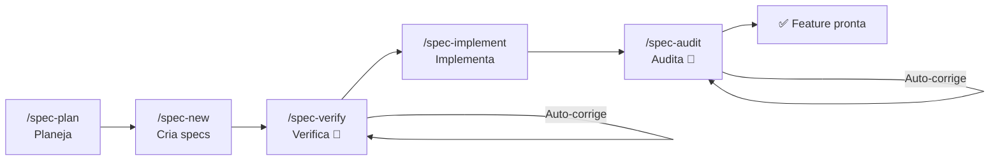

<div align="center">

**🌐 Idioma:** Português | [English](docs/i18n/README.en.md) | [Español](docs/i18n/README.es.md) | [简体中文](docs/i18n/README.zh-Hans.md) | [हिन्दी](docs/i18n/README.hi.md)

</div>

<br/>

<div align="center">
<br/>
<br/>
<p align="center">
  
</p>
<h1>DsCode</h1>

[![][github-license-shield]][github-license-link]
[![][github-stars-shield]][github-stars-link]

**O assistente de IA que planeja, implementa, verifica e audita código automaticamente — com zero vendor lock-in.**

<br/>
</div>

O **DsCode** é um assistente de programação que roda no terminal. Você conversa com **16 modelos entre DeepSeek V4, OpenAI GPT-5.x, Anthropic Claude e Google Gemini** — e ele analisa, sugere, revisa e escreve código no seu projeto.

A diferença: o DsCode é o **único** assistente com um pipeline completo de desenvolvimento orientado a especificações (SDD). Ele não só escreve código — ele **planeja** o que construir, **verifica** a qualidade, **implementa** as tarefas e **audita** o resultado. Tudo com correção automática em cada etapa.

---

## O que torna o DsCode único



| Capacidade | O que faz | Por que nenhum outro tem |
|---|---|---|
| **Pipeline SDD** | Ciclo completo: planejar → criar → verificar → implementar → auditar | Auto-correção em 2 checkpoints — verify e audit corrigem falhas sozinhos |
| **Multi-provedor** | DeepSeek V4, OpenAI GPT-5.x, Anthropic Claude, Google Gemini | Troque de provedor sem alterar uma linha de configuração |
| **Skills como agentes** | Subagentes isolados com modelo, tools e thinking próprios | Cada skill roda em sandbox — não polui o contexto principal |
| **MCP nativo** | Conecte bancos, navegadores e APIs externas | Integrado nas 3 camadas: skills, specs e TUI |
| **Steering** | Regras persistentes que a IA segue em todas as sessões | Controle granular: adicione, liste, altere e remova regras por posição |

---

## Comparação rápida

|  | DsCode | GitHub Copilot | Cursor | Claude Code | Amazon Kiro |
|---|---|---|---|---|---|
| **Roda no terminal** | ✅ TUI nativa | ❌ Só IDE | ❌ Só IDE | ✅ CLI | ⚠️ IDE + CLI |
| **Multi-provedor** | ✅ 4 provedores | ❌ Só GitHub | ⚠️ Limitado | ❌ Só Anthropic | ❌ Só Bedrock |
| **Pipeline SDD** | ✅ Completo + auto-correção | ❌ | ❌ | ❌ | ✅ IDE-based |
| **Skills/Agentes** | ✅ Subagentes isolados | ❌ | ⚠️ Rules | ⚠️ Hooks | ✅ Powers |
| **Grátis** | ✅ Sem custo | ⚠️ Limitado | ⚠️ Limitado | ⚠️ Créditos | ❌ Custo Bedrock |

> O **Amazon Kiro** é o concorrente mais próximo — ambos têm SDD, Steering e Skills. A diferença: o DsCode é **terminal-nativo, multi-provedor e gratuito**; o Kiro é **preso ao Amazon Bedrock e cobra pelo uso dos modelos**.

---

## Instale em 30 segundos

Baixe o binário na **[página de releases](https://github.com/andrelncampos/dscode-public/releases)**. Requer **[Node.js 24+](https://nodejs.org)**.

| Sistema | Arquivo |
|---|---|
| Windows (x64) | `dscode-windows-x64.zip` |
| Linux (x64) | `dscode-linux-x64.tar.gz` |
| macOS (Apple Silicon) | `dscode-macos-arm64.tar.gz` |

Extraia e execute `./dscode`. O DsCode verifica atualizações automaticamente ao iniciar.

---

## Primeiro uso

### 1. Configure sua chave

Crie `~/.dscode/settings.json` com sua chave de API:

```json
{
  "env": {
    "MODEL": "deepseek-v4-pro",
    "BASE_URL": "https://api.deepseek.com",
    "API_KEY": "sua-chave-aqui"
  },
  "thinkingEnabled": true
}
```

### 2. Abra seu projeto e inicie

```bash
cd /caminho/do/seu/projeto
dscode
```

### 3. Faça o tour interativo

Digite `/quickstart` para um tour de 5 minutos. A IA demonstra o pipeline SDD completo criando um projeto de exemplo — você aprende vendo rodar, não lendo documentação.

Ou execute `dscode --quickstart` para pular direto para o tour.

---

## Exemplos do que você pode fazer

| Tarefa | Digite no prompt |
|---|---|
| **Entender um projeto** | "Explique a arquitetura deste projeto em 3 frases." |
| **Revisar código** | "Revise as alterações do último commit antes de eu fazer push." |
| **Implementar feature** | "Adicione validação de email ao formulário em `src/form.ts`." |
| **Refatorar** | "Simplifique a função `processData()` sem mudar o comportamento." |
| **Investigar bug** | "Analise este stack trace e encontre a causa." |
| **Criar testes** | "Crie testes unitários para `validateUser()` em `src/validators.ts`." |
| **Planejar features** | `/spec-plan` — descreva o que quer e a IA cria specs completas. |
| **Criar regras** | `/steering-add sempre use português para responder` |

---

## Comandos essenciais

Digite `/` no prompt para ver o menu completo. Aqui estão os que você mais vai usar:

| Comando | Descrição |
|---|---|
| `/new` | Nova conversa — zera o contexto |
| `/model` | Trocar entre 16 modelos de 4 provedores |
| `/quickstart` | Tour interativo de 5 minutos pelo pipeline SDD |
| `/spec-plan` | Planejar novas funcionalidades com specs |
| `/spec-pipe <n>` | Pipeline completo: new → verify → implement → audit |
| `/init` | Criar `AGENTS.md` com instruções para a IA |
| `/steering-add` | Adicionar regra que a IA segue em todas as sessões |
| `/context` | Ver tokens, custo e cache da sessão |
| `/help` | Lista completa de comandos e atalhos |

> 📋 [Lista completa dos 37 comandos](https://github.com/andrelncampos/dscode-public#todos-os-comandos-slash) — incluindo gestão de modelos, notas, MCP e skills.

---

## Skills e agentes autônomos

Skills são guias em Markdown que ensinam a IA a trabalhar de um jeito específico. O DsCode carrega skills de 3 fontes:

| Local | Uso |
|---|---|
| `templates/skills/` (built-in) | 5 skills sempre disponíveis |
| `~/.agents/skills/<nome>/SKILL.md` | Skills pessoais |
| `./.agents/skills/<nome>/SKILL.md` | Skills do projeto |

Skills podem rodar como **agentes autônomos** (`mode: agent`) — cada um com seu próprio modelo, ferramentas e thinking, executando em sandbox sem poluir o contexto principal.

```yaml
# Exemplo: .agents/skills/reviewer/SKILL.md
name: reviewer
description: Revisa código em busca de bugs
mode: agent
model: deepseek-v4-flash
tools: [Read, Grep, Glob, Bash]
```

---

## Segurança

| Prática | Por quê |
|---|---|
| **Revise comandos antes de permitir** | A IA pode sugerir `rm`, `sudo` ou acesso à rede |
| **Faça commit antes de tarefas grandes** | `git reset --hard` desfaz tudo se algo der errado |
| **Revise os diffs** | O DsCode mostra cada alteração — a IA pode errar |
| **Nunca comite `settings.json`** | Contém sua chave de API (o `.gitignore` já exclui) |
| **Use branch separada para experimentos** | `git checkout -b experimento-ia` antes de mudanças arriscadas |

---

## Licença e origem

**DsCode é gratuito para uso individual e profissional.** O código-fonte é source-available — redistribuição permitida apenas dos binários oficiais.

Este projeto deriva de [DeepCode (lessweb/deepcode-cli)](https://github.com/lessweb/deepcode-cli), originalmente licenciado sob MIT. O aviso de copyright original é preservado em [LICENSE](LICENSE) e [NOTICE](NOTICE).

---

## Canais oficiais

| Canal | Link |
|---|---|
| **GitHub** | [github.com/andrelncampos/dscode-public](https://github.com/andrelncampos/dscode-public) |
| **Releases** | [github.com/andrelncampos/dscode-public/releases](https://github.com/andrelncampos/dscode-public/releases) |
| **Issues** | [github.com/andrelncampos/dscode-public/issues](https://github.com/andrelncampos/dscode-public/issues) |

⚠️ Instale o DsCode **apenas** pelos canais oficiais acima. Não confie em versões de sites de terceiros.

---

<!-- LINK GROUP -->

[github-license-link]: https://github.com/andrelncampos/dscode-public/blob/master/LICENSE
[github-license-shield]: https://img.shields.io/github/license/andrelncampos/dscode?color=4d6BFE&labelColor=black&style=flat-square
[github-stars-link]: https://github.com/andrelncampos/dscode-public/stargazers
[github-stars-shield]: https://img.shields.io/github/stars/andrelncampos/dscode?color=yellow&labelColor=black&style=flat-square
