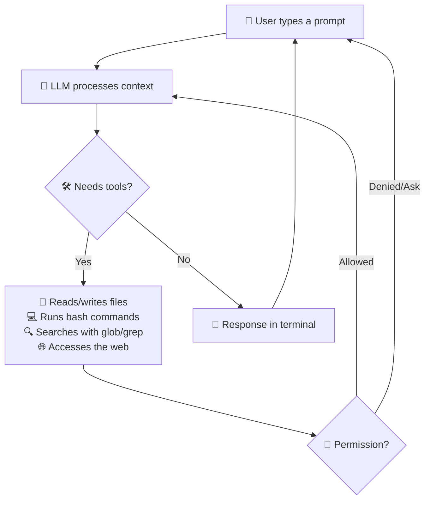
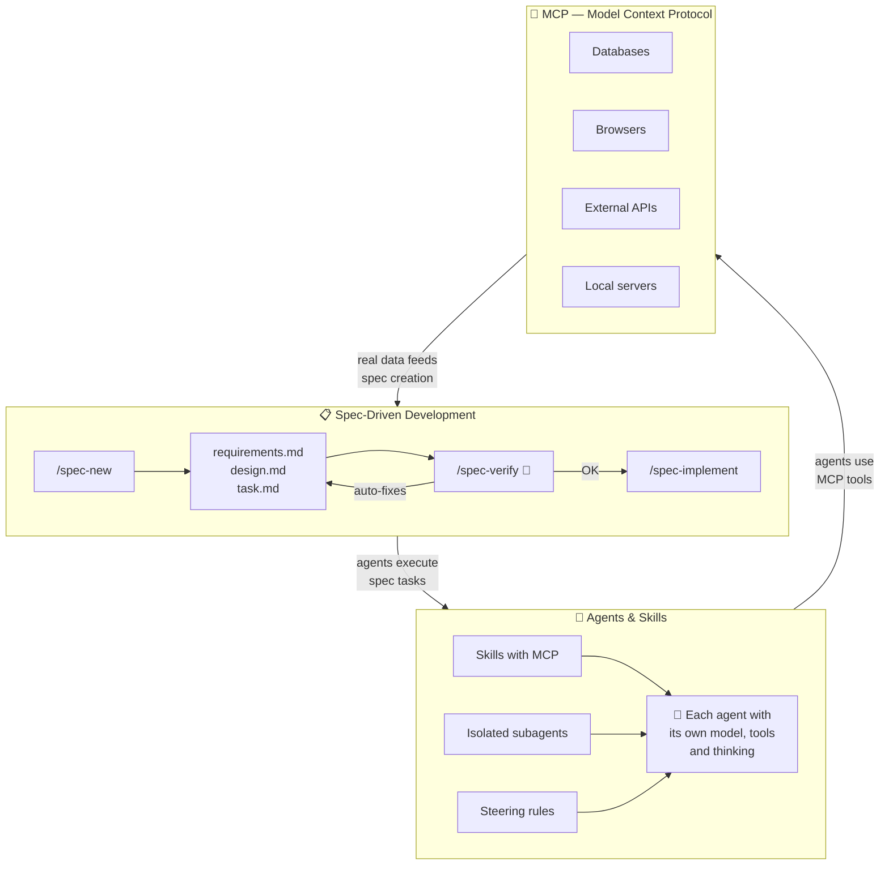
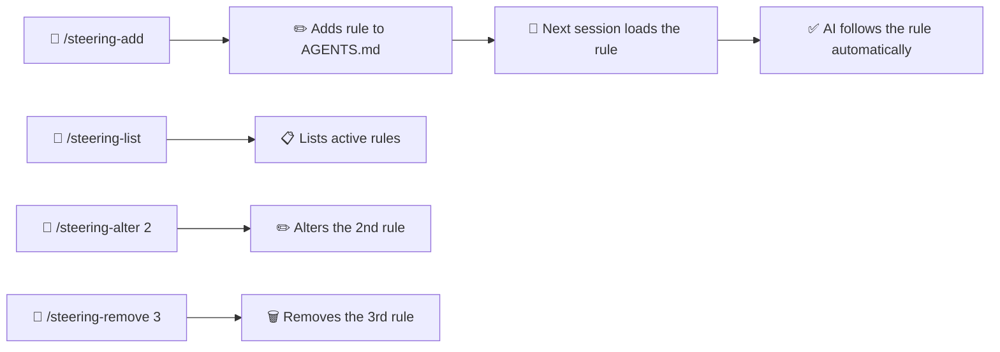
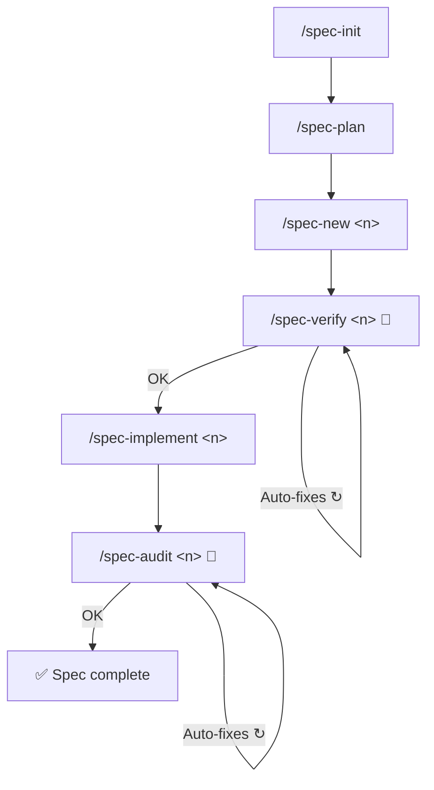

<div align="center">

**🌐 Language:** [Português](../../README.md) | English | [Español](README.es.md) | [简体中文](README.zh-Hans.md) | [हिन्दी](README.hi.md)

</div>

<br/>

<div align="center">
<br/>
<br/>
<p align="center">
  
</p>
<h1>DsCode</h1>

[![][github-license-shield]][github-license-link]

**AI coding assistant in your terminal.**

<br/>
</div>

**DsCode** is a terminal-based AI coding assistant. You talk to an AI model — **16 models across DeepSeek V4, OpenAI GPT-5.x, Anthropic Claude, Google Gemini, or any OpenAI-compatible API** — and it analyzes, suggests, reviews, and writes code in your project. It works on Windows, Linux, and macOS. Its architecture features a **provider-agnostic LLM layer**, letting you switch between providers without changing code.

DsCode is derived from [DeepCode (lessweb/deepcode-cli)](https://github.com/lessweb/deepcode-cli) and has its own evolution, maintained by [André Campos](https://github.com/andrelncampos).

---

## How DsCode works



DsCode works in **sessions**. Each session is an ongoing conversation. The AI uses **tools** (read files, run commands, edit code, search the web) to accomplish tasks. You can **confirm, deny, or configure permissions** for each type of action.

---

## Who DsCode is for

- **Developers** who want AI assistance with everyday tasks.
- **Tech leads** who need to quickly review or understand codebases.
- **People already using AI to code** who want a fast, terminal-integrated workflow.
- **Teams that want to standardize** prompts, skills, agents, and steering to maintain consistency.
- **Users of any LLM provider** — DeepSeek V4, OpenAI, Anthropic, Google Gemini, or compatible APIs. The provider-agnostic layer makes switching effortless.

---

## What DsCode helps with

| Task | How DsCode helps |
|---|---|
| **Analyze a codebase** | Ask "Explain this project's architecture" and the AI reads files and answers. |
| **Review code** | Ask "Review the changes in this diff before committing". |
| **Implement features** | Describe what you need and the AI generates or edits files. |
| **Refactor** | Ask "Simplify this function without changing its behavior". |
| **Investigate bugs** | Paste a stack trace and ask for help finding the cause. |
| **Create or use skills** | Skills are guides that teach the AI to work in a specific way. |
| **Explore code with subagents** | Delegate searches and analysis to the Explore subagent — it combs through code in isolation and returns only the summary, without cluttering context. |
| **Work with Git** | The AI suggests branches, commit messages, and makes versioned changes. |
| **Configure reasoning** | Enable *thinking mode* for hard tasks — the AI "thinks" before responding. |
| **Integrate external tools** | With MCP, connect databases, browsers, APIs, and other tools. |

---

## Comparison

**16 models. 4 providers. Zero vendor lock-in.**

|  | DsCode | GitHub Copilot | Cursor | Claude Code | Amazon Kiro |
|---|---|---|---|---|---|
| **Works in terminal** | ✅ Native TUI | ❌ IDE only | ❌ IDE only | ✅ CLI | ⚠️ IDE + CLI |
| **Provider freedom** | ✅ DeepSeek + OpenAI + Anthropic + Gemini + any compatible | ❌ GitHub only | ⚠️ Limited | ⚠️ Anthropic only | ⚠️ Amazon Bedrock only |
| **Thinking mode per provider** | ✅ max/high/medium/low native | ❌ | ❌ | ⚠️ Claude only | ⚠️ Via Bedrock |
| **Full MCP** | ✅ Skills + SDD + TUI | ❌ | ⚠️ Partial | ⚠️ Partial | ✅ IDE-based |
| **Spec-Driven Development** | ✅ Built-in cycle + auto-fix | ❌ | ❌ | ❌ | ✅ IDE-based |
| **Skills/Powers** | ✅ Markdown, agent mode, MCP per skill | ❌ | ⚠️ Rules only | ⚠️ Hooks | ✅ Powers |
| **Steering** | ✅ Persistent per-project rules | ❌ | ❌ | ❌ | ✅ Markdown files |
| **Free to use** | ✅ No cost | ⚠️ Limited free plan | ⚠️ Limited free plan | ⚠️ Credits | ⚠️ Bedrock costs |

> **Amazon Kiro** is DsCode's closest competitor — both have Spec-Driven Development, Steering, MCP, and Skills/Powers. The key difference: DsCode is **terminal-native, multi-provider, and completely free**; Kiro is **IDE-first, locked to Amazon Bedrock, and charges for model usage**.

---

## The DsCode triad: Spec + SDD + Agent

DsCode is the **only** AI assistant that combines three capabilities in one integrated cycle:



| Piece | What it does | Why it's unique |
|---|---|---|
| **Spec** | Defines what to build: requirements, design, and tasks in versioned documents | Full cycle with auto-fix at 2 checkpoints (verify + audit) |
| **Agent** | Skills run as isolated subagents with independent model, tools, and thinking | Agents use MCP, follow steering rules, and don't pollute the main context |
| **MCP** | Connects AI to databases, APIs, browsers, and local servers | Integrated across 3 layers: skills carry MCP, specs declare MCP, TUI inspects MCP |

The result: you define **what** you want (spec), the AI decides **how** to do it (agent) using **real tools** (MCP), with quality guaranteed by automatic checkpoints. **No other product delivers this cycle.**

---

## Installation

### Via npm (recommended)

```bash
npm install -g @andrelncampos/dscode
```

Requires [Node.js 24+](https://nodejs.org). After installing, run `dscode` in your terminal.

### Standalone binaries

Download the binary for your operating system from the **[releases page](https://github.com/andrelncampos/dscode-public-public/releases)**.  
**No prerequisites** — the binary is self-contained, no Node.js or other dependencies required.

| Operating System | File |
|---|---|
| Windows (x64) | `dscode-windows-x64.zip` |
| Linux (x64) | `dscode-linux-x64.tar.gz` |
| macOS (Intel x64) | `dscode-macos-x64.tar.gz` |
| macOS (Apple Silicon) | `dscode-macos-arm64.tar.gz` |

Each release includes a `checksums.txt` with **SHA256** hashes to verify download integrity.
After downloading, extract the archive and run `./dscode` in your terminal.

## Updates

DsCode automatically checks for new versions on startup. If an update is available, you'll be notified and can install it with one keystroke.

To check manually:

```bash
dscode --update
```

If a newer version is available, DsCode will ask if you want to install it. Otherwise, it will display "DsCode is up to date."

---

## Initial setup

DsCode reads its configuration from `~/.dscode/settings.json` (user) and `.dscode/settings.json` (project). Environment variables with the `DEEPCODE_` prefix are also recognized.

### Minimum example

```json
{
  "env": {
    "MODEL": "deepseek-v4-pro",
    "BASE_URL": "https://api.deepseek.com",
    "API_KEY": "your-key-here"
  },
  "thinkingEnabled": true,
  "reasoningEffort": "max"
}
```

### Where to get your API key

| Provider | Link |
|---|---|
| **DeepSeek** | [platform.deepseek.com](https://platform.deepseek.com) → API Keys |
| **OpenAI** | [platform.openai.com](https://platform.openai.com) → API Keys |
| **Anthropic** | [console.anthropic.com](https://console.anthropic.com) → API Keys |
| **Google Gemini** | [aistudio.google.com](https://aistudio.google.com) → API Keys |

### Available configuration options

| Field | Type | Description | Default |
|---|---|---|---|
| `env.MODEL` | string | AI model to use | `deepseek-v4-pro` |
| `env.BASE_URL` | string | Provider API base URL | `https://api.deepseek.com` |
| `env.API_KEY` | string | Provider API key | *(required)* |
| `thinkingEnabled` | boolean | Enables thinking mode | `true` for DeepSeek |
| `reasoningEffort` | string | Reasoning depth: `"xhigh"`, `"high"`, `"medium"`, `"low"`, `"max"`, or `"none"` (varies by provider) | `"max"` for DeepSeek V4 Pro |
| `temperature` | number | Response creativity (0 to 2) | `0.3` |
| `maxTokens` | number | Token limit per response | 65536 (Pro) / 32768 (Flash) |
| `debugLogEnabled` | boolean | Saves debug logs to `~/.dscode/logs/` | `false` |
| `telemetryEnabled` | boolean | Sends anonymous usage statistics | `false` |
| `permissions` | object | Fine-grained permission control | *(all allowed)* |
| `mcpServers` | object | MCP server configuration | *(none)* |
| `notify` | string | Script executed after each task completes | *(none)* |
| `engines` | object | Per-provider configuration (e.g., `engines.openai.apiKey`) | `{}` |
| `modelPricing` | object | Custom model pricing overrides | *(DeepSeek V4 defaults)* |
| `repositoryVisibility` | `"public"` \| `"private"` | Repository visibility. `"public"` adds `/management/` and `/.agents/` to `.gitignore` automatically | `"private"` |

### Model pricing (`modelPricing`)

DsCode estimates session cost based on token usage. Default prices:

| Model | Input (1M tokens) | Output (1M tokens) | Cache Read (1M tokens) |
|---|---|---|---|
| `deepseek-v4-pro` | $0.435 | $0.87 | $0.003625 |
| `deepseek-v4-flash` | $0.14 | $0.28 | $0.0028 |
| `gpt-5.4` | $1.25 | $10.00 | $0.625 |
| `gpt-5.4-mini` | $0.15 | $0.60 | $0.075 |
| `claude-opus-4-8` | $15.00 | $75.00 | $7.50 |
| `claude-sonnet-4-6` | $3.00 | $15.00 | $1.50 |
| `claude-haiku-4-5` | $0.80 | $4.00 | $0.40 |
| `claude-fable-5` | $10.00 | $50.00 | $1.00 |
| `claude-mythos-5` | $10.00 | $50.00 | $1.00 |
| `gemini-3.5-flash` | $1.50 | $9.00 | $0.15 |
| `gemini-3.1-flash-lite` | $0.25 | $1.50 | $0.025 |
| `gemini-2.5-pro` | $2.50 | $15.00 | $0.25 |
| `gemini-2.5-flash` | $0.50 | $3.00 | $0.05 |

To use custom pricing (or add an unsupported model):

```json
{
  "modelPricing": {
    "my-model": {
      "inputPrice": 0.50,
      "outputPrice": 1.00,
      "cacheReadPrice": 0.05
    }
  }
}
```

Cost is displayed in the top-right corner during a session: `⚡ 42.3K 💰 $0.15`.

---

## Files and structure

DsCode organizes its data in `.dscode/` directories within the project and the user's home:

```
my-project/
├── .dscode/                   # Project config and data
│   ├── settings.json          # Local configuration (optional)
│   ├── AGENTS.md              # Instructions and steering rules
│   ├── sessions-index.json    # Session index
│   ├── <session-id>.jsonl     # Messages for each session
│   └── specs/                 # SDD documents
│       ├── vision.md          # Product vision
│       ├── arch.md            # Architecture
│       ├── roadmap.md         # Roadmap with spec statuses
│       ├── adr.md             # Architecture Decision Records
│       └── lessons.md         # Lessons learned
│
~/.dscode/                     # User config
├── settings.json              # API key (encrypted), default model
├── .credential-key            # AES-256 encryption key (0600 permissions)
└── logs/debug.log             # Debug logs

~/.agents/skills/<skill>/SKILL.md    # User skills
./.agents/skills/<skill>/SKILL.md    # Project skills
```

⚠️ **Security**: Never commit `settings.json` (it contains your API key). The `.gitignore` already excludes it.

---

## First use in 5 minutes

### Step 1: Install

Download the binary from the [releases page](https://github.com/andrelncampos/dscode-public-public/releases), extract it, and run `./dscode`. **No prerequisites.**

### Step 2: Configure your key

Create `~/.dscode/settings.json` with your API key and preferred model (see the Configuration section above).

### Step 3: Open a project folder

```bash
cd /path/to/your/project
```

It can be any project: a Git repo, a personal project, even an empty folder.

### Step 4: Start DsCode

```bash
dscode
```

You'll see a welcome screen with a text input field. The assistant is ready.

**Tip:** Type `@` to search and mention project files — the AI can read and edit the files you reference.

### Step 5: Ask something simple

Type in the prompt field:

```
Explain the structure of this project in 3 sentences.
```

Press **Enter**. The AI will analyze the project files and respond.

### Step 6: Ask for a useful analysis

```
Analyze the codebase and point out possible improvements, without changing anything.
```

The AI will examine the code and suggest improvements. Use `Ctrl+O` to expand output or view running processes.

### Step 7: Review and commit

When the AI makes changes to files, **review each diff** before committing. DsCode shows what was changed and you decide whether to accept it.

> 💡 **Tip**: Make a commit (`git commit`) before requesting large tasks. If something goes wrong, you can undo with `git reset --hard`.

---

## All slash commands

Type `/` in the prompt to open the menu. There are **28 built-in commands** + dynamic skills (`/<skill-name>`):

### Session

| Command | Description |
|---|---|
| `/new` | New conversation — clears context |
| `/resume` | Resume a previous conversation |
| `/continue` | Continue the active conversation (or resume if empty) |
| `/undo` | Restore code and/or conversation to a previous checkpoint |

### Model and display

| Command | Description |
|---|---|
| `/model` | Select from 16 models across 4 providers, with provider-aware thinking mode and reasoning effort |
| `/raw` | Toggle display mode: `lite` (summarized), `normal` (full), `raw-scrollback` (scroll) |

### Provider & model

| Command | Description |
|---|---|
| `/model-list` | List all configured providers with status, models and pricing |
| `/model-add <provider>` | Add a new LLM provider with guided wizard (API key + base URL) |
| `/model-remove <provider>` | Remove a provider from configuration |
| `/model-info <id>` | Show model details: capabilities, pricing, thinking, context |
| `/model-key <provider>` | Update API key for a provider (overwrites previous) |
| `/model-default <id>` | Set the default model |
| `/model-params` | Interactive generation parameter editor: temperature, max_tokens, top_p |
| `/model-thinking <id>` | Configure thinking budget for extended-thinking models |

> 💡 **Encrypted keys**: API keys are stored encrypted (AES-256-GCM) in `settings.json`. Plaintext key migration is automatic on first use. Use `/model-key` to update.

### Skills and agents

| Command | Description |
|---|---|
| `/skills` | List all available skills (built-in + custom) |
| `/<skill-name>` | Run a specific skill by name |
| `/init` | Create `AGENTS.md` with instructions for the AI in the project |
| `/steering-add` | Add a steering rule to the STEERINGS section of `AGENTS.md` |
| `/steering-list` | List all steering rules from `AGENTS.md` |
| `/steering-remove <N>` | Remove the Nth steering rule from `AGENTS.md` |
| `/steering-alter <N>` | Alter the Nth steering rule in `AGENTS.md` |

### SDD (Spec-Driven Development)

| Command | Description |
|---|---|
| `/spec-init` | Initialize SDD structure: `vision.md`, `arch.md`, `roadmap.md`, `adr.md`, `lessons.md` |
| `/spec-plan` | Plan specs from a brainstorm, align with vision, and update roadmap |
| `/spec-new <n>` | Create a new spec with requirements, design, and tasks |
| `/spec-verify <n>` | Verify and **auto-fix** gaps in requirements and design (idempotent — run as many times as you want) |
| `/spec-implement <n>` | Implement all spec tasks sequentially |
| `/spec-audit <n>` | Audit and **auto-fix** implementation bugs, tests, and design deviations (idempotent — each pass improves without degrading) |
| `/spec-list` | List all specs with roadmap statuses |
| `/spec-status [n]` | Show detailed status of a specific spec or all |

### External tools

| Command | Description |
|---|---|
| `/mcp` | Show MCP server status and available tools |

### System

| Command | Description |
|---|---|
| `/exit` | Quit DsCode |

---

## Steering system

**Steering** lets you define persistent rules that the AI follows in **all sessions** of the project. The rules live in the `## Steering` section of the `.dscode/AGENTS.md` file. The full management lifecycle includes adding, listing, altering, and removing rules by position.



**Example:**
```
/steering-add always respond in English
/steering-add never push without explicit authorization
/steering-list
/steering-alter 2 never push or merge without authorization
/steering-remove 1
```

---

## SDD — Spec-Driven Development

DsCode implements a complete spec-driven development cycle. All files live in `management/`.

The two quality checkpoints — **spec-verify** and **spec-audit** — don't just report problems: they **auto-fix them**. Both are **idempotent**: you can run them multiple times and each pass improves quality without degrading what was already correct.



| File | Content |
|---|---|
| `vision.md` | Product vision, target audience, value proposition |
| `arch.md` | Architecture decisions, stack, patterns |
| `roadmap.md` | List of specs with status (planned/in-progress/done) |
| `adr.md` | Architecture Decision Records |
| `lessons.md` | Lessons learned throughout development |

### SDD in practice — a complete example

Imagine you want to add **OpenAI support** to DsCode. The real flow:

```
/spec-plan
  ↓  You type: "I want native OpenAI support with thinking mode"
  ↓  The AI analyzes the vision, creates spec 40, updates the roadmap
/spec-new 40
  ↓  The AI generates complete requirements.md, design.md and task.md
/spec-verify 40
  ↓  The AI finds 3 traceability gaps and AUTO-FIXES them
  ↓  Run it again. If OK → next step
/spec-implement 40
  ↓  The AI creates openai-provider.ts, openai-converter.ts, tests...
  ↓  Each task runs in order. Typecheck and tests at every step
/spec-audit 40
  ↓  The AI finds 1 bug and 1 stale test and FIXES them
  ↓  Run it again. If OK → spec complete ✅
```

> 💡 **Tip**: `spec-verify` and `spec-audit` are your allies. Run them until they say "0 issues found". Each pass improves quality with zero regression risk.

---

## MCP — Model Context Protocol

DsCode integrates the **Model Context Protocol (MCP)**, allowing the AI to connect to external tools such as databases, browsers, APIs, and local servers. Support covers the full lifecycle: skills, SDD, and TUI.

### Skills with MCP

Skills can include an `mcp.json` file that declares MCP servers. When the skill is activated (via keyword match or `#skill-name`), the servers start automatically. When the conversation moves to another topic, they are suspended — no global tool catalog pollution.

Example: a `postgres-dba` skill brings tools like `query`, `list_tables`, and `describe`, plus safety rules (`MCP: deny drop_table`). All in one installable package.

### SDD + MCP

The SDD cycle integrates with MCP at three levels:
- **Specs declare MCP dependencies** in YAML frontmatter, defining servers and tools relevant to that spec.
- **Assisted creation**: during `/spec-new`, the AI queries real data sources (GitHub issues, databases, documentation) to produce requirements grounded in real data.
- **Scoped access**: each spec defines a temporary tool allowlist, keeping the AI focused on what matters.

### TUI Inspection & Actions

The `/mcp` command opens a full management panel:
- **Server list** with status, scope (`[global]`, `[project]`, `[skill: ...]`, `[spec: N]`), and policy summary.
- **Details** with policy badges (`auto-allow`, `ask`, `deny`) for each tool.
- **Execution history** and **error log** for diagnostics.
- **Keyboard shortcuts**: `A` approve, `D` deny, `R` reset policy, `X` disable server, `Ctrl+R` reconnect.

### Where to configure MCP servers

| Level | Location | Scope |
|---|---|---|
| Global | `~/.dscode/settings.json` → `mcpServers` | All sessions |
| Project | `.dscode/mcp.json` | Sessions in that directory |
| Skill | `<skill>/mcp.json` | When the skill is active |
| Spec | Spec YAML frontmatter | During `/spec-implement` |

---

## Skills

Skills are Markdown guides that teach the AI to work in a specific way. DsCode loads skills from 3 sources:

| Location | Usage |
|---|---|
| `templates/skills/` (built-in) | 3 skills always loaded |
| `~/.agents/skills/<name>/SKILL.md` | User's personal skills |
| `./.agents/skills/<name>/SKILL.md` | Project skills |

### Built-in skills

| Skill | Purpose |
|---|---|
| **agent-drift-guard** | Detects and corrects execution drift |
| **karpathy-guidelines** | Best practices to reduce common LLM mistakes |
| **plan-and-execute** | Structured planning with progress tracking |

### Inclusion modes

Each `SKILL.md` can declare how it should be loaded via the optional `inclusion` field in YAML frontmatter:

| Mode | Behavior |
|------|----------|
| `auto` (default) | Loaded automatically via keyword matching in the prompt and available in the `/skills` menu |
| `manual` | **Never** loaded automatically. Activated only with `#skill-name` prefix or via the `/skills` menu |

**Example SKILL.md with `inclusion: manual`:**
```markdown
---
name: my-deploy
description: Deploys to production
inclusion: manual
---

# Deploy

Before deploying, verify...
```

To activate a manual skill, type `#my-deploy` at the start of the prompt — the `#` prefix is stripped and the skill is loaded.

### Skills as autonomous agents

In addition to the `inclusion` field, each `SKILL.md` can declare an execution `mode`:

| Mode | Behavior |
|------|----------|
| `prompt` (default) | The skill content is injected into the conversation context as a guide. |
| `agent` | The skill runs as an **isolated subagent** — with its own model, tools, and thinking — returning only the result. |

Skills with `mode: agent` are registered as tools in the LLM's toolkit. The main agent can delegate work to them by calling the tool with the skill name. This keeps the main context clean and allows each skill to have independent model, temperature, tools, max turns, and timeout settings.

**Example SKILL.md with `mode: agent`:**
```markdown
---
name: code-reviewer
description: Reviews code for bugs and improvements
mode: agent
model: deepseek-v4-flash
thinking: false
tools: [Read, Grep, Glob, Bash]
---
```

When the main agent needs a review, it calls the `code-reviewer` tool and receives only the final result — the subagent's intermediate reasoning doesn't pollute the main context.

---

## Keyboard shortcuts

| Shortcut | Action |
|---|---|
| `Enter` | Send prompt |
| `Shift+Enter` | Insert newline |
| `@` | Search and mention project files |
| `Tab` | Autocomplete commands and mentions |
| `/` | Open command menu |
| `?` | Help screen with all shortcuts |
| `Ctrl+O` | Expand output / view processes |
| `Ctrl+V` | Paste clipboard image |
| `Ctrl+X` | Clear pasted images |
| `Ctrl+C` | Cancel / interrupt AI |
| `Esc` | Close modals / interrupt |
| `Ctrl+Z` / `Ctrl+Shift+Z` | Undo / redo in prompt |
| `Ctrl+W` | Delete previous word |
| `Ctrl+A` / `Ctrl+E` | Start / end of line |
| `Ctrl+K` | Delete to end of line |
| `Alt+←/→` | Navigate by word |
| `↑/↓` | History (empty prompt) or menus |
| `PageUp/PageDown` | Scroll messages |

---

## Practical usage examples

Each example below is something you can type in the DsCode prompt field.

| Task | What to type |
|---|---|
| **Understand the architecture** | "Explain this project's architecture, what the main modules are and how they communicate." |
| **Find bugs** | "Analyze src/ for possible bugs. Only point them out, don't change anything." |
| **Suggest improvements** | "Suggest performance and readability improvements for the code in src/." |
| **Implement a feature** | "Add email validation to the signup form in src/form.ts." |
| **Refactor** | "Refactor the processData() function in src/utils.ts to be clearer, without changing behavior." |
| **Review a diff** | "Review the last commit changes and point out problems." |
| **Create tests** | "Create unit tests for the validateUser() function in src/validators.ts." |
| **Use a skill** | "Use the security review skill to audit this code." |
| **Initialize AGENTS.md** | Type `/init` to create a file with instructions the AI will follow in the project. |

DsCode works **conversationally**: you type what you need, the AI responds and uses tools. You can confirm or reject each action.

---

## Key concepts

| Concept | What it is | When it matters |
|---|---|---|
| **Session** | An ongoing conversation between you and the AI. Each `/new` starts a clean session. | Start a new session when switching tasks to avoid mixing contexts. |
| **Context** | The entire conversation history the AI "remembers". Includes your messages, responses, and files read. | Long contexts use more tokens. Use `/new` to reset. |
| **Skills** | Markdown guides that teach the AI to follow specific rules. | Create a skill to standardize reviews, code style, or team processes. |
| **Tools** | Tools the AI uses: `bash` (shell), `read`/`write`/`edit` (files), `glob`/`grep` (search), `Explore` (subagent), `WebSearch`/`WebFetch` (web), `AskUserQuestion` (questions), `UpdatePlan` (tasks). | The AI decides which to use. You can block dangerous ones via `permissions`. |
| **`@` Mentions** | Type `@` in the prompt to search and reference project files. | Use to direct the AI: "Analyze @src/utils.ts" — it already knows which file to read. |
| **Provider** | The company providing the AI model (DeepSeek, OpenAI, Anthropic, Google Gemini, etc.). | Choose a provider based on cost, quality, and privacy. |
| **Model** | The specific AI model (e.g., `deepseek-v4-pro`, `gpt-5.5`, `claude-sonnet-4-6`, `gemini-3.5-flash`). 16 models available across 4 providers. | Different models have different quality, speed, and cost. |
| **Thinking mode** | The AI "thinks" (reasons) before responding, generating internal tokens you may or may not see. | Enable for complex tasks (debugging, architecture). Disable for speed. |
| **Reasoning effort** | Controls reasoning depth: `"xhigh"`, `"high"`, `"medium"`, `"low"`, `"max"`, or `"none"` (varies by provider). | Use max for hard problems and medium/low for everyday tasks. |
| **Prompt cache** | DeepSeek caches repeated parts of the context to charge fewer tokens (KV Cache). | Happens automatically. Keep prompts stable to save money. |
| **Logs** | Debug files in `~/.dscode/logs/` that record API calls. | Enable `debugLogEnabled` only to diagnose problems. |
| **Permissions** | Control what the AI can do: read files, write, access network, run commands. | Configure restrictive permissions if you want to review each action before execution. |
| **Workspace** | The root folder where DsCode is running. The AI only sees files in this folder (unless you authorize external access). | Open DsCode in the root of the project you want to work on. |
| **Compaction** | When the conversation gets too long, DsCode summarizes the history to fit the token limit. | Automatic. You can force a new session with `/new` if you prefer. |

---

## Using with DeepSeek

DsCode is optimized for DeepSeek V4.

| Model | Best for | Speed | Cost |
|---|---|---|---|
| `deepseek-v4-pro` | Architecture, debugging, deep reasoning | Normal | Higher |
| `deepseek-v4-flash` | Refactoring, review, routine tasks | Fast | Lower |

### Thinking mode
- **Use**: Complex tasks (debugging, architecture, design)
- **Disable**: Quick, simple tasks
- **Options**: `"max"` (deep reasoning), `"high"` (balanced), `"No thinking"` (disabled)
- **Display**: `/raw` toggles between full/summarized/hidden

### KV Cache — DeepSeek **does not charge** for repeated tokens. Keep the system prompt stable.

---

## Using with OpenAI

DsCode has **native OpenAI support** via `OpenAIProvider`. Models with the `gpt-`, `o1`, `o3`, `o4`, or `openai-` prefix are automatically routed to the OpenAI provider — no additional configuration needed.

### OpenAI configuration

```json
{
  "env": {
    "MODEL": "gpt-5.4",
    "BASE_URL": "https://api.openai.com/v1",
    "API_KEY": "sk-your-openai-key"
  },
  "thinkingEnabled": true,
  "reasoningEffort": "high"
}
```

> 💡 `thinkingEnabled` works with OpenAI: `reasoningEffort` is sent as the native `reasoning_effort` API parameter.

### Using multiple providers with `engines`

You can configure separate keys for each provider without switching `settings.json` files:

```json
{
  "env": {
    "MODEL": "deepseek-v4-pro",
    "API_KEY": "sk-deepseek-key"
  },
  "engines": {
    "openai": {
      "apiKey": "sk-openai-key"
    }
  }
}
```

When you switch to `gpt-5.4` (via `/model`), DsCode automatically uses the `openai` engine key. The correct provider and key are selected based on the model prefix.

### What changes compared to DeepSeek

| Feature | With OpenAI |
|---|---|
| **Thinking mode** | ✅ Natively supported. `reasoningEffort` (`"high"` / `"max"`) is passed as `reasoning_effort` |
| **Built-in WebSearch** | ❌ Not available. Use MCP with a search server or ask the AI to use WebFetch on specific URLs |
| **KV Cache** | ❌ Not available (DeepSeek-exclusive) |
| **Images (Ctrl+V)** | ✅ Works with vision models (`gpt-5.5`, `gpt-5`, `gpt-4o`) |
| **Supported models** | `gpt-5.5`, `gpt-5.4`, `gpt-5.4-mini`, `gpt-5`, `gpt-4.5`, `gpt-4o`, `gpt-4o-mini`, `o1`, `o3`, `o4` — any Chat Completions model |
| **Compaction** | Uses `getAuxiliaryModel()`: `gpt-5.4` → `gpt-5.4-mini` to reduce cost (no thinking) when summarizing history |

### Example with a cheaper model

```json
{
  "env": {
    "MODEL": "gpt-5.4-mini",
    "BASE_URL": "https://api.openai.com/v1",
    "API_KEY": "sk-your-openai-key"
  },
  "thinkingEnabled": false
}
```

---

## Using with Anthropic

DsCode has **native Anthropic support** via `AnthropicProvider`. Models with the `claude-` prefix are automatically routed to the Anthropic provider — no additional configuration needed.

### Anthropic configuration

```json
{
  "env": {
    "MODEL": "claude-sonnet-4-6",
    "BASE_URL": "https://api.anthropic.com/v1",
    "API_KEY": "sk-ant-your-anthropic-key"
  },
  "thinkingEnabled": true,
  "reasoningEffort": "high"
}
```

> 💡 `thinkingEnabled` works with Anthropic: Opus/Sonnet/Fable/Mythos models use `thinking {type:"adaptive", effort}` with 3 levels (`"high"`, `"medium"`, `"low"`). Haiku models use `thinking {type:"enabled", budget_tokens}` with 2 levels (`"max"`, `"high"`).

### Using multiple providers with `engines`

```json
{
  "env": {
    "MODEL": "deepseek-v4-pro",
    "API_KEY": "sk-deepseek-key"
  },
  "engines": {
    "anthropic": {
      "apiKey": "sk-ant-anthropic-key"
    }
  }
}
```

### What changes compared to DeepSeek

| Feature | With Anthropic |
|---|---|
| **Thinking mode** | ✅ Natively supported. Adaptive (`"high"`, `"medium"`, `"low"`) for Opus/Sonnet/Fable/Mythos; Extended (`"max"`, `"high"`) with budget_tokens for Haiku |
| **Built-in WebSearch** | ❌ Not available. Use MCP with a search server |
| **KV Cache** | ❌ Not available (DeepSeek-exclusive) |
| **Images (Ctrl+V)** | ✅ Works with all Claude models |
| **Supported models** | `claude-opus-4-8`, `claude-sonnet-4-6`, `claude-haiku-4-5`, `claude-fable-5`, `claude-mythos-5` |

### Example with a cheaper model

```json
{
  "env": {
    "MODEL": "claude-haiku-4-5",
    "BASE_URL": "https://api.anthropic.com/v1",
    "API_KEY": "sk-ant-your-anthropic-key"
  },
  "thinkingEnabled": false
}
```

---

## Using with Google Gemini

DsCode has **native Google Gemini support** via `GeminiProvider`. Models with the `gemini-` prefix are automatically routed to the Gemini provider — no additional configuration needed. Gemini is the first provider implemented with **zero SDK** — it uses Node 24's native `fetch()`.

### Gemini configuration

```json
{
  "env": {
    "MODEL": "gemini-3.5-flash",
    "BASE_URL": "https://generativelanguage.googleapis.com/v1beta",
    "API_KEY": "AIza-your-gemini-key"
  },
  "thinkingEnabled": true,
  "reasoningEffort": "high"
}
```

> 💡 `thinkingEnabled` works with Gemini: the provider sends `thinkingConfig: { thinkingBudget: 8192, includeThoughts: true }` in `generationConfig`. Gemini uses "thinking budget" instead of "reasoning effort".

### Using multiple providers with `engines`

```json
{
  "env": {
    "MODEL": "deepseek-v4-pro",
    "API_KEY": "sk-deepseek-key"
  },
  "engines": {
    "gemini": {
      "apiKey": "AIza-your-gemini-key"
    }
  }
}
```

### What changes compared to DeepSeek

| Feature | With Gemini |
|---|---|
| **Thinking mode** | ✅ Natively supported via `thinkingConfig`. Budget of 8192 tokens. |
| **Built-in WebSearch** | ❌ Not available. Use MCP with a search server. |
| **KV Cache** | ❌ Not available (DeepSeek-exclusive) |
| **Images (Ctrl+V)** | ✅ Works with all Gemini models |
| **Supported models** | `gemini-3.5-flash`, `gemini-3-flash`, `gemini-3.1-flash-lite`, `gemini-2.5-pro`, `gemini-2.5-flash` |
| **Compaction** | Uses `getAuxiliaryModel()`: `gemini-3.5-flash` → `gemini-3.1-flash-lite` to reduce cost (no thinking) |

### Example with a cheaper model

```json
{
  "env": {
    "MODEL": "gemini-3.1-flash-lite",
    "BASE_URL": "https://generativelanguage.googleapis.com/v1beta",
    "API_KEY": "AIza-your-gemini-key"
  },
  "thinkingEnabled": false
}
```

---

## Security best practices

| What to do | Why |
|---|---|
| **Never paste API keys in GitHub issues** | Issues are public. Exposed keys can be used by others and incur charges. |
| **Never commit `settings.json`** | It contains your API key. The project's `.gitignore` already excludes it, but double-check. |
| **Review commands before allowing** | The AI may suggest shell commands. Read before confirming, especially if they involve `rm`, `sudo`, or network. |
| **Commit before requesting large changes** | If the AI does something wrong, `git reset --hard` undoes everything. Without a prior commit, this isn't possible. |
| **Read diffs before accepting** | DsCode shows each change. Review — the AI can make mistakes. |
| **Don't paste sensitive data in prompts** | Information like passwords, tokens, or customer data may appear in logs or responses. |
| **Sanitize logs before asking for help** | Logs in `~/.dscode/logs/` may contain code snippets. Remove confidential information before sharing. |
| **Use a separate branch for experiments** | Create `git checkout -b ai-experiment` before requesting large changes. If something goes wrong, discard the branch. |

---

## Best practices to save tokens/credits

| Practice | Explanation |
|---|---|
| **Ask for analysis before implementation** | "Analyze this code and suggest improvements" uses fewer tokens than "Implement X" without context. |
| **Limit scope** | Instead of "Improve the entire project", say "Improve the `process()` function in `src/utils.ts`". |
| **Specify relevant files** | Say "Only analyze files in `src/api/`" — the AI reads fewer files, using fewer tokens. |
| **Use Flash for simple tasks** | `deepseek-v4-flash` is much cheaper. Use for routine tasks. |
| **Use Pro sparingly** | Reserve `deepseek-v4-pro` for tasks that genuinely need deep reasoning. |
| **Keep prompts concise** | Long prompts with unnecessary information waste tokens. |
| **Reset session with `/new` for new tasks** | Long sessions accumulate context and each subsequent message costs more. |

---

## Troubleshooting

| Problem | Likely cause | How to fix |
|---|---|---|
| `dscode: command not found` | Global npm not in PATH | Reopen terminal. On Windows, check `%APPDATA%\\npm`. On Linux/macOS, check `~/.npm-global/bin`. |
| `Node.js version not supported` | Node below version 24 | Install or upgrade to [Node.js 24+](https://nodejs.org). |
| 401 error | API key missing or invalid | Check that `API_KEY` is correct in `~/.dscode/settings.json` or environment variable. |
| 429 error | Provider rate limit exceeded | Wait a few seconds and try again. Check your plan on the provider's platform. |
| Truncated response | Token limit reached | Increase `maxTokens` in `settings.json` or type "continue" to resume. |
| Timeout / excessive delay | Provider server overloaded or network issue | Wait. If persistent, switch models: use Flash instead of Pro temporarily. |
| Logs not appearing | `debugLogEnabled` is `false` (default) | Enable `"debugLogEnabled": true` in `settings.json`. Logs appear at `~/.dscode/logs/debug.log`. |
| Model not recognized | Incorrect model name | Use exact names: `deepseek-v4-pro`, `deepseek-v4-flash`, or a valid OpenAI-compatible model. |
| Token consumption too high | Long context or overly broad tasks | Use `/new` to reset session. Be specific about files and scope. |

---

## How to get help

If you encounter a problem, open an [issue on GitHub](https://github.com/andrelncampos/dscode-public-public/issues).

When reporting, include:

- **DsCode version**: `dscode --version` (shows version + node + platform)
- **Model used**: `deepseek-v4-pro`, `deepseek-v4-flash`, etc.
- **Command executed** and the full error
- **Sanitized logs**, if relevant (remove keys, tokens, and private data)

⚠️ **Never send**:
- API keys or tokens
- Your private prompts or confidential project data
- Complete `.env` or `settings.json` files
- Full unreviewed logs (they contain code snippets)

For security vulnerabilities, follow the instructions in [SECURITY.md](../SECURITY.md). **Do not open public issues for security flaws.**

---

## Contributing

Contributions are welcome! See the full guide in [CONTRIBUTING.md](../CHANGELOG.md).

Quick summary:

1. **Issues** are welcome for bugs, features, and questions.
2. **Pull requests** pass mandatory CI (typecheck + lint + format + tests + build).
3. **Security PRs** or changes to sensitive areas undergo stricter review.
4. Contributors declare they have the right to contribute the submitted code.

---

## Security

See [SECURITY.md](../SECURITY.md) for the full policy.

- Report vulnerabilities privately (do not open a public issue).
- DsCode masks sensitive data in debug logs, but always review before sharing.
- Keep your API key safe: use environment variables or `settings.json` with restricted permissions (`chmod 600`). Keys in `settings.json` are encrypted with AES-256-GCM. The encryption key is stored at `~/.dscode/.credential-key`.

---

## License and origin

**DsCode is free to use, but the source code is not public.** The product is made available at no cost for individual and professional use. Redistribution is allowed only of the official binaries.

This project is derived from [DeepCode (lessweb/deepcode-cli)](https://github.com/lessweb/deepcode-cli), originally MIT licensed. The original copyright notice is preserved in [LICENSE](../LICENSE) and [NOTICE](../NOTICE).

Third-party dependencies maintain their own licenses. See [NOTICE](../NOTICE) for the dependency list and licenses.

---

## Official channels

| Channel | Link |
|---|---|
| **GitHub** | [github.com/andrelncampos/dscode-public](https://github.com/andrelncampos/dscode-public) |
| **Releases** | [github.com/andrelncampos/dscode-public-public/releases](https://github.com/andrelncampos/dscode-public-public/releases) |
| **Issues** | [github.com/andrelncampos/dscode-public-public/issues](https://github.com/andrelncampos/dscode-public-public/issues) |

⚠️ Install DsCode **only** from the official channels above. Do not trust versions published on third-party sites or unverified links.

---

<!-- LINK GROUP -->

[github-license-link]: https://github.com/andrelncampos/dscode-public-public/blob/master/LICENSE
[github-license-shield]: https://img.shields.io/github/license/andrelncampos/dscode?color=4d6BFE&labelColor=black&style=flat-square&cacheSeconds=1800
