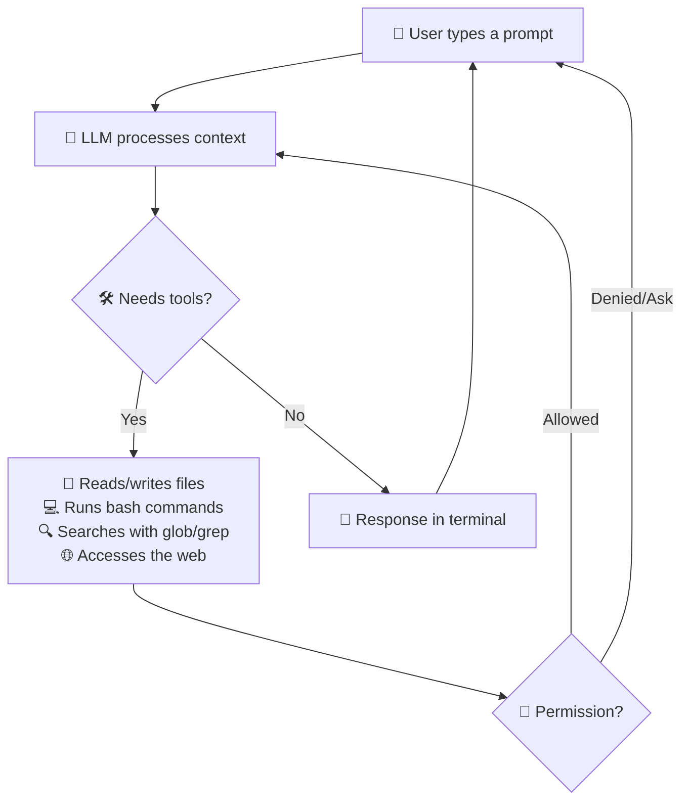
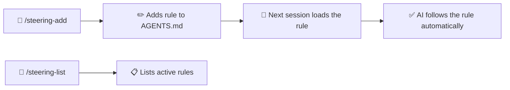
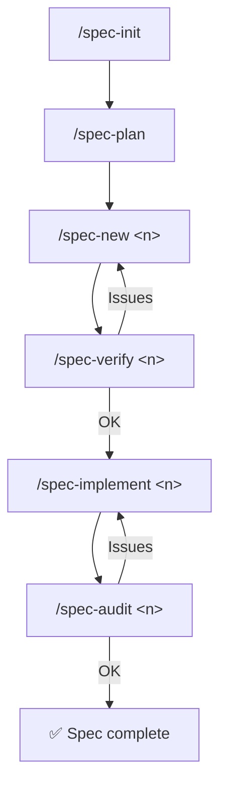

<div align="center">

**🌐 Language:** [Português](../../README.md) | English | [Español](README.es.md) | [简体中文](README.zh-Hans.md) | [हिन्दी](README.hi.md)

</div>

<br/>

<div align="center">
<br/>
<br/>
<p align="center">
  
</p>
<h1>DsCode</h1>

[![][github-license-shield]][github-license-link]

**AI coding assistant in your terminal.**

<br/>
</div>

**DsCode** is a terminal-based AI coding assistant. You talk to an AI model — **DeepSeek V4, OpenAI, Anthropic, or any OpenAI-compatible API** — and it analyzes, suggests, reviews, and writes code in your project. It works on Windows, Linux, and macOS. Its architecture features a **provider-agnostic LLM layer**, letting you switch between providers without changing code.

DsCode is derived from [DeepCode (lessweb/deepcode-cli)](https://github.com/lessweb/deepcode-cli) and has its own evolution, maintained by [André Campos](https://github.com/andrelncampos).

---

## How DsCode works



DsCode works in **sessions**. Each session is an ongoing conversation. The AI uses **tools** (read files, run commands, edit code, search the web) to accomplish tasks. You can **confirm, deny, or configure permissions** for each type of action.

---

## Who DsCode is for

- **Developers** who want AI assistance with everyday tasks.
- **Tech leads** who need to quickly review or understand codebases.
- **People already using AI to code** who want a fast, terminal-integrated workflow.
- **Teams that want to standardize** prompts, skills, agents, and steering to maintain consistency.
- **Users of any LLM provider** — DeepSeek V4, OpenAI, Anthropic, or compatible APIs. The provider-agnostic layer makes switching effortless.

---

## What DsCode helps with

| Task | How DsCode helps |
|---|---|
| **Analyze a codebase** | Ask "Explain this project's architecture" and the AI reads files and answers. |
| **Review code** | Ask "Review the changes in this diff before committing". |
| **Implement features** | Describe what you need and the AI generates or edits files. |
| **Refactor** | Ask "Simplify this function without changing its behavior". |
| **Investigate bugs** | Paste a stack trace and ask for help finding the cause. |
| **Create or use skills** | Skills are guides that teach the AI to work in a specific way. |
| **Work with Git** | The AI suggests branches, commit messages, and makes versioned changes. |
| **Configure reasoning** | Enable *thinking mode* for hard tasks — the AI "thinks" before responding. |
| **Integrate external tools** | With MCP, connect databases, browsers, APIs, and other tools. |

---

## Installation

### Via npm (recommended)

```bash
npm install -g @andrelncampos/dscode
```

**Prerequisite**: [Node.js](https://nodejs.org) version **22** or later.

```bash
dscode --version   # verify installation
npm update -g @andrelncampos/dscode   # update
npm uninstall -g @andrelncampos/dscode   # uninstall
```

### Via binary (future)

> ⚠️ **No releases have been published yet.** The instructions below show the download format once the first release is published.

| Operating System | File |
|---|---|
| Windows (x64) | `dscode-windows-x64.zip` |
| Linux (x64) | `dscode-linux-x64.tar.gz` |
| macOS (Intel x64) | `dscode-macos-x64.tar.gz` |
| macOS (Apple Silicon) | `dscode-macos-arm64.tar.gz` |

Each release includes a `checksums.txt` with SHA256 hashes.

### Installing from source

```bash
git clone https://github.com/andrelncampos/dscode.git
cd dscode
npm ci
npm run build
npm link
dscode --version
```

---

## Initial setup

DsCode reads its configuration from `~/.dscode/settings.json` (user) and `.dscode/settings.json` (project). Environment variables with the `DEEPCODE_` prefix are also recognized.

### Minimum example

```json
{
  "env": {
    "MODEL": "deepseek-v4-pro",
    "BASE_URL": "https://api.deepseek.com",
    "API_KEY": "your-key-here"
  },
  "thinkingEnabled": true,
  "reasoningEffort": "max"
}
```

### Where to get your API key

| Provider | Link |
|---|---|
| **DeepSeek** | [platform.deepseek.com](https://platform.deepseek.com) → API Keys |
| **OpenAI** | [platform.openai.com](https://platform.openai.com) → API Keys |
| **Anthropic** | [console.anthropic.com](https://console.anthropic.com) → API Keys |

### Available configuration options

| Field | Type | Description | Default |
|---|---|---|---|
| `env.MODEL` | string | AI model to use | `deepseek-v4-pro` |
| `env.BASE_URL` | string | Provider API base URL | `https://api.deepseek.com` |
| `env.API_KEY` | string | Provider API key | *(required)* |
| `thinkingEnabled` | boolean | Enables thinking mode | `true` for DeepSeek |
| `reasoningEffort` | string | Reasoning depth: `"high"` or `"max"` | `"max"` for V4 Pro |
| `temperature` | number | Response creativity (0 to 2) | *(provider default)* |
| `maxTokens` | number | Token limit per response | 65536 (Pro) / 32768 (Flash) |
| `debugLogEnabled` | boolean | Saves debug logs to `~/.dscode/logs/` | `false` |
| `telemetryEnabled` | boolean | Sends anonymous usage statistics | `false` |
| `permissions` | object | Fine-grained permission control | *(all allowed)* |
| `mcpServers` | object | MCP server configuration | *(none)* |
| `notify` | string | Script executed after each task completes | *(none)* |
| `modelPricing` | object | Custom model pricing overrides | *(DeepSeek V4 defaults)* |

### Model pricing (`modelPricing`)

DsCode estimates session cost based on token usage. Default prices:

| Model | Input (1M tokens) | Output (1M tokens) | Cache Read (1M tokens) |
|---|---|---|---|
| `deepseek-v4-pro` | $0.435 | $0.87 | $0.003625 |
| `deepseek-v4-flash` | $0.14 | $0.28 | $0.0028 |

To use custom pricing (or add an unsupported model):

```json
{
  "modelPricing": {
    "my-model": {
      "inputPrice": 0.50,
      "outputPrice": 1.00,
      "cacheReadPrice": 0.05
    }
  }
}
```

Cost is displayed in the top-right corner during a session: `⚡ 42.3K 💰 $0.15`.

---

## Files and structure

DsCode organizes its data in `.dscode/` directories within the project and the user's home:

```
my-project/
├── .dscode/                   # Project config and data
│   ├── settings.json          # Local configuration (optional)
│   ├── AGENTS.md              # Instructions and steering rules
│   ├── sessions-index.json    # Session index
│   ├── <session-id>.jsonl     # Messages for each session
│   └── specs/                 # SDD documents
│       ├── vision.md          # Product vision
│       ├── arch.md            # Architecture
│       ├── roadmap.md         # Roadmap with spec statuses
│       ├── adr.md             # Architecture Decision Records
│       └── lessons.md         # Lessons learned
│
~/.dscode/                     # User config
├── settings.json              # API key, default model
└── logs/debug.log             # Debug logs

~/.agents/skills/<skill>/SKILL.md    # User skills
./.agents/skills/<skill>/SKILL.md    # Project skills
```

⚠️ **Security**: Never commit `settings.json` (it contains your API key). The `.gitignore` already excludes it.

---

## First use in 5 minutes

### Step 1: Install

```bash
npm install -g @andrelncampos/dscode
```

### Step 2: Configure your key

Create `~/.dscode/settings.json` with your API key and preferred model (see the Configuration section above).

### Step 3: Open a project folder

```bash
cd /path/to/your/project
```

It can be any project: a Git repo, a personal project, even an empty folder.

### Step 4: Start DsCode

```bash
dscode
```

You'll see a welcome screen with a text input field. The assistant is ready.

**Tip:** Type `@` to search and mention project files — the AI can read and edit the files you reference.

### Step 5: Ask something simple

Type in the prompt field:

```
Explain the structure of this project in 3 sentences.
```

Press **Enter**. The AI will analyze the project files and respond.

### Step 6: Ask for a useful analysis

```
Analyze the codebase and point out possible improvements, without changing anything.
```

The AI will examine the code and suggest improvements. Use `Ctrl+O` to expand output or view running processes.

### Step 7: Review and commit

When the AI makes changes to files, **review each diff** before committing. DsCode shows what was changed and you decide whether to accept it.

> 💡 **Tip**: Make a commit (`git commit`) before requesting large tasks. If something goes wrong, you can undo with `git reset --hard`.

---

## All slash commands

Type `/` in the prompt to open the menu. There are **20 built-in commands** + dynamic skills (`/<skill-name>`):

### Session

| Command | Description |
|---|---|
| `/new` | New conversation — clears context |
| `/resume` | Resume a previous conversation |
| `/continue` | Continue the active conversation (or resume if empty) |
| `/undo` | Restore code and/or conversation to a previous checkpoint |

### Model and display

| Command | Description |
|---|---|
| `/model` | Select model, thinking mode, and reasoning effort |
| `/raw` | Toggle display mode: `lite` (summarized), `normal` (full), `raw-scrollback` (scroll) |

### Skills and agents

| Command | Description |
|---|---|
| `/skills` | List all available skills (built-in + custom) |
| `/<skill-name>` | Run a specific skill by name |
| `/init` | Create `AGENTS.md` with instructions for the AI in the project |
| `/steering-add` | Add a steering rule to the STEERINGS section of `AGENTS.md` |
| `/steering-list` | List all steering rules from `AGENTS.md` |

### SDD (Spec-Driven Development)

| Command | Description |
|---|---|
| `/spec-init` | Initialize SDD structure: `vision.md`, `arch.md`, `roadmap.md`, `adr.md`, `lessons.md` |
| `/spec-plan` | Plan specs from a brainstorm, align with vision, and update roadmap |
| `/spec-new <n>` | Create a new spec with requirements, design, and tasks |
| `/spec-verify <n>` | Verify completeness and alignment with vision |
| `/spec-implement <n>` | Implement all spec tasks sequentially |
| `/spec-audit <n>` | Audit implementation quality and correctness |
| `/spec-list` | List all specs with roadmap statuses |
| `/spec-status [n]` | Show detailed status of a specific spec or all |

### External tools

| Command | Description |
|---|---|
| `/mcp` | Show MCP server status and available tools |

### System

| Command | Description |
|---|---|
| `/exit` | Quit DsCode |

---

## Steering system

**Steering** lets you define persistent rules that the AI follows in **all sessions** of the project. The rules live in the `STEERINGS` section of the `.dscode/AGENTS.md` file.



**Example:**
```
/steering-add always respond in English
/steering-add never push without explicit authorization
```

---

## SDD — Spec-Driven Development

DsCode implements a complete spec-driven development cycle. All files live in `.dscode/specs/`.



| File | Content |
|---|---|
| `vision.md` | Product vision, target audience, value proposition |
| `arch.md` | Architecture decisions, stack, patterns |
| `roadmap.md` | List of specs with status (planned/in-progress/done) |
| `adr.md` | Architecture Decision Records |
| `lessons.md` | Lessons learned throughout development |

---

## Skills

Skills are Markdown guides that teach the AI to work in a specific way. DsCode loads skills from 3 sources:

| Location | Usage |
|---|---|
| `templates/skills/` (built-in) | 3 skills always loaded |
| `~/.agents/skills/<name>/SKILL.md` | User's personal skills |
| `./.agents/skills/<name>/SKILL.md` | Project skills |

### Built-in skills

| Skill | Purpose |
|---|---|
| **agent-drift-guard** | Detects and corrects execution drift |
| **karpathy-guidelines** | Best practices to reduce common LLM mistakes |
| **plan-and-execute** | Structured planning with progress tracking |

---

## Keyboard shortcuts

| Shortcut | Action |
|---|---|
| `Enter` | Send prompt |
| `Shift+Enter` | Insert newline |
| `@` | Search and mention project files |
| `Tab` | Autocomplete commands and mentions |
| `/` | Open command menu |
| `?` | Help screen with all shortcuts |
| `Ctrl+O` | Expand output / view processes |
| `Ctrl+V` | Paste clipboard image |
| `Ctrl+X` | Clear pasted images |
| `Ctrl+C` | Cancel / interrupt AI |
| `Esc` | Close modals / interrupt |
| `Ctrl+Z` / `Ctrl+Shift+Z` | Undo / redo in prompt |
| `Ctrl+W` | Delete previous word |
| `Ctrl+A` / `Ctrl+E` | Start / end of line |
| `Ctrl+K` | Delete to end of line |
| `Alt+←/→` | Navigate by word |
| `↑/↓` | History (empty prompt) or menus |
| `PageUp/PageDown` | Scroll messages |

---

## Practical usage examples

Each example below is something you can type in the DsCode prompt field.

| Task | What to type |
|---|---|
| **Understand the architecture** | "Explain this project's architecture, what the main modules are and how they communicate." |
| **Find bugs** | "Analyze src/ for possible bugs. Only point them out, don't change anything." |
| **Suggest improvements** | "Suggest performance and readability improvements for the code in src/." |
| **Implement a feature** | "Add email validation to the signup form in src/form.ts." |
| **Refactor** | "Refactor the processData() function in src/utils.ts to be clearer, without changing behavior." |
| **Review a diff** | "Review the last commit changes and point out problems." |
| **Create tests** | "Create unit tests for the validateUser() function in src/validators.ts." |
| **Use a skill** | "Use the security review skill to audit this code." |
| **Initialize AGENTS.md** | Type `/init` to create a file with instructions the AI will follow in the project. |

DsCode works **conversationally**: you type what you need, the AI responds and uses tools. You can confirm or reject each action.

---

## Key concepts

| Concept | What it is | When it matters |
|---|---|---|
| **Session** | An ongoing conversation between you and the AI. Each `/new` starts a clean session. | Start a new session when switching tasks to avoid mixing contexts. |
| **Context** | The entire conversation history the AI "remembers". Includes your messages, responses, and files read. | Long contexts use more tokens. Use `/new` to reset. |
| **Skills** | Markdown guides that teach the AI to follow specific rules. | Create a skill to standardize reviews, code style, or team processes. |
| **Tools** | Tools the AI uses: `bash` (shell), `read`/`write`/`edit` (files), `glob`/`grep` (search), `WebSearch`/`WebFetch` (web), `AskUserQuestion` (questions), `UpdatePlan` (tasks). | The AI decides which to use. You can block dangerous ones via `permissions`. |
| **`@` Mentions** | Type `@` in the prompt to search and reference project files. | Use to direct the AI: "Analyze @src/utils.ts" — it already knows which file to read. |
| **Provider** | The company providing the AI model (DeepSeek, OpenAI, Anthropic, etc.). | Choose a provider based on cost, quality, and privacy. |
| **Model** | The specific AI model (e.g., `deepseek-v4-pro`, `gpt-4o`). | Different models have different quality, speed, and cost. |
| **Thinking mode** | The AI "thinks" (reasons) before responding, generating internal tokens you may or may not see. | Enable for complex tasks (debugging, architecture). Disable for speed. |
| **Reasoning effort** | Controls reasoning depth: `"high"` (good, faster) or `"max"` (best, slower). | Use `"max"` for hard problems and `"high"` for everyday tasks. |
| **Prompt cache** | DeepSeek caches repeated parts of the context to charge fewer tokens (KV Cache). | Happens automatically. Keep prompts stable to save money. |
| **Logs** | Debug files in `~/.dscode/logs/` that record API calls. | Enable `debugLogEnabled` only to diagnose problems. |
| **Permissions** | Control what the AI can do: read files, write, access network, run commands. | Configure restrictive permissions if you want to review each action before execution. |
| **Workspace** | The root folder where DsCode is running. The AI only sees files in this folder (unless you authorize external access). | Open DsCode in the root of the project you want to work on. |
| **Compaction** | When the conversation gets too long, DsCode summarizes the history to fit the token limit. | Automatic. You can force a new session with `/new` if you prefer. |

---

## Using with DeepSeek

DsCode is optimized for DeepSeek V4.

| Model | Best for | Speed | Cost |
|---|---|---|---|
| `deepseek-v4-pro` | Architecture, debugging, deep reasoning | Normal | Higher |
| `deepseek-v4-flash` | Refactoring, review, routine tasks | Fast | Lower |

### Thinking mode
- **Use**: Complex tasks (debugging, architecture, design)
- **Disable**: Quick, simple tasks
- **Display**: `/raw` toggles between full/summarized/hidden

### KV Cache — DeepSeek **does not charge** for repeated tokens. Keep the system prompt stable.

---

## Using with OpenAI

DsCode works with any OpenAI model compatible with the Chat Completions API.

### OpenAI configuration

```json
{
  "env": {
    "MODEL": "gpt-4o",
    "BASE_URL": "https://api.openai.com/v1",
    "API_KEY": "sk-your-openai-key"
  },
  "thinkingEnabled": false
}
```

### What changes compared to DeepSeek

| Feature | With OpenAI |
|---|---|
| **Thinking mode** | ⚠️ Must be `false`. Reasoning effort is DeepSeek-proprietary |
| **Built-in WebSearch** | ❌ Not available. Use MCP with a search server or ask the AI to use WebFetch on specific URLs |
| **KV Cache** | ❌ Not available (DeepSeek-exclusive) |
| **Images (Ctrl+V)** | ✅ Works with vision models (`gpt-5.5`, `gpt-5`, `gpt-4o`) |
| **Supported models** | `gpt-5.5`, `gpt-5.4`, `gpt-5`, `gpt-4.5`, `gpt-4o`, `gpt-4o-mini` — any Chat Completions model |

### Example with a cheaper model

```json
{
  "env": {
    "MODEL": "gpt-4o-mini",
    "BASE_URL": "https://api.openai.com/v1",
    "API_KEY": "sk-your-openai-key"
  },
  "thinkingEnabled": false
}
```

---

## Security best practices

| What to do | Why |
|---|---|
| **Never paste API keys in GitHub issues** | Issues are public. Exposed keys can be used by others and incur charges. |
| **Never commit `settings.json`** | It contains your API key. The project's `.gitignore` already excludes it, but double-check. |
| **Review commands before allowing** | The AI may suggest shell commands. Read before confirming, especially if they involve `rm`, `sudo`, or network. |
| **Commit before requesting large changes** | If the AI does something wrong, `git reset --hard` undoes everything. Without a prior commit, this isn't possible. |
| **Read diffs before accepting** | DsCode shows each change. Review — the AI can make mistakes. |
| **Don't paste sensitive data in prompts** | Information like passwords, tokens, or customer data may appear in logs or responses. |
| **Sanitize logs before asking for help** | Logs in `~/.dscode/logs/` may contain code snippets. Remove confidential information before sharing. |
| **Use a separate branch for experiments** | Create `git checkout -b ai-experiment` before requesting large changes. If something goes wrong, discard the branch. |

---

## Best practices to save tokens/credits

| Practice | Explanation |
|---|---|
| **Ask for analysis before implementation** | "Analyze this code and suggest improvements" uses fewer tokens than "Implement X" without context. |
| **Limit scope** | Instead of "Improve the entire project", say "Improve the `process()` function in `src/utils.ts`". |
| **Specify relevant files** | Say "Only analyze files in `src/api/`" — the AI reads fewer files, using fewer tokens. |
| **Use Flash for simple tasks** | `deepseek-v4-flash` is much cheaper. Use for routine tasks. |
| **Use Pro sparingly** | Reserve `deepseek-v4-pro` for tasks that genuinely need deep reasoning. |
| **Keep prompts concise** | Long prompts with unnecessary information waste tokens. |
| **Reset session with `/new` for new tasks** | Long sessions accumulate context and each subsequent message costs more. |

---

## Troubleshooting

| Problem | Likely cause | How to fix |
|---|---|---|
| `dscode: command not found` | Global npm not in PATH | Reopen terminal. On Windows, check `%APPDATA%\\npm`. On Linux/macOS, check `~/.npm-global/bin`. |
| `Node.js version not supported` | Node below version 22 | Install or upgrade to [Node.js 22+](https://nodejs.org). |
| 401 error | API key missing or invalid | Check that `API_KEY` is correct in `~/.dscode/settings.json` or environment variable. |
| 429 error | Provider rate limit exceeded | Wait a few seconds and try again. Check your plan on the provider's platform. |
| Truncated response | Token limit reached | Increase `maxTokens` in `settings.json` or type "continue" to resume. |
| Timeout / excessive delay | Provider server overloaded or network issue | Wait. If persistent, switch models: use Flash instead of Pro temporarily. |
| Windows permission error | npm without write permission | Run PowerShell as administrator or configure npm's prefix. |
| Linux/macOS permission error (EACCES) | Global npm without permission | Configure npm's prefix to a local directory or use `sudo npm install -g`. |
| `npm run build` failed | Typecheck or lint error | Run commands separately to identify the error: `npm run typecheck`, `npm run lint`, `npm run bundle`. |
| Logs not appearing | `debugLogEnabled` is `false` (default) | Enable `"debugLogEnabled": true` in `settings.json`. Logs appear at `~/.dscode/logs/debug.log`. |
| Model not recognized | Incorrect model name | Use exact names: `deepseek-v4-pro`, `deepseek-v4-flash`, or a valid OpenAI-compatible model. |
| Token consumption too high | Long context or overly broad tasks | Use `/new` to reset session. Be specific about files and scope. |

---

## How to get help

If you encounter a problem, open an [issue on GitHub](https://github.com/andrelncampos/dscode/issues).

When reporting, include:

- **DsCode version**: `dscode --version`
- **Operating system**: Windows 11, Ubuntu 24.04, macOS 15, etc.
- **Node.js**: `node --version`
- **Model used**: `deepseek-v4-pro`, `deepseek-v4-flash`, etc.
- **Command executed** and the full error
- **Sanitized logs**, if relevant (remove keys, tokens, and private data)

⚠️ **Never send**:
- API keys or tokens
- Your private prompts or confidential project data
- Complete `.env` or `settings.json` files
- Full unreviewed logs (they contain code snippets)

For security vulnerabilities, follow the instructions in [SECURITY.md](../../SECURITY.md). **Do not open public issues for security flaws.**

---

## Contributing

Contributions are welcome! See the full guide in [CONTRIBUTING.md](../../CONTRIBUTING.md).

Quick summary:

1. **Issues** are welcome for bugs, features, and questions.
2. **Pull requests** pass mandatory CI (typecheck + lint + format + tests + build).
3. **Security PRs** or changes to sensitive areas undergo stricter review.
4. Contributors declare they have the right to contribute the submitted code.

---

## Security

See [SECURITY.md](../../SECURITY.md) for the full policy.

- Report vulnerabilities privately (do not open a public issue).
- DsCode masks sensitive data in debug logs, but always review before sharing.
- Keep your API key safe: use environment variables or `settings.json` with restricted permissions (`chmod 600`).

---

## License and origin

DsCode is licensed under the **MIT License**.

This project is derived from [DeepCode (lessweb/deepcode-cli)](https://github.com/lessweb/deepcode-cli), originally MIT licensed. The original copyright notice is preserved in [LICENSE](../../LICENSE) and [NOTICE](../../NOTICE).

Third-party dependencies maintain their own licenses. See [NOTICE](../../NOTICE) for the dependency list and licenses.

---

## Official channels

| Channel | Link |
|---|---|
| **GitHub** | [github.com/andrelncampos/dscode](https://github.com/andrelncampos/dscode) |
| **Releases** | [github.com/andrelncampos/dscode/releases](https://github.com/andrelncampos/dscode/releases) |
| **npm** | `npm install -g @andrelncampos/dscode` |
| **Issues** | [github.com/andrelncampos/dscode/issues](https://github.com/andrelncampos/dscode/issues) |

⚠️ Install DsCode **only** from the official channels above. Do not trust versions published on third-party sites or unverified links.

---

<!-- LINK GROUP -->

[github-license-link]: https://github.com/andrelncampos/dscode/blob/main/LICENSE
[github-license-shield]: https://img.shields.io/github/license/andrelncampos/dscode?color=4d6BFE&labelColor=black&style=flat-square&cacheSeconds=1800
