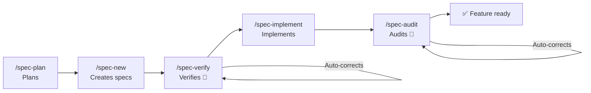

<div align="center">

**🌐 Language:** [Português](../../README.md) | English | [Español](README.es.md) | [简体中文](README.zh-Hans.md) | [हिन्दी](README.hi.md)

</div>

<br/>

<div align="center">
<br/>
<br/>
<p align="center">
  
</p>
<h1>DsCode</h1>

[![][github-license-shield]][github-license-link]
[![][github-stars-shield]][github-stars-link]

**The AI assistant that plans, implements, verifies, and audits code automatically — with zero vendor lock-in.**

<br/>
</div>

**DsCode** is a terminal-based AI coding assistant. You talk to **16 models across DeepSeek V4, OpenAI GPT-5.x, Anthropic Claude, and Google Gemini** — and it analyzes, suggests, reviews, and writes code in your project.

The difference: DsCode is the **only** assistant with a complete Spec-Driven Development (SDD) pipeline. It doesn't just write code — it **plans** what to build, **verifies** quality, **implements** tasks, and **audits** the result. All with automatic correction at each step.

---

## What makes DsCode unique



| Capability | What it does | Why no other tool has it |
|---|---|---|
| **SDD Pipeline** | Full cycle: plan → create → verify → implement → audit | Auto-correction at 2 checkpoints — verify and audit fix issues on their own |
| **Multi-provider** | DeepSeek V4, OpenAI GPT-5.x, Anthropic Claude, Google Gemini | Switch providers without changing a single line of configuration |
| **Skills as agents** | Isolated subagents with their own model, tools, and thinking | Each skill runs sandboxed — never pollutes the main context |
| **Native MCP** | Connect databases, browsers, and external APIs | Integrated across all 3 layers: skills, specs, and TUI |
| **Steering** | Persistent rules the AI follows in every session | Granular control: add, list, edit, and remove rules by position |

---

## Quick comparison

|  | DsCode | GitHub Copilot | Cursor | Claude Code | Amazon Kiro |
|---|---|---|---|---|---|
| **Terminal-native** | ✅ Native TUI | ❌ IDE only | ❌ IDE only | ✅ CLI | ⚠️ IDE + CLI |
| **Multi-provider** | ✅ 4 providers | ❌ GitHub only | ⚠️ Limited | ❌ Anthropic only | ❌ Bedrock only |
| **SDD Pipeline** | ✅ Complete + auto-correct | ❌ | ❌ | ❌ | ✅ IDE-based |
| **Skills/Agents** | ✅ Isolated subagents | ❌ | ⚠️ Rules | ⚠️ Hooks | ✅ Powers |
| **Free** | ✅ No cost | ⚠️ Limited | ⚠️ Limited | ⚠️ Credits | ❌ Bedrock cost |

> **Amazon Kiro** is the closest competitor — both have SDD, Steering, and Skills. The difference: DsCode is **terminal-native, multi-provider, and free**; Kiro is **locked to Amazon Bedrock and charges for model usage**.

---

## Install in 30 seconds

Download the binary from the **[releases page](https://github.com/andrelncampos/dscode-public/releases)**. Requires **[Node.js 24+](https://nodejs.org)**.

| System | File |
|---|---|
| Windows (x64) | `dscode-windows-x64.zip` |
| Linux (x64) | `dscode-linux-x64.tar.gz` |
| macOS (Apple Silicon) | `dscode-macos-arm64.tar.gz` |

Extract and run `./dscode`. DsCode checks for updates automatically on startup.

---

## First use

### 1. Configure your key

Create `~/.dscode/settings.json` with your API key:

```json
{
  "env": {
    "MODEL": "deepseek-v4-pro",
    "BASE_URL": "https://api.deepseek.com",
    "API_KEY": "your-key-here"
  },
  "thinkingEnabled": true
}
```

### 2. Open your project and start

```bash
cd /path/to/your/project
dscode
```

### 3. Take the interactive tour

Type `/quickstart` for a 5-minute tour. The AI demonstrates the full SDD pipeline by building a sample project — you learn by watching it run, not by reading documentation.

Or run `dscode --quickstart` to jump straight into the tour.

---

## What you can do

| Task | Type in the prompt |
|---|---|
| **Understand a project** | "Explain this project's architecture in 3 sentences." |
| **Review code** | "Review the last commit's changes before I push." |
| **Implement a feature** | "Add email validation to the form in `src/form.ts`." |
| **Refactor** | "Simplify the `processData()` function without changing behavior." |
| **Investigate a bug** | "Analyze this stack trace and find the root cause." |
| **Create tests** | "Write unit tests for `validateUser()` in `src/validators.ts`." |
| **Plan features** | `/spec-plan` — describe what you want and the AI creates full specs. |
| **Create rules** | `/steering-add always use TypeScript strict mode` |

---

## Essential commands

Type `/` in the prompt to see the full menu. Here are the ones you'll use most:

| Command | Description |
|---|---|
| `/new` | New conversation — resets context |
| `/model` | Switch between 16 models across 4 providers |
| `/quickstart` | 5-minute interactive SDD pipeline tour |
| `/spec-plan` | Plan new features with specs |
| `/spec-pipe <n>` | Full pipeline: new → verify → implement → audit |
| `/init` | Create `AGENTS.md` with instructions for the AI |
| `/steering-add` | Add a rule the AI follows in every session |
| `/budget` | View project cost by model and timezone |
| `/context` | View session tokens, cost, and cache |
| `/help` | Full list of commands and keyboard shortcuts |

> 📋 [Full list of 51 commands](https://github.com/andrelncampos/dscode-public#todos-os-comandos-slash) — including model management, notes, MCP, and skills.

---

## Skills and autonomous agents

Skills are Markdown guides that teach the AI to work in a specific way. DsCode loads skills from 3 sources:

| Location | Usage |
|---|---|
| `templates/skills/` (built-in) | 5 always-available skills |
| `~/.agents/skills/<name>/SKILL.md` | Personal skills |
| `./.agents/skills/<name>/SKILL.md` | Project skills |

Skills can run as **autonomous agents** (`mode: agent`) — each with its own model, tools, and thinking, executing in a sandbox without polluting the main context.

```yaml
# Example: .agents/skills/reviewer/SKILL.md
name: reviewer
description: Reviews code for bugs and improvements
mode: agent
model: deepseek-v4-flash
tools: [Read, Grep, Glob, Bash]
```

---

## Security

| Practice | Why |
|---|---|
| **Review commands before allowing** | The AI may suggest `rm`, `sudo`, or network access |
| **Commit before large tasks** | `git reset --hard` undoes everything if something goes wrong |
| **Review diffs** | DsCode shows every change — the AI can make mistakes |
| **Never commit `settings.json`** | It contains your API key (`.gitignore` already excludes it) |
| **Use a separate branch for experiments** | `git checkout -b ai-experiment` before risky changes |

---

## License and origin

**DsCode is free for individual and professional use.** The source code is source-available — redistribution is allowed only from official binaries.

This project derives from [DeepCode (lessweb/deepcode-cli)](https://github.com/lessweb/deepcode-cli), originally licensed under MIT. The original copyright notice is preserved in [LICENSE](LICENSE) and [NOTICE](NOTICE).

---

## Official channels

| Channel | Link |
|---|---|
| **GitHub** | [github.com/andrelncampos/dscode-public](https://github.com/andrelncampos/dscode-public) |
| **Releases** | [github.com/andrelncampos/dscode-public/releases](https://github.com/andrelncampos/dscode-public/releases) |
| **Issues** | [github.com/andrelncampos/dscode-public/issues](https://github.com/andrelncampos/dscode-public/issues) |

⚠️ Install DsCode **only** from the official channels above. Do not trust versions from third-party sites.

---

<!-- LINK GROUP -->

[github-license-link]: https://github.com/andrelncampos/dscode-public/blob/master/LICENSE
[github-license-shield]: https://img.shields.io/github/license/andrelncampos/dscode?color=4d6BFE&labelColor=black&style=flat-square
[github-stars-link]: https://github.com/andrelncampos/dscode-public/stargazers
[github-stars-shield]: https://img.shields.io/github/stars/andrelncampos/dscode?color=yellow&labelColor=black&style=flat-square
