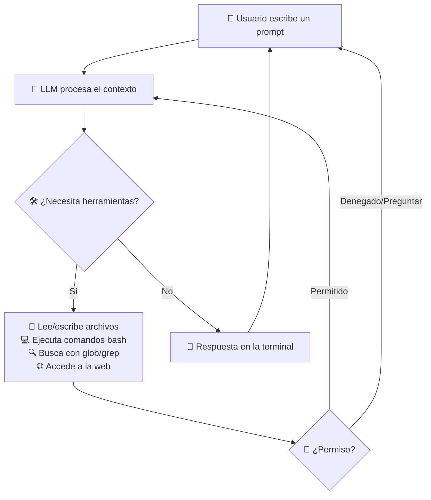
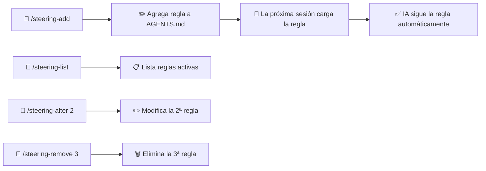
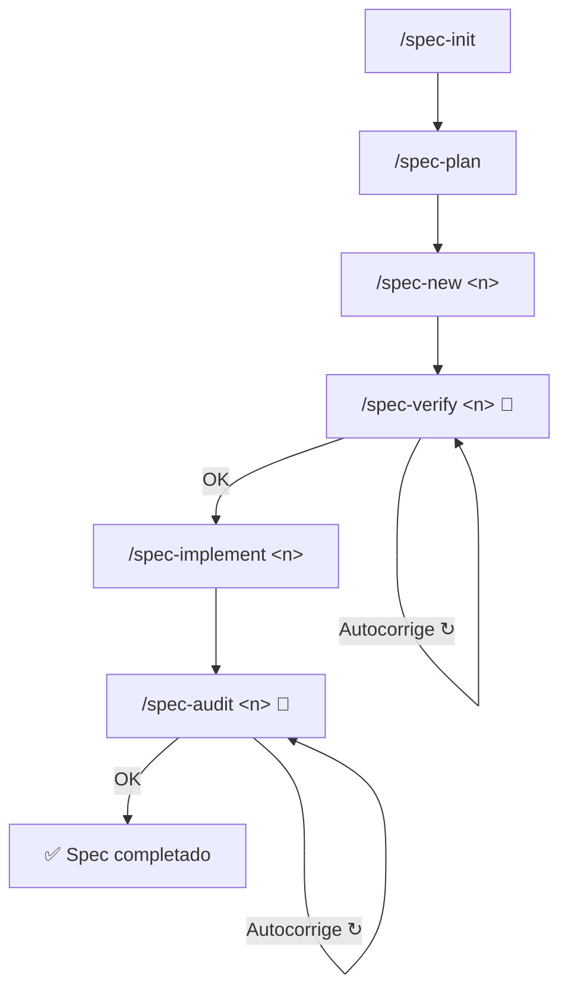

<div align="center">

**🌐 Idioma:** [Português](../../README.md) | [English](README.en.md) | Español | [简体中文](README.zh-Hans.md) | [हिन्दी](README.hi.md)

</div>

<br/>

<div align="center">
<br/>
<br/>
<p align="center">
  
</p>
<h1>DsCode</h1>

[![][github-license-shield]][github-license-link]

**Asistente de programación con IA en tu terminal.**

<br/>
</div>

**DsCode** es un asistente de programación con IA que se ejecuta directamente en la terminal. Conversas con un modelo de IA — **16 modelos entre DeepSeek V4, OpenAI GPT-5.x, Anthropic Claude, Google Gemini o cualquier API compatible con OpenAI** — y este analiza, sugiere, revisa y escribe código en tu proyecto. Funciona en Windows, Linux y macOS. Su arquitectura cuenta con una **capa LLM agnóstica de proveedor**, que permite cambiar entre proveedores sin modificar código.

DsCode deriva de [DeepCode (lessweb/deepcode-cli)](https://github.com/lessweb/deepcode-cli), pero tiene evolución propia, mantenido por [André Campos](https://github.com/andrelncampos).

---

## Cómo funciona DsCode



DsCode funciona en **sesiones**. Cada sesión es una conversación continua. La IA usa **herramientas** (leer archivos, ejecutar comandos, editar código, buscar en la web) para realizar tareas. Puedes **confirmar, denegar o configurar permisos** para cada tipo de acción.

---

## Para quién es DsCode

- **Desarrolladoras y desarrolladores** que quieren ayuda de la IA en tareas diarias.
- **Tech leads** que necesitan revisar o entender bases de código rápidamente.
- **Personas que ya usan IA para programar** y quieren un flujo rápido integrado en la terminal.
- **Equipos que quieren estandarizar** prompts, skills, agentes y steering para mantener consistencia.
- **Usuarios de cualquier proveedor LLM** — DeepSeek V4, OpenAI, Anthropic, Google Gemini o APIs compatibles. La capa agnóstica de proveedor permite alternar sin esfuerzo.

---

## Qué ayuda a hacer DsCode

| Tarea | Cómo ayuda DsCode |
|---|---|
| **Analizar una base de código** | Pregunta "Explica la arquitectura de este proyecto" y la IA lee los archivos y responde. |
| **Revisar código** | Pregunta "Revisa los cambios de este diff antes de hacer commit". |
| **Implementar funcionalidades** | Describe lo que necesitas y la IA genera o edita archivos. |
| **Refactorizar** | Pide "Simplifica esta función sin cambiar su comportamiento". |
| **Investigar bugs** | Pega un stack trace y pide ayuda para encontrar la causa. |
| **Crear o usar skills** | Las skills son guías que enseñan a la IA a trabajar de una forma específica. |
| **Explorar código con subagentes** | Delega búsquedas y análisis al subagente Explore — examina el código de forma aislada y devuelve solo el resumen, sin contaminar el contexto. |
| **Trabajar con Git** | La IA sugiere ramas, mensajes de commit y hace cambios versionados. |
| **Configurar razonamiento** | Activa el *thinking mode* para tareas difíciles — la IA "piensa" antes de responder. |
| **Integrar herramientas externas** | Con MCP, conecta bases de datos, navegadores, APIs y otras herramientas. |

---

## Instalación

Descarga el binario para tu sistema operativo desde la **[página de releases](https://github.com/andrelncampos/dscode-public/releases)**.  
Requiere **[Node.js 24+](https://nodejs.org)**.

| Sistema operativo | Archivo |
|---|---|
| Windows (x64) | `dscode-windows-x64.zip` |
| Linux (x64) | `dscode-linux-x64.tar.gz` |
| macOS (Intel x64) | `dscode-macos-x64.tar.gz` |
| macOS (Apple Silicon) | `dscode-macos-arm64.tar.gz` |

Cada release incluye un `checksums.txt` con hashes **SHA256** para verificar la integridad de la descarga.
Después de descargar, extrae el archivo y ejecuta `./dscode` en la terminal.

## Actualización

DsCode verifica automáticamente nuevas versiones al iniciar. Si hay una actualización disponible, serás notificado y podrás instalarla con un comando.

Para verificar manualmente:

```bash
dscode --update
```

Si hay una versión más reciente, DsCode preguntará si deseas instalarla. De lo contrario, mostrará "DsCode is up to date."

---

## Configuración inicial

DsCode lee su configuración de `~/.dscode/settings.json` (usuario) y `.dscode/settings.json` (proyecto). Las variables de entorno con prefijo `DEEPCODE_` también son reconocidas.

### Ejemplo mínimo

```json
{
  "env": {
    "MODEL": "deepseek-v4-pro",
    "BASE_URL": "https://api.deepseek.com",
    "API_KEY": "pon-tu-clave-aqui"
  },
  "thinkingEnabled": true,
  "reasoningEffort": "max"
}
```

### Dónde obtener tu clave de API

| Proveedor | Link |
|---|---|
| **DeepSeek** | [platform.deepseek.com](https://platform.deepseek.com) → API Keys |
| **OpenAI** | [platform.openai.com](https://platform.openai.com) → API Keys |
| **Anthropic** | [console.anthropic.com](https://console.anthropic.com) → API Keys |
| **Google Gemini** | [aistudio.google.com](https://aistudio.google.com) → API Keys |

### Opciones de configuración disponibles

| Campo | Tipo | Descripción | Predeterminado |
|---|---|---|---|
| `env.MODEL` | string | Modelo de IA a usar | `deepseek-v4-pro` |
| `env.BASE_URL` | string | URL base de la API del proveedor | `https://api.deepseek.com` |
| `env.API_KEY` | string | Clave de API del proveedor | *(obligatorio)* |
| `thinkingEnabled` | boolean | Activa modo de razonamiento | `true` para DeepSeek |
| `reasoningEffort` | string | Intensidad del razonamiento: `"xhigh"`, `"high"`, `"medium"`, `"low"`, `"max"` o `"none"` (varía por proveedor) | `"max"` para DeepSeek V4 Pro |
| `temperature` | number | Creatividad de las respuestas (0 a 2) | `0.3` |
| `maxTokens` | number | Límite de tokens por respuesta | 65536 (Pro) / 32768 (Flash) |
| `debugLogEnabled` | boolean | Guarda logs de depuración en `~/.dscode/logs/` | `false` |
| `telemetryEnabled` | boolean | Envía estadísticas anónimas de uso | `false` |
| `permissions` | object | Control fino de permisos | *(todo permitido)* |
| `mcpServers` | object | Configuración de servidores MCP | *(ninguno)* |
| `notify` | string | Script ejecutado al final de cada tarea | *(ninguno)* |
| `engines` | object | Configuración por proveedor (ej: `engines.openai.apiKey`) | `{}` |
| `modelPricing` | object | Precios personalizados por modelo | *(precios por defecto DeepSeek V4)* |
| `cacheMode` | string | Estrategia de caché: `"aware"` (defecto, optimiza prefijo para KV Cache), `"strict"` (aware + verificación hash), `"off"` (desactiva). Solo DeepSeek | `"aware"` |
| `repositoryVisibility` | `"public"` \| `"private"` | Visibilidad del repositorio. `"public"` añade `/management/` y `/.agents/` a `.gitignore` automáticamente | `"private"` |
| `githubToken` | string | Token de GitHub para autenticar llamadas a la API de releases (opcional — evita el rate limit de 60 req/h en entornos con muchos reinicios) | *(ninguno)* |

### Precios de modelo (`modelPricing`)

DsCode calcula el costo estimado de la sesión según los tokens usados. Precios por defecto:

| Modelo | Input (1M tokens) | Output (1M tokens) | Cache Read (1M tokens) |
|---|---|---|---|
| `deepseek-v4-pro` | $0.435 | $0.87 | $0.003625 |
| `deepseek-v4-flash` | $0.14 | $0.28 | $0.0028 |
| `gpt-5.4` | $1.25 | $10.00 | $0.625 |
| `gpt-5.4-mini` | $0.15 | $0.60 | $0.075 |
| `claude-opus-4-8` | $15.00 | $75.00 | $7.50 |
| `claude-sonnet-4-6` | $3.00 | $15.00 | $1.50 |
| `claude-haiku-4-5` | $0.80 | $4.00 | $0.40 |
| `claude-fable-5` | $10.00 | $50.00 | $1.00 |
| `claude-mythos-5` | $10.00 | $50.00 | $1.00 |
| `gemini-3.5-flash` | $1.50 | $9.00 | $0.15 |
| `gemini-3.1-flash-lite` | $0.25 | $1.50 | $0.025 |
| `gemini-2.5-pro` | $2.50 | $15.00 | $0.25 |
| `gemini-2.5-flash` | $0.50 | $3.00 | $0.05 |

Para usar precios personalizados (o añadir un modelo no soportado):

```json
{
  "modelPricing": {
    "mi-modelo": {
      "inputPrice": 0.50,
      "outputPrice": 1.00,
      "cacheReadPrice": 0.05
    }
  }
}
```

El costo aparece en la esquina superior derecha durante la sesión: `⚡ 42.3K 💰 $0.15`.

---

## Archivos y estructura

DsCode organiza sus datos en directorios `.dscode/` en el proyecto y en el home del usuario:

```
mi-proyecto/
├── .dscode/                   # Config y datos del proyecto
│   ├── settings.json          # Configuraciones locales (opcional)
│   ├── AGENTS.md              # Instrucciones y reglas de steering
│   ├── sessions-index.json    # Índice de sesiones
│   ├── <session-id>.jsonl     # Mensajes de cada sesión
│   └── specs/                 # Documentos SDD
│       ├── vision.md          # Visión del producto
│       ├── arch.md            # Arquitectura
│       ├── roadmap.md         # Roadmap con estado de los specs
│       ├── adr.md             # Decisiones de arquitectura
│       └── lessons.md         # Lecciones aprendidas
│
~/.dscode/                     # Config del usuario
├── settings.json              # Clave de API (cifrada), modelo por defecto
├── .credential-key            # Clave de cifrado AES-256 (permisos 0600)
└── logs/debug.log             # Logs de depuración

~/.agents/skills/<skill>/SKILL.md    # Skills del usuario
./.agents/skills/<skill>/SKILL.md    # Skills del proyecto
```

⚠️ **Seguridad**: Nunca hagas commit de `settings.json` (contiene la clave de API). El `.gitignore` ya lo excluye.

---

## Primer uso en 5 minutos

### Paso 1: Instala

Descarga el binario desde la [página de releases](https://github.com/andrelncampos/dscode-public/releases), extráelo y ejecuta `./dscode`. **Requiere Node.js 24+.**

### Paso 2: Configura tu clave

Crea `~/.dscode/settings.json` con tu clave de API y modelo preferido (consulta la sección de Configuración arriba).

### Paso 3: Abre una carpeta de proyecto

```bash
cd /ruta/de/tu/proyecto
```

Puede ser cualquier proyecto: un repo Git, un proyecto personal, incluso una carpeta vacía.

### Paso 4: Inicia DsCode

```bash
dscode
```

Verás una pantalla de bienvenida con un campo de texto. El asistente está listo.

**Consejo:** Escribe `@` para buscar y mencionar archivos del proyecto — la IA puede leer y editar los archivos que referencies.

**¿Nuevo en DsCode?** Escribe `/quickstart` para un tour interactivo de 5 minutos por el pipeline SDD. O ejecuta `dscode --quickstart` para empezar directamente.

### Paso 5: Pide algo simple

Escribe en el campo de prompt:

```
Explica la estructura de este proyecto en 3 frases.
```

Presiona **Enter**. La IA analizará los archivos del proyecto y responderá.

### Paso 6: Pide un análisis útil

```
Analiza el código fuente y señala posibles mejoras, sin cambiar nada.
```

La IA examinará el código y sugerirá mejoras. Usa `Ctrl+O` para expandir el output o ver procesos en ejecución.

### Paso 7: Revisa y haz commit

Cuando la IA haga cambios en archivos, **revisa cada diff** antes de hacer commit. DsCode muestra lo que se cambió y tú decides si aceptarlo.

> 💡 **Consejo**: Haz un commit (`git commit`) antes de pedir tareas grandes. Si algo sale mal, puedes deshacer con `git reset --hard`.

---

## Todos los comandos slash

Escribe `/` en el prompt para abrir el menú. Son **37 comandos built-in** + skills dinámicos (`/<skill-name>`):

### Sesión

| Comando | Descripción |
|---|---|
| `/new` | Nueva conversación — limpia el contexto |
| `/resume` | Retomar una conversación anterior |
| `/continue` | Continuar la conversación activa (o retomar si está vacía) |
| `/undo` | Restaurar código y/o conversación a un punto anterior |
| `/context` | Mostrar métricas de la sesión: tokens, costo, tasa de acierto de caché, modelo y thinking mode |
| `/clear` | Limpiar el contexto de la sesión — resetea mensajes y tokens manteniendo la sesión activa |

### Modelo y visualización

| Comando | Descripción |
|---|---|
| `/model` | Seleccionar entre 16 modelos de 4 proveedores, con thinking mode y reasoning effort por proveedor |
| `/raw` | Alternar modo de visualización: `lite` (resumido), `normal` (completo), `raw-scrollback` (scroll) |

### Proveedor y modelo

| Comando | Descripción |
|---|---|
| `/model-list` | Listar todos los proveedores configurados con estado, modelos y precios |
| `/model-add <provider>` | Agregar un nuevo proveedor LLM con wizard guiado (API key + URL base) |
| `/model-remove <provider>` | Eliminar un proveedor de la configuración |
| `/model-info <id>` | Mostrar detalles del modelo: capacidades, precio, thinking, contexto |
| `/model-key <provider>` | Actualizar la API key de un proveedor (sobrescribe la anterior) |
| `/model-default <id>` | Establecer el modelo predeterminado |
| `/model-params` | Editor interactivo de parámetros: temperature, max_tokens, top_p |
| `/model-thinking <id>` | Configurar thinking budget para modelos con extended thinking |

> 💡 **Claves cifradas**: Las API keys se almacenan cifradas (AES-256-GCM) en `settings.json`. La migración de claves en texto plano es automática. Use `/model-key` para actualizar.

### Skills y agentes

| Comando | Descripción |
|---|---|
| `/skills` | Listar todas las skills disponibles (built-in + custom) |
| `/<skill-name>` | Ejecutar una skill específica por nombre |
| `/init` | Crear `AGENTS.md` con instrucciones para la IA en el proyecto |
| `/steering-add` | Agregar regla de steering en la sección STEERINGS de `AGENTS.md` |
| `/steering-list` | Listar todas las regras de steering del `AGENTS.md` |
| `/steering-remove <N>` | Eliminar la N-ésima regla de steering del `AGENTS.md` |
| `/steering-alter <N>` | Modificar la N-ésima regla de steering en el `AGENTS.md` |

### Notas de desarrollo

| Comando | Descripción |
|---|---|
| `/notes` | Listar todas las notas con estado, tags, spec vinculada y días hasta el vencimiento |
| `/notes-add` | Crear una nueva nota de desarrollo (con spec, tags y fecha de vencimiento) |
| `/notes-delete <id>` | Eliminar una nota por su ID numérico |
| `/notes-search <término>` | Buscar notas por texto |

### SDD (Spec-Driven Development)

| Comando | Descripción |
|---|---|
| `/spec-init` | Inicializar estructura SDD: `vision.md`, `arch.md`, `roadmap.md`, `adr.md`, `lessons.md` |
| `/spec-plan` | Planear specs a partir de brainstorm, alinear con visión y actualizar roadmap |
| `/spec-plan-begin` | Iniciar una sesión de brainstorming para elicitar requisitos de nuevas specs |
| `/spec-plan-end` | Finalizar el brainstorming y consolidar los specs planeados en el roadmap |
| `/spec-plan-reset` | Descartar el brainstorming actual sin consolidar nada |
| `/spec-new <n>` | Crear nuevo spec con requisitos, diseño y tareas |
| `/spec-verify <n>` | Verificar y **autocorregir** fallos en requisitos y diseño (idempotente — ejecuta cuantas veces quieras) |
| `/spec-implement <n>` | Implementar todas las tareas del spec secuencialmente |
| `/spec-audit <n>` | Auditar y **autocorregir** bugs, tests y desvíos de diseño (idempotente — cada pasada mejora sin degradar) |
| `/spec-pipe <n>` | Atajo: ejecutar el pipeline SDD completo para uno o más specs (números separados por coma): new → verify → implement → audit |
| `/spec-list` | Listar todos los specs con estado del roadmap |
| `/spec-status [n]` | Mostrar estado detallado de un spec específico o de todos |
| `/quickstart` | Tour interactivo por el pipeline SDD — aprende viendo un proyecto demo ejecutar el ciclo completo |

### Herramientas externas

| Comando | Descripción |
|---|---|
| `/mcp` | Mostrar estado de servidores MCP y herramientas disponibles |

### Sistema

| Comando | Descripción |
|---|---|
| `/exit` | Salir de DsCode |
| `/help` | Abrir la pantalla de ayuda con todos los comandos y atajos de teclado |

---

## Sistema de Steering

El **steering** permite definir reglas persistentes que la IA sigue en **todas las sesiones** del proyecto. Las reglas se guardan en la sección `## Steering` del archivo `.dscode/AGENTS.md`. El ciclo completo de gestión incluye agregar, listar, modificar y eliminar reglas por posición.



**Ejemplo:**
```
/steering-add siempre responde en español
/steering-add nunca hagas push sin autorización explícita
/steering-list
/steering-alter 2 nunca hagas push o merge sin autorización
/steering-remove 1
```

---

## SDD — Spec-Driven Development

DsCode implementa un ciclo completo de desarrollo orientado a especificaciones. Todos los archivos se guardan en `management/`.

Los dos puntos de control de calidad — **spec-verify** y **spec-audit** — no solo reportan problemas: los **autocorrigen**. Ambos son **idempotentes**: puedes ejecutarlos varias veces y cada pasada mejora la calidad sin degradar lo que ya estaba correcto.



| Archivo | Contenido |
|---|---|
| `vision.md` | Visión del producto, público objetivo, propuesta de valor |
| `arch.md` | Decisiones de arquitectura, stack, patrones |
| `roadmap.md` | Lista de specs con estado (planned/in-progress/done) |
| `adr.md` | Architecture Decision Records |
| `lessons.md` | Lecciones aprendidas a lo largo del desarrollo |

### SDD en la práctica — un ejemplo completo

Imagina que quieres agregar **soporte para OpenAI** en DsCode. El flujo real:

```
/spec-plan
  ↓  Escribes: "quiero soporte nativo de OpenAI con thinking mode"
  ↓  La IA analiza la visión, crea el spec 40, actualiza el roadmap
/spec-new 40
  ↓  La IA genera requirements.md, design.md y task.md completos
/spec-verify 40
  ↓  La IA encuentra 3 fallos de trazabilidad y los AUTOCORRIGE
  ↓  Ejecútalo de nuevo. Si OK → siguiente paso
/spec-implement 40
  ↓  La IA crea openai-provider.ts, openai-converter.ts, tests...
  ↓  Cada tarea se ejecuta en orden. Typecheck y tests en cada paso
/spec-audit 40
  ↓  La IA encuentra 1 bug y 1 test desactualizado y los CORRIGE
  ↓  Ejecútalo de nuevo. Si OK → spec completado ✅
```

> 💡 **Consejo**: `spec-verify` y `spec-audit` son tus aliados. Ejecútalos hasta que digan "0 issues found". Cada pasada mejora la calidad sin riesgo de regresión.

---

## MCP — Model Context Protocol

DsCode integra el **Model Context Protocol (MCP)**, permitiendo que la IA se conecte a herramientas externas como bases de datos, navegadores, APIs y servidores locales. El soporte cubre el ciclo completo: skills, SDD y TUI.

### Skills con MCP

Las skills pueden incluir un archivo `mcp.json` que declara servidores MCP. Cuando la skill se activa (por palabra clave o `#skill-name`), los servidores se inician automáticamente. Cuando la conversación cambia de tema, se suspenden — sin contaminar el catálogo global de herramientas.

Ejemplo: una skill `postgres-dba` incluye herramientas como `query`, `list_tables` y `describe`, además de reglas de seguridad (`MCP: deny drop_table`). Todo en un paquete instalable.

### SDD + MCP

El ciclo SDD se integra con MCP en tres niveles:
- **Las specs declaran dependencias MCP** en el frontmatter YAML, definiendo servidores y herramientas relevantes para esa spec.
- **Creación asistida**: durante `/spec-new`, la IA consulta fuentes reales (GitHub issues, bases de datos, documentación) para producir requisitos basados en datos concretos.
- **Acceso controlado**: cada spec define un allowlist temporal de herramientas, manteniendo a la IA enfocada.

### Inspección y acciones vía TUI

El comando `/mcp` abre un panel completo de administración:
- **Lista de servidores** con estado, alcance (`[global]`, `[project]`, `[skill: ...]`, `[spec: N]`) y resumen de políticas.
- **Detalles** con badges de política (`auto-allow`, `ask`, `deny`) para cada herramienta.
- **Historial de ejecuciones** y **registro de errores** para diagnóstico.
- **Atajos de teclado**: `A` aprobar, `D` denegar, `R` resetear política, `X` deshabilitar servidor, `Ctrl+R` reconectar.

### Dónde configurar servidores MCP

| Nivel | Ubicación | Alcance |
|---|---|---|
| Global | `~/.dscode/settings.json` → `mcpServers` | Todas las sesiones |
| Proyecto | `.dscode/mcp.json` | Sesiones en ese directorio |
| Skill | `<skill>/mcp.json` | Cuando la skill está activa |
| Spec | Frontmatter YAML del spec | Durante `/spec-implement` |

---

## Skills

Las skills son guías en Markdown que enseñan a la IA a trabajar de una forma específica. DsCode carga skills de 3 fuentes:

| Ubicación | Uso |
|---|---|
| `templates/skills/` (built-in) | 3 skills siempre cargadas |
| `~/.agents/skills/<nombre>/SKILL.md` | Skills personales del usuario |
| `./.agents/skills/<nombre>/SKILL.md` | Skills del proyecto |

### Skills built-in

| Skill | Función |
|---|---|
| **agent-drift-guard** | Detecta y corrige desvíos de ejecución |
| **karpathy-guidelines** | Buenas prácticas para reducir errores comunes de LLM |
| **plan-and-execute** | Planificación estructurada con seguimiento de progreso |
| **sdd-workflow** | Enseña el ciclo SDD completo (planned → created → verified → implemented → audited) |
| **project-structure** | Mapea la estructura `.dscode/` y `management/` del proyecto |

### Modos de inclusión

Cada `SKILL.md` puede declarar cómo se carga mediante el campo opcional `inclusion` en el frontmatter YAML:

| Modo | Comportamiento |
|------|----------------|
| `auto` (predeterminado) | Cargada automáticamente por palabras clave en el prompt y disponible en el menú `/skills` |
| `manual` | **Nunca** cargada automáticamente. Activada solo con `#skill-name` en el prompt o mediante el menú `/skills` |

**Ejemplo de SKILL.md con `inclusion: manual`:**
```markdown
---
name: mi-deploy
description: Despliega en producción
inclusion: manual
---

# Deploy

Antes de desplegar, verifica...
```

Para activar una skill manual, escribe `#mi-deploy` al inicio del prompt — el prefijo `#` se elimina y la skill se carga.

### Skills como agentes autónomos

Además del campo `inclusion`, cada `SKILL.md` puede declarar un `mode` de ejecución:

| Modo | Comportamiento |
|------|----------------|
| `prompt` (predeterminado) | El contenido de la skill se inyecta en el contexto de la conversación como una guía. |
| `agent` | La skill se ejecuta como un **subagente aislado** — con su propio modelo, tools y thinking — y devuelve solo el resultado. |

Las skills con `mode: agent` se registran como herramientas en el toolkit del LLM. El agente principal puede delegarles trabajo llamando a la herramienta con el nombre de la skill. Esto mantiene el contexto principal limpio y permite que cada skill tenga configuraciones independientes de modelo, temperatura, tools, max turns y timeout.

**Ejemplo de SKILL.md con `mode: agent`:**
```markdown
---
name: code-reviewer
description: Revisa código en busca de bugs y mejoras
mode: agent
model: deepseek-v4-flash
thinking: false
tools: [Read, Grep, Glob, Bash]
---
```

Cuando el agente principal necesita una revisión, llama a la herramienta `code-reviewer` y recibe solo el resultado final — el razonamiento intermedio del subagente no contamina el contexto principal.

---

## Atajos de teclado

| Atajo | Acción |
|---|---|
| `Enter` | Enviar prompt |
| `Shift+Enter` | Insertar salto de línea |
| `#` | Activar skill por nombre (menú de skills) |
| `@` | Buscar y mencionar archivos del proyecto |
| `Tab` | Autocompletar comandos y menciones |
| `/` | Abrir menú de comandos |
| `?` | Pantalla de ayuda con todos los atajos |
| `Ctrl+O` | Expandir output / ver procesos |
| `Ctrl+V` | Pegar imagen del portapapeles |
| `Ctrl+X` | Limpiar imágenes pegadas |
| `Ctrl+C` | Cancelar / interrumpir IA |
| `Esc` | Cerrar modales / interrumpir |
| `Ctrl+Z` / `Ctrl+Shift+Z` | Deshacer / rehacer en el prompt |
| `Ctrl+W` | Borrar palabra anterior |
| `Ctrl+A` / `Ctrl+E` | Inicio / fin de línea |
| `Ctrl+K` | Borrar hasta el fin de la línea |
| `Alt+←/→` | Navegar por palabra |
| `↑/↓` | Historial (prompt vacío) o menús |
| `PageUp/PageDown` | Desplazar mensajes |

---

## Ejemplos prácticos de uso

Cada ejemplo a continuación es algo que puedes escribir en el campo de prompt de DsCode.

| Tarea | Qué escribir |
|---|---|
| **Entender la arquitectura** | "Explica la arquitectura de este proyecto, cuáles son los módulos principales y cómo se comunican." |
| **Encontrar bugs** | "Analiza src/ en busca de posibles bugs. Solo señálalos, no cambies nada." |
| **Sugerir mejoras** | "Sugiere mejoras de rendimiento y legibilidad para el código en src/." |
| **Implementar feature** | "Agrega validación de email al formulario de registro en src/form.ts." |
| **Refactorizar** | "Refactoriza la función processData() en src/utils.ts para que sea más clara, sin cambiar el comportamiento." |
| **Revisar diff** | "Revisa los cambios del último commit y señala problemas." |
| **Crear tests** | "Crea tests unitarios para la función validateUser() en src/validators.ts." |
| **Usar una skill** | "Usa la skill de revisión de seguridad para auditar este código." |
| **Registrar una nota** | Escribe `/notes-add` para crear una nota de desarrollo con tags, spec vinculada y fecha de vencimiento. |
| **Inicializar AGENTS.md** | Escribe `/init` para crear un archivo con instrucciones que la IA seguirá en el proyecto. |

DsCode funciona de forma **conversacional**: escribes lo que necesitas, la IA responde y usa herramientas. Puedes confirmar o rechazar cada acción.

---

## Conceptos esenciales

| Concepto | Qué es | Cuándo importa |
|---|---|---|
| **Sesión** | Una conversación continua entre tú y la IA. Cada `/new` inicia una sesión limpia. | Comienza una nueva sesión al cambiar de tarea para no mezclar contextos. |
| **Contexto** | Todo el historial de la conversación que la IA "recuerda". Incluye tus mensajes, respuestas y archivos leídos. | Contextos muy largos gastan más tokens. Usa `/new` para reiniciar. |
| **Skills** | Guías escritas en Markdown que enseñan a la IA a seguir reglas específicas. | Crea una skill para estandarizar revisiones, estilo de código o procesos del equipo. |
| **Notas de desarrollo** | Sistema de notas integrado en DsCode. Permite registrar deuda técnica, ideas y tareas con tags, vinculación a specs y fechas de vencimiento. | Usa `/notes-add` durante el desarrollo para no perder contexto. Las notas se guardan en `.dscode/notes.json`. |
| **Tools** | Herramientas que la IA usa: `bash` (shell), `read`/`write`/`edit` (archivos), `glob`/`grep` (búsqueda), `Explore` (subagente), `WebSearch`/`WebFetch` (web), `AskUserQuestion` (preguntas), `UpdatePlan` (tareas). | La IA decide cuáles usar. Puedes bloquear las peligrosas vía `permissions`. |
| **Menciones `@`** | Escribe `@` en el prompt para buscar y referenciar archivos del proyecto. | Usa para dirigir a la IA: "Analiza @src/utils.ts" — ya sabe qué archivo leer. |
| **Provider** | La empresa que proporciona el modelo de IA (DeepSeek, OpenAI, Anthropic, Google Gemini, etc.). | Elige el proveedor según costo, calidad y privacidad. |
| **Modelo** | El modelo específico de IA (ej: `deepseek-v4-pro`, `gpt-5.5`, `claude-sonnet-4-6`, `gemini-3.5-flash`). 16 modelos disponibles entre 4 proveedores. | Diferentes modelos tienen calidad, velocidad y costo diferentes. |
| **Thinking mode** | La IA "piensa" (razona) antes de responder, generando tokens internos que puedes ver o no. | Actívalo para tareas complejas (debug, arquitectura). Desactívalo para agilidad. |
| **Reasoning effort** | Controla la profundidad del razonamiento: `"xhigh"`, `"high"`, `"medium"`, `"low"`, `"max"` o `"none"` (varía por proveedor). | Usa máximo para problemas difíciles y medio/bajo para el día a día. |
| **Prompt cache** | DeepSeek almacena en caché partes repetidas del contexto para cobrar menos tokens (KV Cache). Configura `cacheMode` para optimizar. | Sucede automáticamente. Mantén los prompts estables para ahorrar. Al salir, DsCode muestra la eficiencia del caché (tasa de acierto y USD ahorrado). |
| **Logs** | Archivos de depuración en `~/.dscode/logs/` que registran las llamadas de API. | Activa `debugLogEnabled` solo para diagnosticar problemas. |
| **Permisos** | Control de lo que la IA puede hacer: leer archivos, escribir, acceder a la red, ejecutar comandos. | Configura permisos restrictivos si quieres revisar cada acción antes de ejecutarla. |
| **Workspace** | La carpeta raíz donde DsCode se está ejecutando. La IA solo ve archivos en esta carpeta (a menos que autorices acceso externo). | Abre DsCode en la raíz del proyecto en el que quieres trabajar. |
| **Compactación** | Cuando la conversación se vuelve muy larga, DsCode resume el historial para ajustarse al límite de tokens. | Automática. Puedes forzar una nueva sesión con `/new` si lo prefieres. |

---

## Cómo usar con DeepSeek

DsCode está optimizado para los modelos DeepSeek V4.

| Modelo | Mejor para | Velocidad | Costo |
|---|---|---|---|
| `deepseek-v4-pro` | Arquitectura, debug, razonamiento profundo | Normal | Mayor |
| `deepseek-v4-flash` | Refactorización, revisión, tareas rutinarias | Rápido | Menor |

### Thinking mode
- **Usar**: Tareas complejas (debug, arquitectura, diseño)
- **Desactivar**: Tareas rápidas y simples
- **Opciones**: `"max"` (razonamiento profundo), `"high"` (equilibrado), `"No thinking"` (desactivado)
- **Visualización**: `/raw` alterna entre completo/resumido/oculto

### KV Cache — DeepSeek **no cobra** por tokens repetidos. Mantén el system prompt estable.

---

## Cómo usar con OpenAI

DsCode tiene **soporte nativo para OpenAI** mediante `OpenAIProvider`. Los modelos con prefijo `gpt-`, `o1`, `o3`, `o4` u `openai-` se enrutan automáticamente al provider OpenAI — sin configuración adicional.

### Configuración para OpenAI

```json
{
  "env": {
    "MODEL": "gpt-5.4",
    "BASE_URL": "https://api.openai.com/v1",
    "API_KEY": "sk-tu-clave-openai"
  },
  "thinkingEnabled": true,
  "reasoningEffort": "high"
}
```

> 💡 `thinkingEnabled` funciona con OpenAI: `reasoningEffort` se envía como el parámetro nativo `reasoning_effort` de la API.

### Usando múltiples proveedores con `engines`

Puedes configurar claves separadas para cada proveedor sin cambiar de `settings.json`:

```json
{
  "env": {
    "MODEL": "deepseek-v4-pro",
    "API_KEY": "sk-clave-deepseek"
  },
  "engines": {
    "openai": {
      "apiKey": "sk-clave-openai"
    }
  }
}
```

Cuando cambias el modelo a `gpt-5.4` (vía `/model`), DsCode usa automáticamente la clave del engine `openai`. El provider y la clave correcta se seleccionan según el prefijo del modelo.

### Qué cambia respecto a DeepSeek

| Funcionalidad | Con OpenAI |
|---|---|
| **Thinking mode** | ✅ Soportado nativamente. `reasoningEffort` (`"high"` / `"max"`) se envía como `reasoning_effort` |
| **WebSearch built-in** | ❌ No disponible. Usa MCP con servidor de búsqueda o pide a la IA usar WebFetch en URLs específicas |
| **KV Cache** | ❌ No disponible (exclusivo de DeepSeek) |
| **Imágenes (Ctrl+V)** | ✅ Funciona con modelos de visión (`gpt-5.5`, `gpt-5`, `gpt-4o`) |
| **Modelos soportados** | `gpt-5.5`, `gpt-5.4`, `gpt-5.4-mini`, `gpt-5`, `gpt-4.5`, `gpt-4o`, `gpt-4o-mini`, `o1`, `o3`, `o4` — cualquier modelo Chat Completions |
| **Compactación** | Usa `getAuxiliaryModel()`: `gpt-5.4` → `gpt-5.4-mini` para reducir costo (sin thinking) al resumir historial |

### Ejemplo con modelo más barato

```json
{
  "env": {
    "MODEL": "gpt-5.4-mini",
    "BASE_URL": "https://api.openai.com/v1",
    "API_KEY": "sk-tu-clave-openai"
  },
  "thinkingEnabled": false
}
```

---

## Cómo usar con Anthropic

DsCode tiene **soporte nativo para Anthropic** mediante `AnthropicProvider`. Los modelos con prefijo `claude-` se enrutan automáticamente al provider Anthropic — sin configuración adicional.

### Configuración para Anthropic

```json
{
  "env": {
    "MODEL": "claude-sonnet-4-6",
    "BASE_URL": "https://api.anthropic.com/v1",
    "API_KEY": "sk-ant-tu-clave-anthropic"
  },
  "thinkingEnabled": true,
  "reasoningEffort": "high"
}
```

> 💡 `thinkingEnabled` funciona con Anthropic: modelos Opus/Sonnet/Fable/Mythos usan `thinking {type:"adaptive", effort}` con 3 niveles (`"high"`, `"medium"`, `"low"`). Modelos Haiku usan `thinking {type:"enabled", budget_tokens}` con 2 niveles (`"max"`, `"high"`).

### Usando múltiples proveedores con `engines`

```json
{
  "env": {
    "MODEL": "deepseek-v4-pro",
    "API_KEY": "sk-clave-deepseek"
  },
  "engines": {
    "anthropic": {
      "apiKey": "sk-ant-clave-anthropic"
    }
  }
}
```

### Qué cambia respecto a DeepSeek

| Funcionalidad | Con Anthropic |
|---|---|
| **Thinking mode** | ✅ Soportado nativamente. Adaptive (`"high"`, `"medium"`, `"low"`) para Opus/Sonnet/Fable/Mythos; Extended (`"max"`, `"high"`) con budget_tokens para Haiku |
| **WebSearch built-in** | ❌ No disponible. Usa MCP con servidor de búsqueda |
| **KV Cache** | ❌ No disponible (exclusivo de DeepSeek) |
| **Imágenes (Ctrl+V)** | ✅ Funciona con todos los modelos Claude |
| **Modelos soportados** | `claude-opus-4-8`, `claude-sonnet-4-6`, `claude-haiku-4-5`, `claude-fable-5`, `claude-mythos-5` |

### Ejemplo con modelo más barato

```json
{
  "env": {
    "MODEL": "claude-haiku-4-5",
    "BASE_URL": "https://api.anthropic.com/v1",
    "API_KEY": "sk-ant-tu-clave-anthropic"
  },
  "thinkingEnabled": false
}
```

---

## Cómo usar con Google Gemini

DsCode tiene **soporte nativo para Google Gemini** mediante `GeminiProvider`. Los modelos con prefijo `gemini-` se enrutan automáticamente al provider Gemini — sin configuración adicional. Gemini es el primer provider implementado con **cero SDK** — usa `fetch()` nativo de Node 24.

### Configuración para Gemini

```json
{
  "env": {
    "MODEL": "gemini-3.5-flash",
    "BASE_URL": "https://generativelanguage.googleapis.com/v1beta",
    "API_KEY": "AIza-tu-clave-gemini"
  },
  "thinkingEnabled": true,
  "reasoningEffort": "high"
}
```

> 💡 `thinkingEnabled` funciona con Gemini: el provider envía `thinkingConfig: { thinkingBudget: 8192, includeThoughts: true }` en `generationConfig`. Gemini usa "thinking budget" en lugar de "reasoning effort".

### Usando múltiples proveedores con `engines`

```json
{
  "env": {
    "MODEL": "deepseek-v4-pro",
    "API_KEY": "sk-clave-deepseek"
  },
  "engines": {
    "gemini": {
      "apiKey": "AIza-tu-clave-gemini"
    }
  }
}
```

### Qué cambia respecto a DeepSeek

| Funcionalidad | Con Gemini |
|---|---|
| **Thinking mode** | ✅ Soportado nativamente vía `thinkingConfig`. Budget de 8192 tokens. |
| **WebSearch built-in** | ❌ No disponible. Usa MCP con servidor de búsqueda. |
| **KV Cache** | ❌ No disponible (exclusivo de DeepSeek) |
| **Imágenes (Ctrl+V)** | ✅ Funciona con todos los modelos Gemini |
| **Modelos soportados** | `gemini-3.5-flash`, `gemini-3-flash`, `gemini-3.1-flash-lite`, `gemini-2.5-pro`, `gemini-2.5-flash` |
| **Compactación** | Usa `getAuxiliaryModel()`: `gemini-3.5-flash` → `gemini-3.1-flash-lite` para reducir costo (sin thinking) |

### Ejemplo con modelo más barato

```json
{
  "env": {
    "MODEL": "gemini-3.1-flash-lite",
    "BASE_URL": "https://generativelanguage.googleapis.com/v1beta",
    "API_KEY": "AIza-tu-clave-gemini"
  },
  "thinkingEnabled": false
}
```

---

## Buenas prácticas de seguridad

| Qué hacer | Por qué |
|---|---|
| **Nunca pegues claves de API en issues de GitHub** | Las issues son públicas. Las claves expuestas pueden ser usadas por otros y generar cobros. |
| **Nunca hagas commit del archivo `settings.json`** | Contiene tu clave de API. El `.gitignore` del proyecto ya lo excluye, pero verifícalo. |
| **Revisa comandos antes de permitir** | La IA puede sugerir comandos shell. Lee antes de confirmar, especialmente si involucran `rm`, `sudo` o red. |
| **Haz commit antes de pedir cambios grandes** | Si la IA hace algo incorrecto, `git reset --hard` deshace todo. Sin commit previo, esto no es posible. |
| **Lee los diffs antes de aceptar** | DsCode muestra cada cambio. Revisa — la IA puede cometer errores. |
| **No pegues datos sensibles en los prompts** | Información como contraseñas, tokens o datos de clientes pueden aparecer en logs o respuestas. |
| **Sanitiza los logs antes de pedir ayuda** | Los logs en `~/.dscode/logs/` pueden contener fragmentos de tu código. Elimina información confidencial antes de compartir. |
| **Usa una rama separada para experimentos** | Crea `git checkout -b experimento-ia` antes de pedir cambios grandes. Si algo sale mal, descarta la rama. |

---

## Buenas prácticas para ahorrar tokens/créditos

| Práctica | Explicación |
|---|---|
| **Pide análisis antes de implementación** | "Analiza este código y sugiere mejoras" gasta menos tokens que "Implementa X" sin contexto. |
| **Limita el alcance** | En lugar de "Mejora todo el proyecto", di "Mejora la función `procesar()` en `src/utils.ts`". |
| **Informa los archivos relevantes** | Di "Analiza solo los archivos en `src/api/`" — la IA lee menos archivos, gasta menos tokens. |
| **Usa Flash para tareas simples** | `deepseek-v4-flash` es mucho más barato. Úsalo para tareas rutinarias. |
| **Usa Pro con moderación** | Reserva `deepseek-v4-pro` para tareas que realmente necesiten razonamiento profundo. |
| **Mantén los prompts concisos** | Prompts largos con información innecesaria gastan tokens de más. |
| **Reinicia la sesión con `/new` para tareas nuevas** | Sesiones muy largas acumulan contexto y cada mensaje posterior cuesta más caro. |

---

## Troubleshooting

| Problema | Causa probable | Cómo resolver |
|---|---|---|
| `dscode: comando no encontrado` | npm global no está en PATH | Reabre la terminal. En Windows, verifica `%APPDATA%\\npm`. En Linux/macOS, verifica `~/.npm-global/bin`. |
| `Node.js version not supported` | Node inferior a la versión 24 | Instala o actualiza a [Node.js 24+](https://nodejs.org). |
| Error 401 | Clave de API ausente o inválida | Verifica que `API_KEY` esté correcto en `~/.dscode/settings.json` o en la variable de entorno. |
| Error 429 | Límite de solicitudes del proveedor excedido | Espera unos segundos y vuelve a intentar. Verifica tu plan en la plataforma del proveedor. |
| Respuesta truncada | Límite de tokens alcanzado | Aumenta `maxTokens` en `settings.json` o escribe "continúa" para retomar. |
| Timeout / demora excesiva | Servidor del proveedor sobrecargado o problema de red | Espera. Si persiste, cambia de modelo: usa Flash en lugar de Pro temporalmente. |
| No aparecen logs | `debugLogEnabled` está `false` (predeterminado) | Activa `"debugLogEnabled": true` en `settings.json`. Los logs aparecen en `~/.dscode/logs/debug.log`. |
| Modelo no reconocido | Nombre del modelo incorrecto | Usa los nombres exactos: `deepseek-v4-pro`, `deepseek-v4-flash`, o un modelo compatible con OpenAI. |
| Modelo no reconocido | Nombre del modelo incorrecto | Usa los nombres exactos: `deepseek-v4-pro`, `deepseek-v4-flash`, o un modelo compatible con OpenAI. |
| Consumo de tokens muy alto | Contexto largo o tareas muy amplias | Usa `/new` para reiniciar la sesión. Sé específico sobre archivos y alcance. |

---

## Cómo pedir ayuda

Si encuentras un problema, abre una [issue en GitHub](https://github.com/andrelncampos/dscode-public/issues).

Al reportar un problema, incluye:

- **Versión de DsCode**: `dscode --version` (muestra versión + node + plataforma)
- **Modelo usado**: `deepseek-v4-pro`, `deepseek-v4-flash`, etc.
- **Comando ejecutado** y el error completo
- **Logs sanitizados**, si son relevantes (elimina claves, tokens y datos privados)

⚠️ **Nunca envíes**:
- Claves de API o tokens
- Tus prompts privados o datos de proyecto confidenciales
- Archivos `.env` o `settings.json` completos
- Logs completos sin revisión (contienen fragmentos de tu código)

Para vulnerabilidades de seguridad, sigue las instrucciones en [SECURITY.md](../SECURITY.md). **No abras issues públicas para fallos de seguridad.**

---

## Contribución

¡Las contribuciones son bienvenidas! Consulta la guía completa en [CONTRIBUTING.md](../CHANGELOG.md).

Resumen rápido:

1. **Issues** son bienvenidas para bugs, features y dudas.
2. **Pull requests** pasan por CI obligatorio (typecheck + lint + format + tests + build).
3. **PRs de seguridad** o cambios en áreas sensibles pasan por revisión más rigurosa.
4. Los contribuidores declaran tener el derecho de contribuir el código enviado.

---

## Seguridad

Consulta [SECURITY.md](../SECURITY.md) para la política completa.

- Reporta vulnerabilidades de forma privada (no abras una issue pública).
- DsCode enmascara datos sensibles en logs de depuración, pero siempre revisa antes de compartir.
- Mantén tu clave de API segura: usa variables de entorno o `settings.json` con permisos restringidos (`chmod 600`). Las claves en `settings.json` se cifran con AES-256-GCM. La clave de cifrado se almacena en `~/.dscode/.credential-key`.

---

## Licencia y origen

**DsCode es gratuito para uso, pero el código fuente no es público.** El producto se ofrece sin costo para uso individual y profesional. La redistribución está permitida solo de los binarios oficiales.

Este proyecto deriva de [DeepCode (lessweb/deepcode-cli)](https://github.com/lessweb/deepcode-cli), originalmente licenciado bajo MIT. El aviso de copyright original se conserva en [LICENSE](../LICENSE) y en [NOTICE](../CHANGELOG.md).

Las dependencias de terceros mantienen sus propias licencias. Consulta [NOTICE](../CHANGELOG.md) para la lista de dependencias y sus licencias.

---

## Canales oficiales

| Canal | Link |
|---|---|
| **GitHub** | [github.com/andrelncampos/dscode-public](https://github.com/andrelncampos/dscode-public) |
| **Releases** | [github.com/andrelncampos/dscode-public/releases](https://github.com/andrelncampos/dscode-public/releases) |
| **Issues** | [github.com/andrelncampos/dscode-public/issues](https://github.com/andrelncampos/dscode-public/issues) |

⚠️ Instala DsCode **solo** desde los canales oficiales mencionados. No confíes en versiones publicadas en sitios de terceros o enlaces no verificados.

---

<!-- LINK GROUP -->

[github-license-link]: https://github.com/andrelncampos/dscode-public/blob/master/LICENSE
[github-license-shield]: https://img.shields.io/github/license/andrelncampos/dscode?color=4d6BFE&labelColor=black&style=flat-square&cacheSeconds=1800
