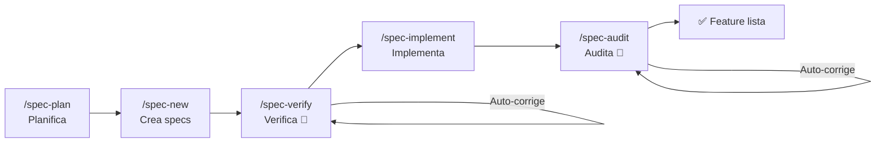

<div align="center">

**🌐 Idioma:** [Português](../../README.md) | [English](README.en.md) | Español | [简体中文](README.zh-Hans.md) | [हिन्दी](README.hi.md)

</div>

<br/>

<div align="center">
<br/>
<br/>
<p align="center">
  
</p>
<h1>DsCode</h1>

[![][github-license-shield]][github-license-link]
[![][github-stars-shield]][github-stars-link]

**El asistente de IA que planifica, implementa, verifica y audita código automáticamente — con cero vendor lock-in.**

<br/>
</div>

**DsCode** es un asistente de programación que se ejecuta en la terminal. Conversas con **16 modelos entre DeepSeek V4, OpenAI GPT-5.x, Anthropic Claude y Google Gemini** — y él analiza, sugiere, revisa y escribe código en tu proyecto.

La diferencia: DsCode es el **único** asistente con un pipeline completo de Desarrollo Orientado a Especificaciones (SDD). No solo escribe código — **planifica** qué construir, **verifica** la calidad, **implementa** las tareas y **audita** el resultado. Todo con corrección automática en cada etapa.

---

## Qué hace único a DsCode



| Capacidad | Qué hace | Por qué ningún otro lo tiene |
|---|---|---|
| **Pipeline SDD** | Ciclo completo: planificar → crear → verificar → implementar → auditar | Auto-corrección en 2 checkpoints — verify y audit corrigen fallos solos |
| **Multi-proveedor** | DeepSeek V4, OpenAI GPT-5.x, Anthropic Claude, Google Gemini | Cambia de proveedor sin tocar una línea de configuración |
| **Skills como agentes** | Subagentes aislados con su propio modelo, tools y thinking | Cada skill se ejecuta en sandbox — no contamina el contexto principal |
| **MCP nativo** | Conecta bases de datos, navegadores y APIs externas | Integrado en las 3 capas: skills, specs y TUI |
| **Steering** | Reglas persistentes que la IA sigue en todas las sesiones | Control granular: añade, lista, edita y elimina reglas por posición |

---

## Comparación rápida

|  | DsCode | GitHub Copilot | Cursor | Claude Code | Amazon Kiro |
|---|---|---|---|---|---|
| **Terminal nativo** | ✅ TUI nativa | ❌ Solo IDE | ❌ Solo IDE | ✅ CLI | ⚠️ IDE + CLI |
| **Multi-proveedor** | ✅ 4 proveedores | ❌ Solo GitHub | ⚠️ Limitado | ❌ Solo Anthropic | ❌ Solo Bedrock |
| **Pipeline SDD** | ✅ Completo + auto-corrección | ❌ | ❌ | ❌ | ✅ IDE-based |
| **Skills/Agentes** | ✅ Subagentes aislados | ❌ | ⚠️ Rules | ⚠️ Hooks | ✅ Powers |
| **Gratis** | ✅ Sin costo | ⚠️ Limitado | ⚠️ Limitado | ⚠️ Créditos | ❌ Costo Bedrock |

> **Amazon Kiro** es el competidor más cercano — ambos tienen SDD, Steering y Skills. La diferencia: DsCode es **nativo de terminal, multi-proveedor y gratuito**; Kiro está **atado a Amazon Bedrock y cobra por el uso de modelos**.

---

## Instala en 30 segundos

Descarga el binario desde la **[página de releases](https://github.com/andrelncampos/dscode-public/releases)**. Requiere **[Node.js 24+](https://nodejs.org)**.

| Sistema | Archivo |
|---|---|
| Windows (x64) | `dscode-windows-x64.zip` |
| Linux (x64) | `dscode-linux-x64.tar.gz` |
| macOS (Apple Silicon) | `dscode-macos-arm64.tar.gz` |

Extrae y ejecuta `./dscode`. DsCode verifica actualizaciones automáticamente al iniciar.

---

## Primer uso

### 1. Configura tu clave

Crea `~/.dscode/settings.json` con tu clave de API:

```json
{
  "env": {
    "MODEL": "deepseek-v4-pro",
    "BASE_URL": "https://api.deepseek.com",
    "API_KEY": "tu-clave-aqui"
  },
  "thinkingEnabled": true
}
```

### 2. Abre tu proyecto e inicia

```bash
cd /ruta/de/tu/proyecto
dscode
```

### 3. Haz el tour interactivo

Escribe `/quickstart` para un tour de 5 minutos. La IA demuestra el pipeline SDD completo creando un proyecto de ejemplo — aprendes viéndolo ejecutarse, no leyendo documentación.

O ejecuta `dscode --quickstart` para ir directo al tour.

---

## Lo que puedes hacer

| Tarea | Escribe en el prompt |
|---|---|
| **Entender un proyecto** | "Explica la arquitectura de este proyecto en 3 frases." |
| **Revisar código** | "Revisa los cambios del último commit antes de hacer push." |
| **Implementar feature** | "Añade validación de email al formulario en `src/form.ts`." |
| **Refactorizar** | "Simplifica la función `processData()` sin cambiar el comportamiento." |
| **Investigar bug** | "Analiza este stack trace y encuentra la causa." |
| **Crear tests** | "Crea tests unitarios para `validateUser()` en `src/validators.ts`." |
| **Planificar features** | `/spec-plan` — describe qué quieres y la IA crea specs completas. |
| **Crear reglas** | `/steering-add usa siempre español para responder` |

---

## Comandos esenciales

Escribe `/` en el prompt para ver el menú completo. Estos son los que más usarás:

| Comando | Descripción |
|---|---|
| `/new` | Nueva conversación — reinicia el contexto |
| `/model` | Cambiar entre 16 modelos de 4 proveedores |
| `/quickstart` | Tour interactivo de 5 minutos por el pipeline SDD |
| `/spec-plan` | Planificar nuevas funcionalidades con specs |
| `/spec-pipe <n>` | Pipeline completo: new → verify → implement → audit |
| `/init` | Crear `AGENTS.md` con instrucciones para la IA |
| `/steering-add` | Añadir regla que la IA sigue en todas las sesiones |
| `/budget` | Ver costo del proyecto por modelo y zona horaria |
| `/context` | Ver tokens, costo y caché de la sesión |
| `/help` | Lista completa de comandos y atajos |

> 📋 [Lista completa de 51 comandos](https://github.com/andrelncampos/dscode-public#todos-os-comandos-slash) — incluyendo gestión de modelos, notas, MCP y skills.

---

## Skills y agentes autónomos

Las skills son guías en Markdown que enseñan a la IA a trabajar de una forma específica. DsCode carga skills de 3 fuentes:

| Ubicación | Uso |
|---|---|
| `templates/skills/` (built-in) | 5 skills siempre disponibles |
| `~/.agents/skills/<nombre>/SKILL.md` | Skills personales |
| `./.agents/skills/<nombre>/SKILL.md` | Skills del proyecto |

Las skills pueden ejecutarse como **agentes autónomos** (`mode: agent`) — cada uno con su propio modelo, herramientas y thinking, ejecutándose en sandbox sin contaminar el contexto principal.

```yaml
# Ejemplo: .agents/skills/reviewer/SKILL.md
name: reviewer
description: Revisa código en busca de bugs y mejoras
mode: agent
model: deepseek-v4-flash
tools: [Read, Grep, Glob, Bash]
```

---

## Seguridad

| Práctica | Por qué |
|---|---|
| **Revisa comandos antes de permitir** | La IA puede sugerir `rm`, `sudo` o acceso a red |
| **Haz commit antes de tareas grandes** | `git reset --hard` deshace todo si algo sale mal |
| **Revisa los diffs** | DsCode muestra cada cambio — la IA puede equivocarse |
| **Nunca hagas commit de `settings.json`** | Contiene tu clave de API (`.gitignore` ya lo excluye) |
| **Usa una rama separada para experimentos** | `git checkout -b experimento-ia` antes de cambios arriesgados |

---

## Licencia y origen

**DsCode es gratuito para uso individual y profesional.** El código fuente es source-available — la redistribución está permitida solo desde los binarios oficiales.

Este proyecto deriva de [DeepCode (lessweb/deepcode-cli)](https://github.com/lessweb/deepcode-cli), originalmente bajo licencia MIT. El aviso de copyright original se preserva en [LICENSE](LICENSE) y [NOTICE](NOTICE).

---

## Canales oficiales

| Canal | Link |
|---|---|
| **GitHub** | [github.com/andrelncampos/dscode-public](https://github.com/andrelncampos/dscode-public) |
| **Releases** | [github.com/andrelncampos/dscode-public/releases](https://github.com/andrelncampos/dscode-public/releases) |
| **Issues** | [github.com/andrelncampos/dscode-public/issues](https://github.com/andrelncampos/dscode-public/issues) |

⚠️ Instala DsCode **solo** desde los canales oficiales. No confíes en versiones de sitios de terceros.

---

<!-- LINK GROUP -->

[github-license-link]: https://github.com/andrelncampos/dscode-public/blob/master/LICENSE
[github-license-shield]: https://img.shields.io/github/license/andrelncampos/dscode?color=4d6BFE&labelColor=black&style=flat-square
[github-stars-link]: https://github.com/andrelncampos/dscode-public/stargazers
[github-stars-shield]: https://img.shields.io/github/stars/andrelncampos/dscode?color=yellow&labelColor=black&style=flat-square
