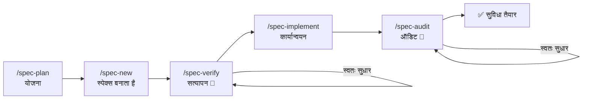

<div align="center">

**🌐 भाषा:** [Português](../../README.md) | [English](README.en.md) | [Español](README.es.md) | [简体中文](README.zh-Hans.md) | हिन्दी

</div>

<br/>

<div align="center">
<br/>
<br/>
<p align="center">
  
</p>
<h1>DsCode</h1>

[![][github-license-shield]][github-license-link]
[![][github-stars-shield]][github-stars-link]

**वह AI सहायक जो कोड की योजना बनाता, लागू करता, सत्यापित करता और ऑडिट करता है — शून्य vendor lock-in के साथ।**

<br/>
</div>

**DsCode** एक टर्मिनल-आधारित AI कोडिंग सहायक है। आप **DeepSeek V4, OpenAI GPT-5.x, Anthropic Claude और Google Gemini के 16 मॉडलों** से बात करते हैं — और यह आपके प्रोजेक्ट में कोड का विश्लेषण, सुझाव, समीक्षा और लेखन करता है।

अंतर: DsCode एकमात्र सहायक है जिसमें संपूर्ण Spec-Driven Development (SDD) पाइपलाइन है। यह सिर्फ कोड नहीं लिखता — यह **योजना बनाता है** कि क्या बनाना है, गुणवत्ता **सत्यापित करता है**, कार्यों को **लागू करता है**, और परिणाम का **ऑडिट करता है**। हर चरण में स्वचालित सुधार के साथ।

---

## DsCode को क्या अनूठा बनाता है



| क्षमता | यह क्या करता है | कोई अन्य उपकरण क्यों नहीं कर सकता |
|---|---|---|
| **SDD पाइपलाइन** | पूर्ण चक्र: योजना → निर्माण → सत्यापन → कार्यान्वयन → ऑडिट | 2 चेकपॉइंट पर स्वतः सुधार — verify और audit समस्याओं को स्वयं ठीक करते हैं |
| **बहु-प्रदाता** | DeepSeek V4, OpenAI GPT-5.x, Anthropic Claude, Google Gemini | बिना एक भी कॉन्फ़िगरेशन लाइन बदले प्रदाता बदलें |
| **एजेंट के रूप में स्किल्स** | अपने मॉडल, टूल्स और thinking के साथ पृथक सब-एजेंट | प्रत्येक स्किल सैंडबॉक्स में चलती है — मुख्य संदर्भ को प्रदूषित नहीं करती |
| **मूल MCP** | डेटाबेस, ब्राउज़र और बाहरी API से जुड़ें | सभी 3 परतों में एकीकृत: स्किल्स, स्पेक्स और TUI |
| **स्टीयरिंग** | स्थायी नियम जिनका AI हर सत्र में पालन करता है | सूक्ष्म नियंत्रण: स्थिति के अनुसार नियम जोड़ें, सूचीबद्ध करें, संपादित करें और हटाएं |

---

## त्वरित तुलना

|  | DsCode | GitHub Copilot | Cursor | Claude Code | Amazon Kiro |
|---|---|---|---|---|---|
| **टर्मिनल-मूल** | ✅ मूल TUI | ❌ केवल IDE | ❌ केवल IDE | ✅ CLI | ⚠️ IDE + CLI |
| **बहु-प्रदाता** | ✅ 4 प्रदाता | ❌ केवल GitHub | ⚠️ सीमित | ❌ केवल Anthropic | ❌ केवल Bedrock |
| **SDD पाइपलाइन** | ✅ पूर्ण + स्वतः सुधार | ❌ | ❌ | ❌ | ✅ IDE-आधारित |
| **स्किल्स/एजेंट** | ✅ पृथक सब-एजेंट | ❌ | ⚠️ नियम | ⚠️ Hooks | ✅ Powers |
| **मुफ़्त** | ✅ कोई लागत नहीं | ⚠️ सीमित | ⚠️ सीमित | ⚠️ क्रेडिट | ❌ Bedrock लागत |

> **Amazon Kiro** सबसे करीबी प्रतिस्पर्धी है — दोनों में SDD, Steering और Skills हैं। अंतर: DsCode **टर्मिनल-मूल, बहु-प्रदाता और मुफ़्त** है; Kiro **Amazon Bedrock से बंधा है और मॉडल उपयोग के लिए शुल्क लेता है**।

---

## 30 सेकंड में इंस्टॉल करें

**[रिलीज़ पेज](https://github.com/andrelncampos/dscode-public/releases)** से बाइनरी डाउनलोड करें। **[Node.js 24+](https://nodejs.org)** आवश्यक है।

| सिस्टम | फ़ाइल |
|---|---|
| Windows (x64) | `dscode-windows-x64.zip` |
| Linux (x64) | `dscode-linux-x64.tar.gz` |
| macOS (Apple Silicon) | `dscode-macos-arm64.tar.gz` |

निकालें और `./dscode` चलाएं। DsCode स्टार्टअप पर स्वचालित रूप से अपडेट की जांच करता है।

---

## पहला उपयोग

### 1. अपनी कुंजी कॉन्फ़िगर करें

अपनी API कुंजी के साथ `~/.dscode/settings.json` बनाएं:

```json
{
  "env": {
    "MODEL": "deepseek-v4-pro",
    "BASE_URL": "https://api.deepseek.com",
    "API_KEY": "आपकी-कुंजी-यहां"
  },
  "thinkingEnabled": true
}
```

### 2. अपना प्रोजेक्ट खोलें और शुरू करें

```bash
cd /आपके/प्रोजेक्ट/का/पथ
dscode
```

### 3. इंटरैक्टिव टूर लें

5 मिनट के टूर के लिए `/quickstart` टाइप करें। AI एक नमूना प्रोजेक्ट बनाकर पूर्ण SDD पाइपलाइन का प्रदर्शन करता है — आप इसे चलते हुए देखकर सीखते हैं, दस्तावेज़ पढ़कर नहीं।

या सीधे टूर में जाने के लिए `dscode --quickstart` चलाएं।

---

## आप क्या कर सकते हैं

| कार्य | प्रॉम्प्ट में टाइप करें |
|---|---|
| **प्रोजेक्ट समझें** | "इस प्रोजेक्ट की आर्किटेक्चर 3 वाक्यों में समझाएं।" |
| **कोड समीक्षा** | "पुश करने से पहले अंतिम कमिट के बदलावों की समीक्षा करें।" |
| **सुविधा लागू करें** | "`src/form.ts` में फॉर्म में ईमेल सत्यापन जोड़ें।" |
| **रीफैक्टर** | "`processData()` फ़ंक्शन को बिना व्यवहार बदले सरल बनाएं।" |
| **बग जांच** | "इस स्टैक ट्रेस का विश्लेषण करें और मूल कारण खोजें।" |
| **टेस्ट बनाएं** | "`src/validators.ts` में `validateUser()` के लिए यूनिट टेस्ट लिखें।" |
| **सुविधाओं की योजना** | `/spec-plan` — बताएं कि आपको क्या चाहिए और AI पूर्ण स्पेक्स बनाता है। |
| **नियम बनाएं** | `/steering-add हमेशा TypeScript स्ट्रिक्ट मोड का उपयोग करें` |

---

## आवश्यक कमांड

पूर्ण मेनू देखने के लिए प्रॉम्प्ट में `/` टाइप करें। ये वे हैं जिनका आप सबसे अधिक उपयोग करेंगे:

| कमांड | विवरण |
|---|---|
| `/new` | नई बातचीत — संदर्भ रीसेट करता है |
| `/model` | 4 प्रदाताओं के 16 मॉडलों के बीच स्विच करें |
| `/quickstart` | 5 मिनट का इंटरैक्टिव SDD पाइपलाइन टूर |
| `/spec-plan` | स्पेक्स के साथ नई सुविधाओं की योजना बनाएं |
| `/spec-pipe <n>` | पूर्ण पाइपलाइन: new → verify → implement → audit |
| `/init` | AI के लिए निर्देशों के साथ `AGENTS.md` बनाएं |
| `/steering-add` | एक नियम जोड़ें जिसका AI हर सत्र में पालन करे |
| `/context` | सत्र के टोकन, लागत और कैश देखें |
| `/help` | कमांड और कीबोर्ड शॉर्टकट की पूरी सूची |

> 📋 [37 कमांड की पूरी सूची](https://github.com/andrelncampos/dscode-public#todos-os-comandos-slash) — मॉडल प्रबंधन, नोट्स, MCP और स्किल्स सहित।

---

## स्किल्स और स्वायत्त एजेंट

स्किल्स Markdown गाइड हैं जो AI को एक विशिष्ट तरीके से काम करना सिखाती हैं। DsCode 3 स्रोतों से स्किल्स लोड करता है:

| स्थान | उपयोग |
|---|---|
| `templates/skills/` (अंतर्निहित) | 5 हमेशा उपलब्ध स्किल्स |
| `~/.agents/skills/<नाम>/SKILL.md` | व्यक्तिगत स्किल्स |
| `./.agents/skills/<नाम>/SKILL.md` | प्रोजेक्ट स्किल्स |

स्किल्स **स्वायत्त एजेंट** (`mode: agent`) के रूप में चल सकती हैं — प्रत्येक अपने मॉडल, टूल्स और thinking के साथ, मुख्य संदर्भ को प्रदूषित किए बिना सैंडबॉक्स में निष्पादित होती हैं।

```yaml
# उदाहरण: .agents/skills/reviewer/SKILL.md
name: reviewer
description: बग और सुधार के लिए कोड की समीक्षा करता है
mode: agent
model: deepseek-v4-flash
tools: [Read, Grep, Glob, Bash]
```

---

## सुरक्षा

| अभ्यास | क्यों |
|---|---|
| **अनुमति देने से पहले कमांड की समीक्षा करें** | AI `rm`, `sudo` या नेटवर्क एक्सेस का सुझाव दे सकता है |
| **बड़े कार्यों से पहले कमिट करें** | कुछ गलत होने पर `git reset --hard` सब कुछ पूर्ववत कर देता है |
| **डिफ की समीक्षा करें** | DsCode हर बदलाव दिखाता है — AI गलतियाँ कर सकता है |
| **`settings.json` कभी कमिट न करें** | इसमें आपकी API कुंजी है (`.gitignore` पहले से बाहर रखता है) |
| **प्रयोगों के लिए अलग ब्रांच का उपयोग करें** | जोखिम भरे बदलावों से पहले `git checkout -b ai-experiment` |

---

## लाइसेंस और उत्पत्ति

**DsCode व्यक्तिगत और व्यावसायिक उपयोग के लिए मुफ़्त है।** स्रोत कोड source-available है — केवल आधिकारिक बाइनरी से पुनर्वितरण की अनुमति है।

यह प्रोजेक्ट [DeepCode (lessweb/deepcode-cli)](https://github.com/lessweb/deepcode-cli) से व्युत्पन्न है, जो मूल रूप से MIT लाइसेंस के तहत है। मूल कॉपीराइट नोटिस [LICENSE](LICENSE) और [NOTICE](NOTICE) में संरक्षित है।

---

## आधिकारिक चैनल

| चैनल | लिंक |
|---|---|
| **GitHub** | [github.com/andrelncampos/dscode-public](https://github.com/andrelncampos/dscode-public) |
| **रिलीज़** | [github.com/andrelncampos/dscode-public/releases](https://github.com/andrelncampos/dscode-public/releases) |
| **इश्यूज़** | [github.com/andrelncampos/dscode-public/issues](https://github.com/andrelncampos/dscode-public/issues) |

⚠️ DsCode को **केवल** उपरोक्त आधिकारिक चैनलों से इंस्टॉल करें। तृतीय-पक्ष साइटों के संस्करणों पर भरोसा न करें।

---

<!-- LINK GROUP -->

[github-license-link]: https://github.com/andrelncampos/dscode-public/blob/master/LICENSE
[github-license-shield]: https://img.shields.io/github/license/andrelncampos/dscode?color=4d6BFE&labelColor=black&style=flat-square
[github-stars-link]: https://github.com/andrelncampos/dscode-public/stargazers
[github-stars-shield]: https://img.shields.io/github/stars/andrelncampos/dscode?color=yellow&labelColor=black&style=flat-square
