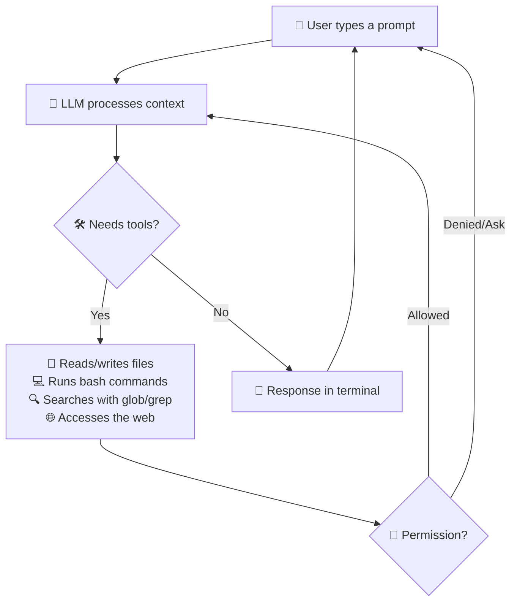
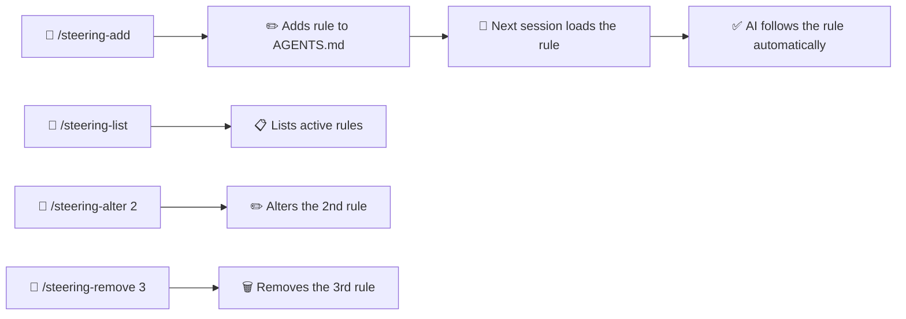
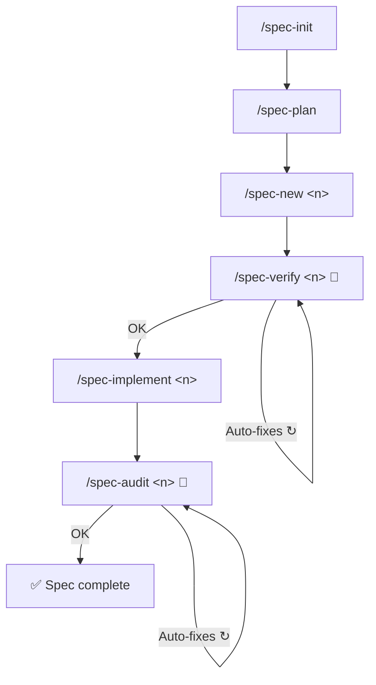

<div align="center">

**🌐 भाषा:** [Português](../../README.md) | [English](README.en.md) | [Español](README.es.md) | [简体中文](README.zh-Hans.md) | हिन्दी

</div>

<br/>

<div align="center">
<br/>
<br/>
<p align="center">
  
</p>
<h1>DsCode</h1>

[![][github-license-shield]][github-license-link]

**आपके टर्मिनल में AI कोडिंग असिस्टेंट।**

<br/>
</div>

**DsCode** एक टर्मिनल-आधारित AI कोडिंग असिस्टेंट है। आप एक AI मॉडल से बात करते हैं — **DeepSeek V4, OpenAI GPT-5.x, Anthropic Claude, Google Gemini के 16 मॉडल या कोई भी OpenAI-संगत API** — और वह आपके प्रोजेक्ट में कोड का विश्लेषण, सुझाव, समीक्षा और लेखन करता है। यह Windows, Linux और macOS पर काम करता है। इसकी आर्किटेक्चर में एक **प्रोवाइडर-अज्ञेय LLM लेयर** है, जिससे आप बिना कोड बदले प्रोवाइडर स्विच कर सकते हैं।

DsCode [DeepCode (lessweb/deepcode-cli)](https://github.com/lessweb/deepcode-cli) से लिया गया है और इसका अपना विकास है, जिसे [André Campos](https://github.com/andrelncampos) द्वारा बनाए रखा गया है।

---

<!-- TODO: translate to Hindi -->

## How DsCode works



DsCode works in **sessions**. Each session is an ongoing conversation. The AI uses **tools** (read files, run commands, edit code, search the web) to accomplish tasks. You can **confirm, deny, or configure permissions** for each type of action.

<!-- end TODO -->

---

## DsCode किसके लिए है

DsCode इनके लिए उपयोगी है:

- **डेवलपर्स** जो रोज़मर्रा के कार्यों में AI सहायता चाहते हैं।
- **टेक लीड्स** जिन्हें कोडबेस को जल्दी से समीक्षा या समझना है।
- **जो लोग पहले से AI से कोड कर रहे हैं** और एक तेज़, टर्मिनल-एकीकृत वर्कफ़्लो चाहते हैं।
- **टीमें जो मानकीकरण करना चाहती हैं** prompts, skills, agents और steering को एकरूपता बनाए रखने के लिए।
- **किसी भी LLM प्रोवाइडर के उपयोगकर्ता** — DeepSeek V4, OpenAI, Anthropic, Google Gemini या संगत APIs। प्रोवाइडर-अज्ञेय लेयर स्विचिंग को सरल बनाती है।

---

## DsCode किन कार्यों में मदद करता है

| कार्य | DsCode कैसे मदद करता है |
|---|---|
| **कोडबेस का विश्लेषण** | पूछें "इस प्रोजेक्ट की आर्किटेक्चर समझाएं" और AI फ़ाइलें पढ़कर उत्तर देता है। |
| **कोड की समीक्षा** | पूछें "कमिट करने से पहले इस diff में बदलावों की समीक्षा करें"। |
| **सुविधाएं लागू करना** | बताएं कि आपको क्या चाहिए और AI फ़ाइलें जनरेट या संपादित करता है। |
| **रीफैक्टर** | पूछें "इस फ़ंक्शन को बिना व्यवहार बदले सरल बनाएं"। |
| **बग की जांच** | स्टैक ट्रेस पेस्ट करें और कारण खोजने में मदद मांगें। |
| **Skills बनाना या उपयोग करना** | Skills वे गाइड हैं जो AI को एक विशिष्ट तरीके से काम करना सिखाती हैं। |
| **उप-एजेंटों के साथ कोड अन्वेषण** | Explore उप-एजेंट को खोज और विश्लेषण सौंपें — यह कोड को अलग-थलग करके खोजता है और बिना संदर्भ को दूषित किए केवल सारांश लौटाता है। |
| **Git के साथ काम** | AI ब्रांच, कमिट मैसेज सुझाता है और वर्ज़न किए गए बदलाव करता है। |
| **रीज़निंग कॉन्फ़िगर करना** | कठिन कार्यों के लिए *thinking mode* सक्षम करें — AI जवाब देने से पहले "सोचता" है। |
| **बाहरी टूल्स को एकीकृत करना** | MCP के साथ, डेटाबेस, ब्राउज़र, API और अन्य टूल्स कनेक्ट करें। |

---

## इंस्टॉलेशन

**[रिलीज़ पेज](https://github.com/andrelncampos/dscode/releases)** से अपने ऑपरेटिंग सिस्टम के लिए बाइनरी डाउनलोड करें।  
**[Node.js 24+](https://nodejs.org)** आवश्यक है।

| ऑपरेटिंग सिस्टम | फ़ाइल |
|---|---|
| Windows (x64) | `dscode-windows-x64.zip` |
| Linux (x64) | `dscode-linux-x64.tar.gz` |
| macOS (Intel x64) | `dscode-macos-x64.tar.gz` |
| macOS (Apple Silicon) | `dscode-macos-arm64.tar.gz` |

डाउनलोड की अखंडता सत्यापित करने के लिए प्रत्येक release में **SHA256** हैश के साथ `checksums.txt` शामिल है।
डाउनलोड करने के बाद, संग्रह निकालें और टर्मिनल में `./dscode` चलाएं।

## अपडेट

DsCode स्टार्टअप पर स्वचालित रूप से नए संस्करणों की जांच करता है। यदि कोई अपडेट उपलब्ध है, तो आपको सूचित किया जाएगा।

मैन्युअल रूप से जांचने के लिए:

```bash
dscode --update
```

यदि कोई नया संस्करण उपलब्ध है, तो DsCode पूछेगा कि क्या आप इसे इंस्टॉल करना चाहते हैं। अन्यथा, "DsCode is up to date." प्रदर्शित करेगा।

---

## प्रारंभिक सेटअप

DsCode अपनी कॉन्फ़िगरेशन `~/.dscode/settings.json` (आपकी होम डायरेक्टरी में) से पढ़ता है। आप स्थानीय सेटिंग्स के लिए किसी विशिष्ट प्रोजेक्ट के अंदर `.dscode/settings.json` भी रख सकते हैं। `DEEPCODE_` उपसर्ग वाले एनवायरनमेंट वेरिएबल्स भी पहचाने जाते हैं।

### न्यूनतम उदाहरण

```json
{
  "env": {
    "MODEL": "deepseek-v4-pro",
    "BASE_URL": "https://api.deepseek.com",
    "API_KEY": "अपनी_की_यहां_डालें"
  },
  "thinkingEnabled": true,
  "reasoningEffort": "max"
}
```

### API की कहां से प्राप्त करें

| प्रदाता | लिंक |
|---|---|
| **DeepSeek** | [platform.deepseek.com](https://platform.deepseek.com) → API Keys |
| **OpenAI** | [platform.openai.com](https://platform.openai.com) → API Keys |
| **Anthropic** | [console.anthropic.com](https://console.anthropic.com) → API Keys |
| **Google Gemini** | [aistudio.google.com](https://aistudio.google.com) → API Keys |

### उपलब्ध कॉन्फ़िगरेशन विकल्प

| फ़ील्ड | प्रकार | विवरण | डिफ़ॉल्ट |
|---|---|---|---|
| `env.MODEL` | string | उपयोग करने के लिए AI मॉडल | `deepseek-v4-pro` |
| `env.BASE_URL` | string | प्रदाता का API बेस URL | `https://api.deepseek.com` |
| `env.API_KEY` | string | प्रदाता की API की | *(आवश्यक)* |
| `thinkingEnabled` | boolean | रीज़निंग मोड सक्षम करता है | DeepSeek के लिए `true` |
| `reasoningEffort` | string | रीज़निंग गहराई: `"xhigh"`, `"high"`, `"medium"`, `"low"`, `"max"` या `"none"` (प्रोवाइडर के अनुसार भिन्न) | DeepSeek V4 Pro के लिए `"max"` |
| `temperature` | number | प्रतिक्रिया रचनात्मकता (0 से 2) | `0.3` |
| `maxTokens` | number | प्रति प्रतिक्रिया टोकन सीमा | 65536 (Pro) / 32768 (Flash) |
| `debugLogEnabled` | boolean | डीबग लॉग `~/.dscode/logs/` में सहेजता है | `false` |
| `telemetryEnabled` | boolean | अनाम उपयोग आंकड़े भेजता है | `false` |
| `permissions` | object | सूक्ष्म अनुमति नियंत्रण | *(सभी अनुमत)* |
| `mcpServers` | object | MCP सर्वर कॉन्फ़िगरेशन | *(कोई नहीं)* |
| `notify` | string | प्रत्येक कार्य पूरा होने के बाद निष्पादित स्क्रिप्ट | *(कोई नहीं)* |
| `engines` | object | प्रति-प्रदाता कॉन्फ़िगरेशन (जैसे `engines.openai.apiKey`) | `{}` |
| `modelPricing` | object | कस्टम मॉडल प्राइसिंग ओवरराइड | *(DeepSeek V4 डिफ़ॉल्ट)* |
| `cacheMode` | string | कैश रणनीति: `"off"` (डिफ़ॉल्ट), `"aware"` (KV Cache के लिए प्रीफ़िक्स अनुकूलित), `"strict"` (aware + हैश सत्यापन)। केवल DeepSeek | `"off"` |
| `repositoryVisibility` | `"public"` \| `"private"` | रिपॉजिटरी दृश्यता। `"public"` होने पर `/management/` और `/.agents/` को `.gitignore` में स्वतः जोड़ता है | `"private"` |

### मॉडल प्राइसिंग (`modelPricing`)

DsCode टोकन उपयोग के आधार पर सत्र लागत का अनुमान लगाता है। डिफ़ॉल्ट मूल्य:

| मॉडल | इनपुट (1M टोकन) | आउटपुट (1M टोकन) | कैश रीड (1M टोकन) |
|---|---|---|---|
| `deepseek-v4-pro` | $0.435 | $0.87 | $0.003625 |
| `deepseek-v4-flash` | $0.14 | $0.28 | $0.0028 |
| `gpt-5.4` | $1.25 | $10.00 | $0.625 |
| `gpt-5.4-mini` | $0.15 | $0.60 | $0.075 |
| `claude-opus-4-8` | $15.00 | $75.00 | $7.50 |
| `claude-sonnet-4-6` | $3.00 | $15.00 | $1.50 |
| `claude-haiku-4-5` | $0.80 | $4.00 | $0.40 |
| `claude-fable-5` | $10.00 | $50.00 | $1.00 |
| `claude-mythos-5` | $10.00 | $50.00 | $1.00 |
| `gemini-3.5-flash` | $1.50 | $9.00 | $0.15 |
| `gemini-3.1-flash-lite` | $0.25 | $1.50 | $0.025 |
| `gemini-2.5-pro` | $2.50 | $15.00 | $0.25 |
| `gemini-2.5-flash` | $0.50 | $3.00 | $0.05 |

कस्टम प्राइसिंग उपयोग करने के लिए (या असमर्थित मॉडल जोड़ने के लिए):

```json
{
  "modelPricing": {
    "मेरा-मॉडल": {
      "inputPrice": 0.50,
      "outputPrice": 1.00,
      "cacheReadPrice": 0.05
    }
  }
}
```

सत्र के दौरान लागत ऊपरी दाएं कोने में दिखाई देती है: `⚡ 42.3K 💰 $0.15`।

---

<!-- TODO: translate to Hindi -->

## Files and structure

DsCode organizes its data in `.dscode/` directories within the project and the user's home:

```
my-project/
├── .dscode/                   # Project config and data
│   ├── settings.json          # Local configuration (optional)
│   ├── AGENTS.md              # Instructions and steering rules
│   ├── sessions-index.json    # Session index
│   ├── <session-id>.jsonl     # Messages for each session
│   └── specs/                 # SDD documents
│       ├── vision.md          # Product vision
│       ├── arch.md            # Architecture
│       ├── roadmap.md         # Roadmap with spec statuses
│       ├── adr.md             # Architecture Decision Records
│       └── lessons.md         # Lessons learned
│
~/.dscode/                     # User config
├── settings.json              # API key (encrypted), default model
├── .credential-key            # AES-256 encryption key (0600 permissions)
└── logs/debug.log             # Debug logs

~/.agents/skills/<skill>/SKILL.md    # User skills
./.agents/skills/<skill>/SKILL.md    # Project skills
```

⚠️ **Security**: Never commit `settings.json` (it contains your API key). The `.gitignore` already excludes it.

<!-- end TODO -->

---

## 5 मिनट में पहला उपयोग

### चरण 1: इंस्टॉल करें

[रिलीज़ पेज](https://github.com/andrelncampos/dscode/releases) से बाइनरी डाउनलोड करें, निकालें और `./dscode` चलाएं। **Node.js 24+ आवश्यक है।**

### चरण 2: अपनी की कॉन्फ़िगर करें

अपनी API की और पसंदीदा मॉडल के साथ `~/.dscode/settings.json` बनाएं (ऊपर कॉन्फ़िगरेशन अनुभाग देखें)।

### चरण 3: एक प्रोजेक्ट फ़ोल्डर खोलें

```bash
cd /path/to/your/project
```

यह कोई भी प्रोजेक्ट हो सकता है: Git रिपो, व्यक्तिगत प्रोजेक्ट, यहां तक कि खाली फ़ोल्डर भी।

### चरण 4: DsCode शुरू करें

```bash
dscode
```

आपको टेक्स्ट इनपुट फ़ील्ड के साथ एक स्वागत स्क्रीन दिखेगी। असिस्टेंट तैयार है।

**टिप:** प्रोजेक्ट फ़ाइलों को खोजने और उल्लेख करने के लिए `@` टाइप करें — AI आपके द्वारा संदर्भित फ़ाइलों को पढ़ और संपादित कर सकता है।

### चरण 5: कुछ सरल पूछें

प्रॉम्प्ट फ़ील्ड में टाइप करें:

```
इस प्रोजेक्ट की संरचना को 3 वाक्यों में समझाएं।
```

**Enter** दबाएं। AI प्रोजेक्ट फ़ाइलों का विश्लेषण करेगा और उत्तर देगा।

### चरण 6: एक उपयोगी विश्लेषण मांगें

```
कोडबेस का विश्लेषण करें और बिना कुछ बदले संभावित सुधार बताएं।
```

AI कोड की जांच करेगा और सुधार सुझाएगा। आउटपुट विस्तारित करने या चल रही प्रक्रियाओं को देखने के लिए `Ctrl+O` का उपयोग करें।

### चरण 7: समीक्षा और कमिट

जब AI फ़ाइलों में बदलाव करे, तो कमिट करने से पहले **प्रत्येक diff की समीक्षा करें**। DsCode दिखाता है कि क्या बदला गया और आप तय करते हैं कि स्वीकार करना है या नहीं।

> 💡 **टिप**: बड़े कार्यों का अनुरोध करने से पहले कमिट करें (`git commit`)। यदि कुछ गलत होता है, तो आप `git reset --hard` से पूर्ववत कर सकते हैं।

---

<!-- TODO: translate to Hindi -->

## All slash commands

Type `/` in the prompt to open the menu. There are **28 built-in commands** + dynamic skills (`/<skill-name>`):

### Session

| Command | Description |
|---|---|
| `/new` | New conversation — clears context |
| `/resume` | Resume a previous conversation |
| `/continue` | Continue the active conversation (or resume if empty) |
| `/undo` | Restore code and/or conversation to a previous checkpoint |

### Model and display

| Command | Description |
|---|---|
| `/model` | 4 प्रदाताओं के 16 मॉडलों में से चुनें, प्रोवाइडर-अनुरूप thinking mode और reasoning effort के साथ |
| `/raw` | Toggle display mode: `lite` (summarized), `normal` (full), `raw-scrollback` (scroll) |

### Provider & model

| Command | Description |
|---|---|
| `/model-list` | List all configured providers with status, models and pricing |
| `/model-add <provider>` | Add a new LLM provider with guided wizard (API key + base URL) |
| `/model-remove <provider>` | Remove a provider from configuration |
| `/model-info <id>` | Show model details: capabilities, pricing, thinking, context |
| `/model-key <provider>` | Update API key for a provider (overwrites previous) |
| `/model-default <id>` | Set the default model |
| `/model-params` | Interactive generation parameter editor: temperature, max_tokens, top_p |
| `/model-thinking <id>` | Configure thinking budget for extended-thinking models |

> 💡 **Encrypted keys**: API keys are stored encrypted (AES-256-GCM) in `settings.json`. Plaintext key migration is automatic on first use. Use `/model-key` to update.

### Skills and agents

| Command | Description |
|---|---|
| `/skills` | List all available skills (built-in + custom) |
| `/<skill-name>` | Run a specific skill by name |
| `/init` | Create `AGENTS.md` with instructions for the AI in the project |
| `/steering-add` | Add a steering rule to the STEERINGS section of `AGENTS.md` |
| `/steering-list` | List all steering rules from `AGENTS.md` |

### SDD (Spec-Driven Development)

| Command | Description |
|---|---|
| `/spec-init` | Initialize SDD structure: `vision.md`, `arch.md`, `roadmap.md`, `adr.md`, `lessons.md` |
| `/spec-plan` | Plan specs from a brainstorm, align with vision, and update roadmap |
| `/spec-new <n>` | Create a new spec with requirements, design, and tasks |
| `/spec-verify <n>` | Verify and **auto-fix** gaps in requirements and design (idempotent — run as many times as you want) |
| `/spec-implement <n>` | Implement all spec tasks sequentially |
| `/spec-audit <n>` | Audit and **auto-fix** implementation bugs, tests, and design deviations (idempotent — each pass improves without degrading) |
| `/spec-list` | List all specs with roadmap statuses |
| `/spec-status [n]` | Show detailed status of a specific spec or all |

### External tools

| Command | Description |
|---|---|
| `/mcp` | Show MCP server status and available tools |

### System

| Command | Description |
|---|---|
| `/exit` | Quit DsCode |

<!-- end TODO -->

---

<!-- TODO: translate to Hindi -->

## Steering system

**Steering** lets you define persistent rules that the AI follows in **all sessions** of the project. The rules live in the `## Steering` section of the `.dscode/AGENTS.md` file. The full management lifecycle includes adding, listing, altering, and removing rules by position.



**Example:**
```
/steering-add always respond in English
/steering-add never push without explicit authorization
/steering-list
/steering-alter 2 never push or merge without authorization
/steering-remove 1
```

<!-- end TODO -->

---

<!-- TODO: translate to Hindi -->

## SDD — Spec-Driven Development

DsCode implements a complete spec-driven development cycle. All files live in `management/`.

The two quality checkpoints — **spec-verify** and **spec-audit** — don't just report problems: they **auto-fix them**. Both are **idempotent**: you can run them multiple times and each pass improves quality without degrading what was already correct.



| File | Content |
|---|---|
| `vision.md` | Product vision, target audience, value proposition |
| `arch.md` | Architecture decisions, stack, patterns |
| `roadmap.md` | List of specs with status (planned/in-progress/done) |
| `adr.md` | Architecture Decision Records |
| `lessons.md` | Lessons learned throughout development |

### SDD in practice — a complete example

Imagine you want to add **OpenAI support** to DsCode. The real flow:

```
/spec-plan
  ↓  You type: "I want native OpenAI support with thinking mode"
  ↓  The AI analyzes the vision, creates spec 40, updates the roadmap
/spec-new 40
  ↓  The AI generates complete requirements.md, design.md and task.md
/spec-verify 40
  ↓  The AI finds 3 traceability gaps and AUTO-FIXES them
  ↓  Run it again. If OK → next step
/spec-implement 40
  ↓  The AI creates openai-provider.ts, openai-converter.ts, tests...
  ↓  Each task runs in order. Typecheck and tests at every step
/spec-audit 40
  ↓  The AI finds 1 bug and 1 stale test and FIXES them
  ↓  Run it again. If OK → spec complete ✅
```

> 💡 **Tip**: `spec-verify` and `spec-audit` are your allies. Run them until they say "0 issues found". Each pass improves quality with zero regression risk.

<!-- end TODO -->

---

<!-- TODO: translate to Hindi -->

## MCP — Model Context Protocol

DsCode integrates the **Model Context Protocol (MCP)**, allowing the AI to connect to external tools such as databases, browsers, APIs, and local servers. Support covers the full lifecycle: skills, SDD, and TUI.

### Skills with MCP

Skills can include an `mcp.json` file that declares MCP servers. When the skill is activated (via keyword match or `#skill-name`), the servers start automatically. When the conversation moves to another topic, they are suspended — no global tool catalog pollution.

Example: a `postgres-dba` skill brings tools like `query`, `list_tables`, and `describe`, plus safety rules (`MCP: deny drop_table`). All in one installable package.

### SDD + MCP

The SDD cycle integrates with MCP at three levels:
- **Specs declare MCP dependencies** in YAML frontmatter, defining servers and tools relevant to that spec.
- **Assisted creation**: during `/spec-new`, the AI queries real data sources (GitHub issues, databases, documentation) to produce requirements grounded in real data.
- **Scoped access**: each spec defines a temporary tool allowlist, keeping the AI focused on what matters.

### TUI Inspection & Actions

The `/mcp` command opens a full management panel:
- **Server list** with status, scope (`[global]`, `[project]`, `[skill: ...]`, `[spec: N]`), and policy summary.
- **Details** with policy badges (`auto-allow`, `ask`, `deny`) for each tool.
- **Execution history** and **error log** for diagnostics.
- **Keyboard shortcuts**: `A` approve, `D` deny, `R` reset policy, `X` disable server, `Ctrl+R` reconnect.

### Where to configure MCP servers

| Level | Location | Scope |
|---|---|---|
| Global | `~/.dscode/settings.json` → `mcpServers` | All sessions |
| Project | `.dscode/mcp.json` | Sessions in that directory |
| Skill | `<skill>/mcp.json` | When the skill is active |
| Spec | Spec YAML frontmatter | During `/spec-implement` |

---

<!-- TODO: translate to Hindi -->

## Skills

Skills are Markdown guides that teach the AI to work in a specific way. DsCode loads skills from 3 sources:

| Location | Usage |
|---|---|
| `templates/skills/` (built-in) | 3 skills always loaded |
| `~/.agents/skills/<name>/SKILL.md` | User's personal skills |
| `./.agents/skills/<name>/SKILL.md` | Project skills |

### Built-in skills

| Skill | Purpose |
|---|---|
| **agent-drift-guard** | Detects and corrects execution drift |
| **karpathy-guidelines** | Best practices to reduce common LLM mistakes |
| **plan-and-execute** | Structured planning with progress tracking |

### Inclusion modes

Each `SKILL.md` can declare how it should be loaded via the optional `inclusion` field in YAML frontmatter:

| Mode | Behavior |
|------|----------|
| `auto` (default) | Loaded automatically via keyword matching in the prompt and available in the `/skills` menu |
| `manual` | **Never** loaded automatically. Activated only with `#skill-name` prefix or via the `/skills` menu |

**Example SKILL.md with `inclusion: manual`:**
```markdown
---
name: my-deploy
description: Deploys to production
inclusion: manual
---

# Deploy

Before deploying, verify...
```

To activate a manual skill, type `#my-deploy` at the start of the prompt — the `#` prefix is stripped and the skill is loaded.

### Skills as autonomous agents

In addition to the `inclusion` field, each `SKILL.md` can declare an execution `mode`:

| Mode | Behavior |
|------|----------|
| `prompt` (default) | The skill content is injected into the conversation context as a guide. |
| `agent` | The skill runs as an **isolated subagent** — with its own model, tools, and thinking — returning only the result. |

Skills with `mode: agent` are registered as tools in the LLM's toolkit. The main agent can delegate work to them by calling the tool with the skill name. This keeps the main context clean and allows each skill to have independent model, temperature, tools, max turns, and timeout settings.

**Example SKILL.md with `mode: agent`:**
```markdown
---
name: code-reviewer
description: Reviews code for bugs and improvements
mode: agent
model: deepseek-v4-flash
thinking: false
tools: [Read, Grep, Glob, Bash]
---
```

When the main agent needs a review, it calls the `code-reviewer` tool and receives only the final result — the subagent's intermediate reasoning doesn't pollute the main context.

<!-- end TODO -->

---

## कीबोर्ड शॉर्टकट

| शॉर्टकट | कार्य |
|---|---|
| `Enter` | प्रॉम्प्ट भेजें |
| `Shift+Enter` | नई पंक्ति डालें |
| `@` | प्रोजेक्ट फ़ाइलें खोजें और उल्लेख करें |
| `Tab` | स्वतः पूर्ण (कमांड और फ़ाइल उल्लेख) |
| `/` | स्लैश कमांड मेनू खोलें |
| `?` | सभी शॉर्टकट के साथ सहायता स्क्रीन |
| `Ctrl+O` | आउटपुट विस्तारित करें / चल रही प्रक्रियाएं देखें |
| `Ctrl+V` | क्लिपबोर्ड छवि पेस्ट करें |
| `Ctrl+X` | पेस्ट की गई छवियां साफ़ करें |
| `Ctrl+C` | प्रॉम्प्ट रद्द करें / AI को बाधित करें |
| `Esc` | मोडल बंद करें / बाधित करें |
| `Ctrl+Z` / `Ctrl+Shift+Z` | प्रॉम्प्ट संपादन पूर्ववत / फिर से करें |
| `Ctrl+W` | पिछला शब्द हटाएं |
| `Ctrl+A` / `Ctrl+E` | पंक्ति की शुरुआत / अंत में जाएं |
| `Ctrl+K` | कर्सर से पंक्ति के अंत तक हटाएं |
| `Alt+←/→` | शब्द दर शब्द नेविगेट करें |
| `↑/↓` | इतिहास नेविगेट करें (खाली प्रॉम्प्ट) या मेनू |
| `PageUp/PageDown` | संदेश इतिहास स्क्रॉल करें |

---

## व्यावहारिक उपयोग उदाहरण

नीचे प्रत्येक उदाहरण कुछ ऐसा है जिसे आप DsCode प्रॉम्प्ट फ़ील्ड में टाइप कर सकते हैं।

| कार्य | क्या टाइप करें |
|---|---|
| **आर्किटेक्चर समझना** | "इस प्रोजेक्ट की आर्किटेक्चर समझाएं, मुख्य मॉड्यूल क्या हैं और वे कैसे संवाद करते हैं।" |
| **बग ढूंढना** | "src/ में संभावित बग का विश्लेषण करें। केवल बताएं, कुछ भी न बदलें।" |
| **सुधार सुझाना** | "src/ में कोड के लिए प्रदर्शन और पठनीयता सुधार सुझाएं।" |
| **सुविधा लागू करना** | "src/form.ts में साइनअप फॉर्म में ईमेल सत्यापन जोड़ें।" |
| **रीफैक्टर** | "src/utils.ts में processData() फ़ंक्शन को बिना व्यवहार बदले स्पष्ट बनाने के लिए रीफैक्टर करें।" |
| **Diff की समीक्षा** | "पिछले कमिट के बदलावों की समीक्षा करें और समस्याएं बताएं।" |
| **टेस्ट बनाना** | "src/validators.ts में validateUser() फ़ंक्शन के लिए यूनिट टेस्ट बनाएं।" |
| **Skill का उपयोग** | "इस कोड का ऑडिट करने के लिए सुरक्षा समीक्षा skill का उपयोग करें।" |
| **AGENTS.md शुरू करना** | `/init` टाइप करें एक फ़ाइल बनाने के लिए जिसमें AI प्रोजेक्ट में पालन करने के निर्देश हों। |

DsCode **संवादात्मक रूप से** काम करता है: आप जो चाहिए वह टाइप करते हैं, AI जवाब देता है और टूल्स का उपयोग करता है। आप प्रत्येक क्रिया की पुष्टि या अस्वीकार कर सकते हैं।

---

## मुख्य अवधारणाएं

| अवधारणा | यह क्या है | कब महत्वपूर्ण है |
|---|---|---|
| **सेशन** | आपके और AI के बीच चल रही बातचीत। प्रत्येक `/new` एक साफ़ सेशन शुरू करता है। | कार्य बदलते समय नया सेशन शुरू करें ताकि संदर्भ न मिलें। |
| **कॉन्टेक्स्ट** | बातचीत का पूरा इतिहास जो AI "याद रखता है"। आपके संदेश, उत्तर और पढ़ी गई फ़ाइलें शामिल हैं। | लंबे कॉन्टेक्स्ट अधिक टोकन का उपयोग करते हैं। रीसेट करने के लिए `/new` का उपयोग करें। |
| **Skills** | Markdown गाइड जो AI को विशिष्ट नियमों का पालन करना सिखाती हैं। | समीक्षा, कोड शैली या टीम प्रक्रियाओं को मानकीकृत करने के लिए skill बनाएं। |
| **Tools** | AI द्वारा उपयोग किए जाने वाले टूल्स: `bash` (शेल), `read`/`write`/`edit` (फ़ाइलें), `glob`/`grep` (खोज), `Explore` (उप-एजेंट), `WebSearch`/`WebFetch` (वेब), `AskUserQuestion` (प्रश्न), `UpdatePlan` (कार्य)। | AI तय करता है कि कौन से उपयोग करने हैं। आप `permissions` के माध्यम से खतरनाक को ब्लॉक कर सकते हैं। |
| **`@` उल्लेख** | प्रोजेक्ट फ़ाइलों को खोजने और संदर्भित करने के लिए प्रॉम्प्ट में `@` टाइप करें। | AI को निर्देशित करने के लिए: "विश्लेषण करें @src/utils.ts" — इसे पहले से पता है कि कौन सी फ़ाइल पढ़नी है। |
| **Provider** | AI मॉडल प्रदान करने वाली कंपनी (DeepSeek, OpenAI, Anthropic, Google Gemini आदि)। | लागत, गुणवत्ता और गोपनीयता के आधार पर प्रदाता चुनें। |
| **मॉडल** | विशिष्ट AI मॉडल (जैसे `deepseek-v4-pro`, `gpt-5.5`, `claude-sonnet-4-6`, `gemini-3.5-flash`)। 4 प्रोवाइडर के 16 मॉडल उपलब्ध। | विभिन्न मॉडलों की गुणवत्ता, गति और लागत अलग-अलग होती है। |
| **Thinking mode** | AI जवाब देने से पहले "सोचता" (तर्क करता) है, आंतरिक टोकन उत्पन्न करता है जिन्हें आप देख सकते हैं या नहीं। | जटिल कार्यों (डीबगिंग, आर्किटेक्चर) के लिए सक्षम करें। गति के लिए अक्षम करें। |
| **Reasoning effort** | तर्क की गहराई को नियंत्रित करता है: `"xhigh"`, `"high"`, `"medium"`, `"low"`, `"max"` या `"none"` (प्रोवाइडर के अनुसार भिन्न)। | कठिन समस्याओं के लिए अधिकतम और रोज़मर्रा के कार्यों के लिए मध्यम/कम का उपयोग करें। |
| **Prompt cache** | DeepSeek संदर्भ के दोहराए गए भागों को कैश करता है ताकि कम टोकन का शुल्क लगे (KV Cache)। ऑप्टिमाइज़ करने के लिए `cacheMode` सेट करें। | स्वचालित रूप से होता है। पैसे बचाने के लिए प्रॉम्प्ट स्थिर रखें। बाहर निकलने पर, DsCode कैश दक्षता (हिट दर और USD बचत) प्रदर्शित करता है। |
| **Logs** | `~/.dscode/logs/` में डीबग फ़ाइलें जो API कॉल रिकॉर्ड करती हैं। | केवल समस्याओं का निदान करने के लिए `debugLogEnabled` सक्षम करें। |
| **Permissions** | AI क्या कर सकता है इसका नियंत्रण: फ़ाइलें पढ़ना, लिखना, नेटवर्क एक्सेस, कमांड चलाना। | यदि आप प्रत्येक क्रिया को निष्पादन से पहले समीक्षा करना चाहते हैं तो प्रतिबंधात्मक अनुमतियां कॉन्फ़िगर करें। |
| **Workspace** | रूट फ़ोल्डर जहां DsCode चल रहा है। AI केवल इस फ़ोल्डर की फ़ाइलें देखता है (जब तक आप बाहरी एक्सेस अधिकृत न करें)। | DsCode को उस प्रोजेक्ट के रूट में खोलें जिस पर आप काम करना चाहते हैं। |
| **कम्पैक्शन** | जब बातचीत बहुत लंबी हो जाती है, DsCode टोकन सीमा में फिट होने के लिए इतिहास का सारांश बनाता है। | स्वचालित। यदि आप चाहें तो `/new` से नया सेशन बाध्य कर सकते हैं। |

---

## DeepSeek के साथ उपयोग

DsCode DeepSeek V4 मॉडल के लिए अनुकूलित है।

| मॉडल | सर्वोत्तम उपयोग | गति | लागत |
|---|---|---|---|
| `deepseek-v4-pro` | जटिल कार्य, आर्किटेक्चर, डीबगिंग, गहन तर्क | सामान्य | अधिक |
| `deepseek-v4-flash` | सरल कार्य, रीफैक्टरिंग, त्वरित समीक्षा | तेज़ | कम |

### Thinking mode
- **उपयोग करें**: जटिल कार्य (डीबगिंग, आर्किटेक्चर, डिज़ाइन)
- **अक्षम करें**: त्वरित, सरल कार्य
- **विकल्प**: `"max"` (गहन तर्क), `"high"` (संतुलित), `"No thinking"` (अक्षम)
- **प्रदर्शन**: `/raw` पूर्ण/सारांश/छिपा हुआ के बीच टॉगल करता है

### KV Cache — DeepSeek दोहराए गए टोकन के लिए **शुल्क नहीं लेता**। system prompt स्थिर रखें।

---

<!-- TODO: translate to Hindi -->

## Using with OpenAI

DsCode has **native OpenAI support** via `OpenAIProvider`. Models with the `gpt-`, `o1`, `o3`, `o4`, or `openai-` prefix are automatically routed to the OpenAI provider — no additional configuration needed.

### OpenAI configuration

```json
{
  "env": {
    "MODEL": "gpt-5.4",
    "BASE_URL": "https://api.openai.com/v1",
    "API_KEY": "sk-your-openai-key"
  },
  "thinkingEnabled": true,
  "reasoningEffort": "high"
}
```

> 💡 `thinkingEnabled` works with OpenAI: `reasoningEffort` is sent as the native `reasoning_effort` API parameter.

### Using multiple providers with `engines`

You can configure separate keys for each provider without switching `settings.json` files:

```json
{
  "env": {
    "MODEL": "deepseek-v4-pro",
    "API_KEY": "sk-deepseek-key"
  },
  "engines": {
    "openai": {
      "apiKey": "sk-openai-key"
    }
  }
}
```

When you switch to `gpt-5.4` (via `/model`), DsCode automatically uses the `openai` engine key. The correct provider and key are selected based on the model prefix.

### What changes compared to DeepSeek

| Feature | With OpenAI |
|---|---|
| **Thinking mode** | ✅ Natively supported. `reasoningEffort` (`"high"` / `"max"`) is passed as `reasoning_effort` |
| **Built-in WebSearch** | ❌ Not available. Use MCP with a search server or ask the AI to use WebFetch on specific URLs |
| **KV Cache** | ❌ Not available (DeepSeek-exclusive) |
| **Images (Ctrl+V)** | ✅ Works with vision models (`gpt-5.5`, `gpt-5`, `gpt-4o`) |
| **Supported models** | `gpt-5.5`, `gpt-5.4`, `gpt-5.4-mini`, `gpt-5`, `gpt-4.5`, `gpt-4o`, `gpt-4o-mini`, `o1`, `o3`, `o4` — any Chat Completions model |
| **Compaction** | Uses `getAuxiliaryModel()`: `gpt-5.4` → `gpt-5.4-mini` to reduce cost (no thinking) when summarizing history |

### Example with a cheaper model

```json
{
  "env": {
    "MODEL": "gpt-5.4-mini",
    "BASE_URL": "https://api.openai.com/v1",
    "API_KEY": "sk-your-openai-key"
  },
  "thinkingEnabled": false
}
```

<!-- end TODO -->

---

## Anthropic के साथ उपयोग

DsCode में `AnthropicProvider` के माध्यम से **नेटिव Anthropic सपोर्ट** है। `claude-` उपसर्ग वाले मॉडल स्वचालित रूप से Anthropic प्रोवाइडर को रूट किए जाते हैं — कोई अतिरिक्त कॉन्फ़िगरेशन आवश्यक नहीं।

### Anthropic कॉन्फ़िगरेशन

```json
{
  "env": {
    "MODEL": "claude-sonnet-4-6",
    "BASE_URL": "https://api.anthropic.com/v1",
    "API_KEY": "sk-ant-your-anthropic-key"
  },
  "thinkingEnabled": true,
  "reasoningEffort": "high"
}
```

> 💡 `thinkingEnabled` Anthropic के साथ काम करता है: Opus/Sonnet/Fable/Mythos मॉडल `thinking {type:"adaptive", effort}` का उपयोग करते हैं, 3 स्तरों के साथ (`"high"`, `"medium"`, `"low"`)। Haiku मॉडल `thinking {type:"enabled", budget_tokens}` का उपयोग करते हैं, 2 स्तरों के साथ (`"max"`, `"high"`)।

### `engines` के साथ कई प्रदाताओं का उपयोग

```json
{
  "env": {
    "MODEL": "deepseek-v4-pro",
    "API_KEY": "sk-deepseek-key"
  },
  "engines": {
    "anthropic": {
      "apiKey": "sk-ant-anthropic-key"
    }
  }
}
```

### DeepSeek की तुलना में क्या बदलता है

| सुविधा | Anthropic के साथ |
|---|---|
| **Thinking mode** | ✅ नेटिव समर्थित। Opus/Sonnet/Fable/Mythos के लिए Adaptive (`"high"`, `"medium"`, `"low"`); Haiku के लिए Extended (`"max"`, `"high"`) + budget_tokens |
| **बिल्ट-इन WebSearch** | ❌ उपलब्ध नहीं। सर्च सर्वर के साथ MCP का उपयोग करें |
| **KV Cache** | ❌ उपलब्ध नहीं (DeepSeek-अनन्य) |
| **इमेज (Ctrl+V)** | ✅ सभी Claude मॉडलों के साथ काम करता है |
| **समर्थित मॉडल** | `claude-opus-4-8`, `claude-sonnet-4-6`, `claude-haiku-4-5`, `claude-fable-5`, `claude-mythos-5` |

### सस्ते मॉडल के साथ उदाहरण

```json
{
  "env": {
    "MODEL": "claude-haiku-4-5",
    "BASE_URL": "https://api.anthropic.com/v1",
    "API_KEY": "sk-ant-your-anthropic-key"
  },
  "thinkingEnabled": false
}
```

---

<!-- TODO: translate to Hindi -->

## Using with Google Gemini

DsCode has **native Google Gemini support** via `GeminiProvider`. Models with the `gemini-` prefix are automatically routed to the Gemini provider — no additional configuration needed. Gemini is the first provider implemented with **zero SDK** — it uses Node 24's native `fetch()`.

### Gemini configuration

```json
{
  "env": {
    "MODEL": "gemini-3.5-flash",
    "BASE_URL": "https://generativelanguage.googleapis.com/v1beta",
    "API_KEY": "AIza-your-gemini-key"
  },
  "thinkingEnabled": true,
  "reasoningEffort": "high"
}
```

> 💡 `thinkingEnabled` works with Gemini: the provider sends `thinkingConfig: { thinkingBudget: 8192, includeThoughts: true }` in `generationConfig`. Gemini uses "thinking budget" instead of "reasoning effort".

### Using multiple providers with `engines`

```json
{
  "env": {
    "MODEL": "deepseek-v4-pro",
    "API_KEY": "sk-deepseek-key"
  },
  "engines": {
    "gemini": {
      "apiKey": "AIza-your-gemini-key"
    }
  }
}
```

### What changes compared to DeepSeek

| Feature | With Gemini |
|---|---|
| **Thinking mode** | ✅ Natively supported via `thinkingConfig`. Budget of 8192 tokens. |
| **Built-in WebSearch** | ❌ Not available. Use MCP with a search server. |
| **KV Cache** | ❌ Not available (DeepSeek-exclusive) |
| **Images (Ctrl+V)** | ✅ Works with all Gemini models |
| **Supported models** | `gemini-3.5-flash`, `gemini-3-flash`, `gemini-3.1-flash-lite`, `gemini-2.5-pro`, `gemini-2.5-flash` |
| **Compaction** | Uses `getAuxiliaryModel()`: `gemini-3.5-flash` → `gemini-3.1-flash-lite` to reduce cost (no thinking) |

### Example with a cheaper model

```json
{
  "env": {
    "MODEL": "gemini-3.1-flash-lite",
    "BASE_URL": "https://generativelanguage.googleapis.com/v1beta",
    "API_KEY": "AIza-your-gemini-key"
  },
  "thinkingEnabled": false
}
```

<!-- end TODO -->

---

## सुरक्षा सर्वोत्तम अभ्यास

| क्या करें | क्यों |
|---|---|
| **GitHub issues में कभी API की पेस्ट न करें** | Issues सार्वजनिक हैं। उजागर की का उपयोग अन्य लोग कर सकते हैं और शुल्क लग सकता है। |
| **`settings.json` कभी कमिट न करें** | इसमें आपकी API की है। प्रोजेक्ट का `.gitignore` पहले से इसे बाहर रखता है, लेकिन दोबारा जांचें। |
| **अनुमति देने से पहले कमांड की समीक्षा करें** | AI शेल कमांड सुझा सकता है। पुष्टि करने से पहले पढ़ें, खासकर यदि `rm`, `sudo` या नेटवर्क शामिल हो। |
| **बड़े बदलावों का अनुरोध करने से पहले कमिट करें** | यदि AI कुछ गलत करता है, तो `git reset --hard` सब कुछ पूर्ववत कर देता है। बिना पूर्व कमिट के, यह संभव नहीं है। |
| **स्वीकार करने से पहले diff पढ़ें** | DsCode प्रत्येक बदलाव दिखाता है। समीक्षा करें — AI गलतियां कर सकता है। |
| **प्रॉम्प्ट में संवेदनशील डेटा पेस्ट न करें** | पासवर्ड, टोकन या ग्राहक डेटा जैसी जानकारी लॉग या उत्तरों में दिख सकती है। |
| **मदद मांगने से पहले लॉग साफ़ करें** | `~/.dscode/logs/` में लॉग में कोड स्निपेट हो सकते हैं। साझा करने से पहले गोपनीय जानकारी हटाएं। |
| **प्रयोगों के लिए अलग ब्रांच का उपयोग करें** | बड़े बदलावों का अनुरोध करने से पहले `git checkout -b ai-experiment` बनाएं। यदि कुछ गलत होता है, तो ब्रांच को छोड़ दें। |

---

## टोकन/क्रेडिट बचाने के सर्वोत्तम अभ्यास

| अभ्यास | व्याख्या |
|---|---|
| **कार्यान्वयन से पहले विश्लेषण मांगें** | "इस कोड का विश्लेषण करें और सुधार सुझाएं" बिना संदर्भ के "X लागू करें" की तुलना में कम टोकन खर्च करता है। |
| **दायरा सीमित करें** | "पूरे प्रोजेक्ट को सुधारें" के बजाय, "`src/utils.ts` में `process()` फ़ंक्शन को सुधारें" कहें। |
| **प्रासंगिक फ़ाइलें बताएं** | "केवल `src/api/` में फ़ाइलों का विश्लेषण करें" कहें — AI कम फ़ाइलें पढ़ता है, कम टोकन खर्च करता है। |
| **सरल कार्यों के लिए Flash का उपयोग करें** | `deepseek-v4-flash` बहुत सस्ता है। नियमित कार्यों के लिए उपयोग करें। |
| **Pro का संयम से उपयोग करें** | `deepseek-v4-pro` को वास्तव में गहन तर्क की आवश्यकता वाले कार्यों के लिए आरक्षित करें। |
| **प्रॉम्प्ट संक्षिप्त रखें** | अनावश्यक जानकारी वाले लंबे प्रॉम्प्ट टोकन बर्बाद करते हैं। |
| **नए कार्यों के लिए `/new` से सेशन रीसेट करें** | लंबे सेशन संदर्भ जमा करते हैं और प्रत्येक बाद का संदेश अधिक महंगा होता है। |

---

## समस्या निवारण (Troubleshooting)

| समस्या | संभावित कारण | कैसे हल करें |
|---|---|---|
| **`dscode: command not found`** | ग्लोबल npm PATH में नहीं है | टर्मिनल फिर से खोलें। Windows पर, `%APPDATA%\\npm` जांचें। Linux/macOS पर, `~/.npm-global/bin` जांचें। |
| **`Node.js version not supported`** | Node संस्करण 24 से नीचे | [Node.js 24+](https://nodejs.org) इंस्टॉल या अपग्रेड करें। |
| **401 त्रुटि (Unauthorized)** | API की गुम या अमान्य | जांचें कि `~/.dscode/settings.json` या एनवायरनमेंट वेरिएबल में `API_KEY` सही है। |
| **429 त्रुटि (Too Many Requests)** | प्रदाता की दर सीमा पार | कुछ सेकंड प्रतीक्षा करें और पुनः प्रयास करें। प्रदाता के प्लेटफ़ॉर्म पर अपना प्लान जांचें। |
| **उत्तर काट दिया गया** | टोकन सीमा तक पहुंच गया | `settings.json` में `maxTokens` बढ़ाएं या फिर से शुरू करने के लिए "जारी रखें" टाइप करें। |
| **टाइमआउट / अत्यधिक देरी** | प्रदाता सर्वर ओवरलोड या नेटवर्क समस्या | प्रतीक्षा करें। यदि जारी रहे, तो मॉडल बदलें: अस्थायी रूप से Pro के बजाय Flash का उपयोग करें। |
| **Windows अनुमति त्रुटि** | npm के पास लेखन अनुमति नहीं | PowerShell को एडमिन के रूप में चलाएं या npm का prefix कॉन्फ़िगर करें। |
| **लॉग दिखाई नहीं दे रहे** | `debugLogEnabled` `false` है (डिफ़ॉल्ट) | `settings.json` में `"debugLogEnabled": true` सक्षम करें। लॉग `~/.dscode/logs/debug.log` पर दिखाई देंगे। |
| **मॉडल पहचाना नहीं गया** | गलत मॉडल नाम | सटीक नामों का उपयोग करें: `deepseek-v4-pro`, `deepseek-v4-flash`, या एक मान्य OpenAI-संगत मॉडल। |
| **टोकन खपत बहुत अधिक** | लंबा संदर्भ या बहुत व्यापक कार्य | सेशन रीसेट करने के लिए `/new` का उपयोग करें। फ़ाइलों और दायरे के बारे में विशिष्ट रहें। |

---

## सहायता कैसे प्राप्त करें

यदि आपको कोई समस्या आती है, तो [GitHub पर एक issue खोलें](https://github.com/andrelncampos/dscode/issues)।

रिपोर्ट करते समय, शामिल करें:

- **DsCode संस्करण**: `dscode --version` (संस्करण + node + प्लेटफ़ॉर्म दिखाता है)
- **उपयोग किया गया मॉडल**: `deepseek-v4-pro`, `deepseek-v4-flash` आदि
- **निष्पादित कमांड** और पूरी त्रुटि
- **साफ़ किए गए लॉग**, यदि प्रासंगिक हों (की, टोकन और निजी डेटा हटाएं)

⚠️ **कभी न भेजें**:
- API की या टोकन
- आपके निजी प्रॉम्प्ट या गोपनीय प्रोजेक्ट डेटा
- पूर्ण `.env` या `settings.json` फ़ाइलें
- बिना समीक्षा के पूर्ण लॉग (उनमें कोड स्निपेट होते हैं)

सुरक्षा कमजोरियों के लिए, [SECURITY.md](../../SECURITY.md) में दिए गए निर्देशों का पालन करें। **सुरक्षा खामियों के लिए सार्वजनिक issue न खोलें।**

---

## योगदान

योगदान का स्वागत है! [CONTRIBUTING.md](../../CONTRIBUTING.md) में पूरी गाइड देखें।

त्वरित सारांश:

1. **Issues** बग, सुविधाओं और प्रश्नों के लिए स्वागत हैं।
2. **Pull requests** अनिवार्य CI (typecheck + lint + format + tests + build) से गुजरते हैं।
3. **सुरक्षा PR** या संवेदनशील क्षेत्रों में बदलाव की अधिक कठोर समीक्षा होती है।
4. योगदानकर्ता घोषित करते हैं कि उनके पास सबमिट किए गए कोड का योगदान करने का अधिकार है।

---

## सुरक्षा

पूरी नीति के लिए [SECURITY.md](../../SECURITY.md) देखें।

- कमजोरियों की रिपोर्ट निजी तौर पर करें (सार्वजनिक issue न खोलें)।
- DsCode डीबग लॉग में संवेदनशील डेटा को मास्क करता है, लेकिन साझा करने से पहले हमेशा समीक्षा करें।
- अपनी API की सुरक्षित रखें: एनवायरनमेंट वेरिएबल्स या प्रतिबंधित अनुमतियों (`chmod 600`) वाले `settings.json` का उपयोग करें।

---

## लाइसेंस और उत्पत्ति

**DsCode उपयोग के लिए मुफ़्त है, लेकिन स्रोत कोड सार्वजनिक नहीं है।** यह उत्पाद व्यक्तिगत और पेशेवर उपयोग के लिए बिना किसी लागत के उपलब्ध है। पुनर्वितरण केवल आधिकारिक बाइनरी का अनुमत है।

यह प्रोजेक्ट [DeepCode (lessweb/deepcode-cli)](https://github.com/lessweb/deepcode-cli) से लिया गया है, मूल रूप से MIT लाइसेंस प्राप्त है। मूल कॉपीराइट नोटिस [LICENSE](../../LICENSE) और [NOTICE](../../NOTICE) में संरक्षित है।

तृतीय-पक्ष निर्भरताएं अपने स्वयं के लाइसेंस बनाए रखती हैं। निर्भरता सूची और लाइसेंस के लिए [NOTICE](../../NOTICE) देखें।

---

## आधिकारिक चैनल

| चैनल | लिंक |
|---|---|
| **GitHub** | [github.com/andrelncampos/dscode](https://github.com/andrelncampos/dscode) |
| **Releases** | [github.com/andrelncampos/dscode/releases](https://github.com/andrelncampos/dscode/releases) |
| **Issues** | [github.com/andrelncampos/dscode/issues](https://github.com/andrelncampos/dscode/issues) |

⚠️ DsCode को **केवल** ऊपर दिए गए आधिकारिक चैनलों से इंस्टॉल करें। तृतीय-पक्ष साइटों या असत्यापित लिंक पर प्रकाशित संस्करणों पर भरोसा न करें।

---

<!-- LINK GROUP -->

[github-license-link]: https://github.com/andrelncampos/dscode/blob/main/LICENSE
[github-license-shield]: https://img.shields.io/github/license/andrelncampos/dscode?color=4d6BFE&labelColor=black&style=flat-square&cacheSeconds=1800
