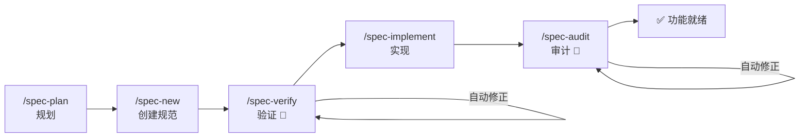

<div align="center">

**🌐 语言:** [Português](../../README.md) | [English](README.en.md) | [Español](README.es.md) | 简体中文 | [हिन्दी](README.hi.md)

</div>

<br/>

<div align="center">
<br/>
<br/>
<p align="center">
  
</p>
<h1>DsCode</h1>

[![][github-license-shield]][github-license-link]
[![][github-stars-shield]][github-stars-link]

**自动规划、实现、验证和审计代码的 AI 助手 — 零供应商锁定。**

<br/>
</div>

**DsCode** 是一个运行在终端中的 AI 编程助手。你可以与 **16 个模型对话，涵盖 DeepSeek V4、OpenAI GPT-5.x、Anthropic Claude 和 Google Gemini** — 它会分析、建议、审查和编写你项目中的代码。

不同之处：DsCode 是**唯一**拥有完整规范驱动开发（SDD）流水线的助手。它不止写代码 — 它**规划**构建内容，**验证**质量，**实现**任务，并**审计**结果。每一步都带有自动修正功能。

---

## DsCode 的独特之处



| 能力 | 功能 | 为什么没有其他工具拥有 |
|---|---|---|
| **SDD 流水线** | 完整周期：规划 → 创建 → 验证 → 实现 → 审计 | 2 个检查点自动修正 — verify 和 audit 自行修复问题 |
| **多供应商** | DeepSeek V4、OpenAI GPT-5.x、Anthropic Claude、Google Gemini | 无需更改任何配置即可切换供应商 |
| **技能作为代理** | 拥有独立模型、工具和 thinking 的隔离子代理 | 每个技能在沙箱中运行 — 不污染主上下文 |
| **原生 MCP** | 连接数据库、浏览器和外部 API | 跨 3 层集成：技能、规范和 TUI |
| **Steering** | AI 在每个会话中遵循的持久规则 | 细粒度控制：按位置添加、列出、编辑和移除规则 |

---

## 快速对比

|  | DsCode | GitHub Copilot | Cursor | Claude Code | Amazon Kiro |
|---|---|---|---|---|---|
| **终端原生** | ✅ 原生 TUI | ❌ 仅 IDE | ❌ 仅 IDE | ✅ CLI | ⚠️ IDE + CLI |
| **多供应商** | ✅ 4 个供应商 | ❌ 仅 GitHub | ⚠️ 有限 | ❌ 仅 Anthropic | ❌ 仅 Bedrock |
| **SDD 流水线** | ✅ 完整 + 自动修正 | ❌ | ❌ | ❌ | ✅ 基于 IDE |
| **技能/代理** | ✅ 隔离子代理 | ❌ | ⚠️ 规则 | ⚠️ Hooks | ✅ Powers |
| **免费** | ✅ 无费用 | ⚠️ 有限 | ⚠️ 有限 | ⚠️ 积分 | ❌ Bedrock 费用 |

> **Amazon Kiro** 是最接近的竞争对手 — 两者都有 SDD、Steering 和 Skills。区别在于：DsCode 是**终端原生、多供应商且免费**；Kiro **锁定在 Amazon Bedrock 并按模型使用量收费**。

---

## 30 秒安装

从 **[发布页面](https://github.com/andrelncampos/dscode-public/releases)** 下载二进制文件。需要 **[Node.js 24+](https://nodejs.org)**。

| 系统 | 文件 |
|---|---|
| Windows (x64) | `dscode-windows-x64.zip` |
| Linux (x64) | `dscode-linux-x64.tar.gz` |
| macOS (Apple Silicon) | `dscode-macos-arm64.tar.gz` |

解压并运行 `./dscode`。DsCode 在启动时自动检查更新。

---

## 首次使用

### 1. 配置你的密钥

创建 `~/.dscode/settings.json`，填入你的 API 密钥：

```json
{
  "env": {
    "MODEL": "deepseek-v4-pro",
    "BASE_URL": "https://api.deepseek.com",
    "API_KEY": "你的密钥"
  },
  "thinkingEnabled": true
}
```

### 2. 打开项目并启动

```bash
cd /你的/项目/路径
dscode
```

### 3. 参加互动教程

输入 `/quickstart` 参加 5 分钟教程。AI 通过构建示例项目演示完整的 SDD 流水线 — 你通过观察运行来学习，而不是阅读文档。

或运行 `dscode --quickstart` 直接进入教程。

---

## 你可以做什么

| 任务 | 在提示框中输入 |
|---|---|
| **理解项目** | "用 3 句话解释这个项目的架构。" |
| **审查代码** | "在我推送之前审查最后一次提交的更改。" |
| **实现功能** | "在 `src/form.ts` 的表单中添加邮箱验证。" |
| **重构** | "简化 `processData()` 函数，不改变其行为。" |
| **调查错误** | "分析这个堆栈跟踪并找到根本原因。" |
| **创建测试** | "为 `src/validators.ts` 中的 `validateUser()` 编写单元测试。" |
| **规划功能** | `/spec-plan` — 描述你想要的，AI 创建完整的规范。 |
| **创建规则** | `/steering-add 始终使用 TypeScript 严格模式` |

---

## 常用命令

在提示框中输入 `/` 查看完整菜单。以下是你最常用的命令：

| 命令 | 描述 |
|---|---|
| `/new` | 新对话 — 重置上下文 |
| `/model` | 在 4 个供应商的 16 个模型之间切换 |
| `/quickstart` | 5 分钟 SDD 流水线互动教程 |
| `/spec-plan` | 使用规范规划新功能 |
| `/spec-pipe <n>` | 完整流水线：new → verify → implement → audit |
| `/init` | 创建 `AGENTS.md` 为 AI 提供指令 |
| `/steering-add` | 添加 AI 在每个会话中遵循的规则 |
| `/context` | 查看会话的 tokens、成本和缓存 |
| `/help` | 完整的命令和键盘快捷键列表 |

> 📋 [37 个命令的完整列表](https://github.com/andrelncampos/dscode-public#todos-os-comandos-slash) — 包括模型管理、笔记、MCP 和技能。

---

## 技能和自主代理

技能是 Markdown 指南，教 AI 以特定方式工作。DsCode 从 3 个来源加载技能：

| 位置 | 用途 |
|---|---|
| `templates/skills/`（内置） | 5 个始终可用的技能 |
| `~/.agents/skills/<名称>/SKILL.md` | 个人技能 |
| `./.agents/skills/<名称>/SKILL.md` | 项目技能 |

技能可以作为**自主代理**（`mode: agent`）运行 — 每个代理拥有自己的模型、工具和 thinking，在沙箱中执行而不污染主上下文。

```yaml
# 示例：.agents/skills/reviewer/SKILL.md
name: reviewer
description: 审查代码中的错误和改进点
mode: agent
model: deepseek-v4-flash
tools: [Read, Grep, Glob, Bash]
```

---

## 安全

| 实践 | 原因 |
|---|---|
| **允许前审查命令** | AI 可能建议 `rm`、`sudo` 或网络访问 |
| **大型任务前提交** | `git reset --hard` 可在出错时撤销所有更改 |
| **审查差异** | DsCode 显示每个更改 — AI 可能会出错 |
| **永远不要提交 `settings.json`** | 它包含你的 API 密钥（`.gitignore` 已排除） |
| **为实验使用单独分支** | 在风险更改前执行 `git checkout -b ai-experiment` |

---

## 许可证和起源

**DsCode 对个人和专业使用免费。** 源代码为 source-available — 仅允许从官方二进制文件重新分发。

本项目源自 [DeepCode (lessweb/deepcode-cli)](https://github.com/lessweb/deepcode-cli)，最初基于 MIT 许可。原始版权声明保留在 [LICENSE](LICENSE) 和 [NOTICE](NOTICE) 中。

---

## 官方渠道

| 渠道 | 链接 |
|---|---|
| **GitHub** | [github.com/andrelncampos/dscode-public](https://github.com/andrelncampos/dscode-public) |
| **发布** | [github.com/andrelncampos/dscode-public/releases](https://github.com/andrelncampos/dscode-public/releases) |
| **问题** | [github.com/andrelncampos/dscode-public/issues](https://github.com/andrelncampos/dscode-public/issues) |

⚠️ **仅**从上述官方渠道安装 DsCode。不要信任第三方网站的版本。

---

<!-- LINK GROUP -->

[github-license-link]: https://github.com/andrelncampos/dscode-public/blob/master/LICENSE
[github-license-shield]: https://img.shields.io/github/license/andrelncampos/dscode?color=4d6BFE&labelColor=black&style=flat-square
[github-stars-link]: https://github.com/andrelncampos/dscode-public/stargazers
[github-stars-shield]: https://img.shields.io/github/stars/andrelncampos/dscode?color=yellow&labelColor=black&style=flat-square
