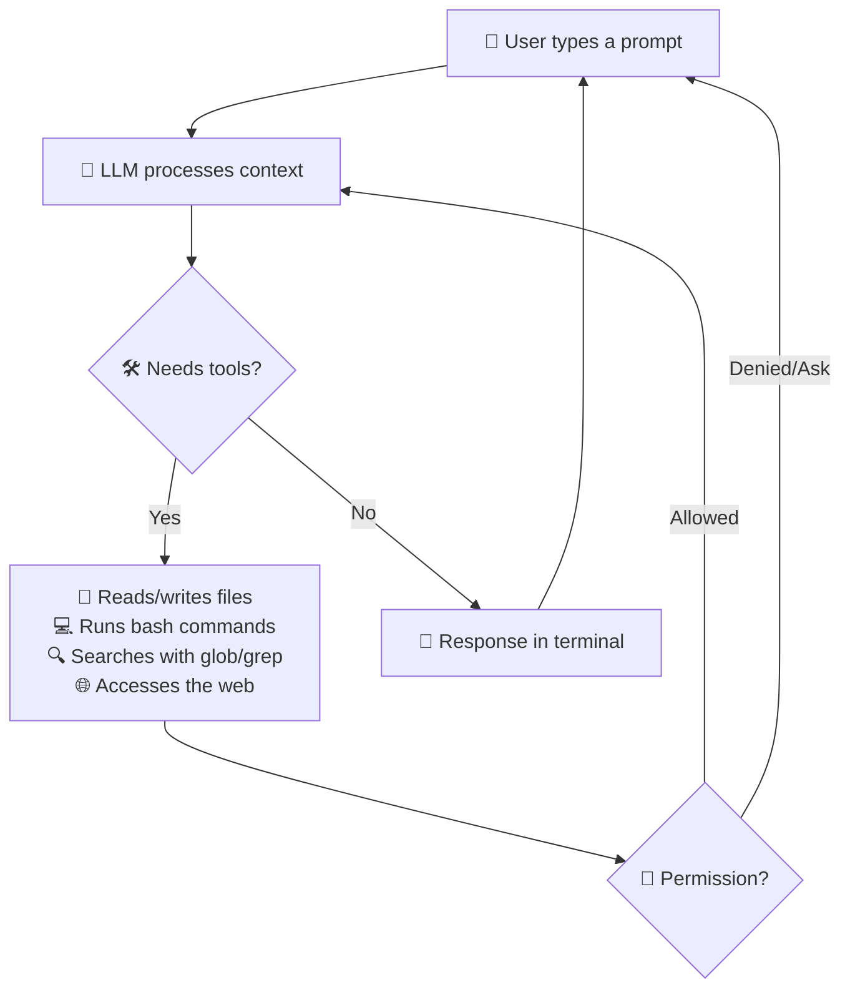
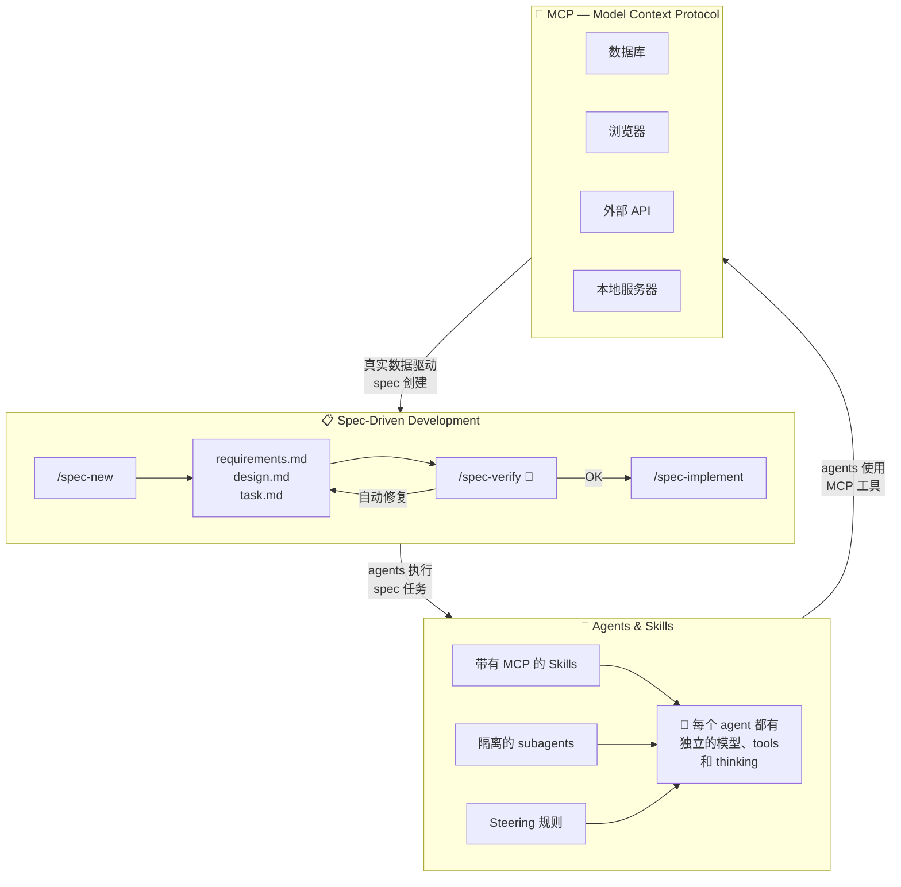
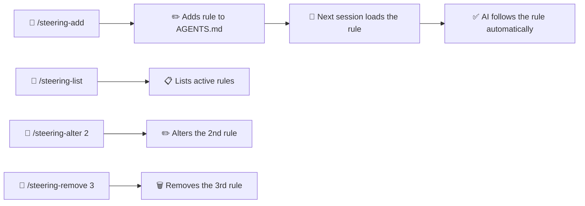
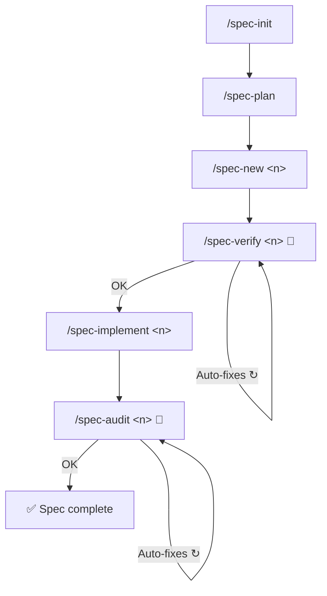

<div align="center">

**🌐 语言:** [Português](../../README.md) | [English](README.en.md) | [Español](README.es.md) | 简体中文 | [हिन्दी](README.hi.md)

</div>

<br/>

<div align="center">
<br/>
<br/>
<p align="center">
  
</p>
<h1>DsCode</h1>

[![][github-license-shield]][github-license-link]

**终端里的 AI 编程助手。**

<br/>
</div>

**DsCode** 是一个运行在终端中的 AI 编程助手。你可以与 AI 模型对话 — **支持 16 个模型，涵盖 DeepSeek V4、OpenAI GPT-5.x、Anthropic Claude、Google Gemini 及任何兼容 OpenAI 的 API** — 它会分析、建议、审查并在你的项目中编写代码。支持 Windows、Linux 和 macOS。其架构采用**与提供商无关的 LLM 抽象层**，让你无需修改代码即可在不同提供商之间切换。

DsCode 源自 [DeepCode (lessweb/deepcode-cli)](https://github.com/lessweb/deepcode-cli)，但有自己的演进方向，由 [André Campos](https://github.com/andrelncampos) 维护。

---

<!-- TODO: translate to Chinese -->

## How DsCode works



DsCode works in **sessions**. Each session is an ongoing conversation. The AI uses **tools** (read files, run commands, edit code, search the web) to accomplish tasks. You can **confirm, deny, or configure permissions** for each type of action.

<!-- end TODO -->

---

## DsCode 适合谁

DsCode 对以下人群有用：

- **开发者**：希望在日常工作中获得 AI 帮助。
- **技术负责人**：需要快速审查或理解代码库。
- **已经在使用 AI 编程的人**：想要一个快速、集成在终端中的工作流。
- **希望标准化的团队**：统一 prompts、skills、agents 和 steering 以保持一致性。
- **任何 LLM 提供商的用户** — DeepSeek V4、OpenAI、Anthropic、Google Gemini 或兼容的 API。与提供商无关的抽象层让你可以轻松切换。

---

## DsCode 能帮什么忙

| 任务 | DsCode 如何帮助 |
|---|---|
| **分析代码库** | 问"解释这个项目的架构"，AI 读取文件并回答。 |
| **审查代码** | 问"审查这个 diff，在提交前指出问题"。 |
| **实现功能** | 描述你的需求，AI 生成或编辑文件。 |
| **重构** | 问"简化这个函数，不改变行为"。 |
| **调查 bug** | 粘贴 stack trace，请 AI 帮助找到原因。 |
| **创建或使用 skills** | Skills 是教 AI 以特定方式工作的指南。 |
| **使用子代理探索代码** | 将搜索和分析委托给 Explore 子代理 — 它在隔离环境中梳理代码，只返回摘要，不会污染上下文。 |
| **使用 Git** | AI 建议分支、提交信息并做版本化修改。 |
| **配置推理** | 为困难任务启用 *thinking mode*——AI 在回答前"思考"。 |
| **集成外部工具** | 通过 MCP，连接数据库、浏览器、API 和其他工具。 |

---

## 对比

**16 个模型。4 个提供商。零厂商锁定。**

|  | DsCode | GitHub Copilot | Cursor | Claude Code | Amazon Kiro |
|---|---|---|---|---|---|
| **在终端中运行** | ✅ 原生 TUI | ❌ 仅 IDE | ❌ 仅 IDE | ✅ CLI | ❌ 仅 IDE |
| **提供商自由** | ✅ DeepSeek + OpenAI + Anthropic + Gemini + 任何兼容 | ❌ 仅 GitHub | ⚠️ 有限 | ⚠️ 仅 Anthropic | ⚠️ 仅 Amazon Bedrock |
| **每个提供商的 Thinking mode** | ✅ max/high/medium/low 原生 | ❌ | ❌ | ⚠️ 仅 Claude | ❌ |
| **完整 MCP** | ✅ Skills + SDD + TUI | ❌ | ⚠️ 部分 | ⚠️ 部分 | ❌ |
| **Spec-Driven Development** | ✅ 完整内置周期 | ❌ | ❌ | ❌ | ❌ |
| **Skills 和 subagents** | ✅ Markdown，agent 模式，每 skill 的 MCP | ❌ | ⚠️ 仅规则 | ⚠️ Hooks | ⚠️ Agents |
| **Steering 系统** | ✅ 每个项目的持久规则 | ❌ | ❌ | ❌ | ❌ |
| **粘贴图像 (Ctrl+V)** | ✅ 剪贴板 | ❌ | ✅ | ❌ | ❌ |
| **免费使用** | ✅ | ⚠️ 有限免费计划 | ⚠️ 有限免费计划 | ⚠️ 积分 | ⚠️ 有限免费计划 |


## DsCode 的三位一体：Spec + SDD + Agent

DsCode 是**唯一**将三种能力整合到一个循环中的 AI 助手：



| 部分 | 做什么 | 为什么独特 |
|---|---|---|
| **Spec** | 定义要构建什么：版本化文档中的需求、设计和任务 | 完整周期，2 个自动修复检查点（verify + audit） |
| **Agent** | Skills 作为隔离的 subagents 运行，具有独立的模型、tools 和 thinking | Agents 使用 MCP，遵循 steering 规则，不污染主上下文 |
| **MCP** | 将 AI 连接到数据库、API、浏览器和本地服务器 | 集成在 3 个层面：skills 携带 MCP，specs 声明 MCP，TUI 检查 MCP |

结果：你定义**想要什么**（spec），AI 决定**如何实现**（agent），使用**真实工具**（MCP），质量由自动检查点保障。**没有其他产品提供这个循环。**

---

## 安装

### 通过 npm（推荐）

```bash
npm install -g @andrelncampos/dscode
```

需要 [Node.js 24+](https://nodejs.org)。安装后，在终端运行 `dscode`。

## 更新

DsCode 在启动时自动检查新版本。如果有更新可用，您将收到通知并可以安装。

手动检查：

```bash
dscode --update
```

如果有更新的版本，DsCode 将询问是否安装。否则显示 "DsCode is up to date."

---

## 初始配置

DsCode 从 `~/.dscode/settings.json`（你的用户目录）读取配置。你也可以在特定项目中使用 `.dscode/settings.json` 进行本地设置。带 `DEEPCODE_` 前缀的环境变量也会被识别。

### 最小示例

```json
{
  "env": {
    "MODEL": "deepseek-v4-pro",
    "BASE_URL": "https://api.deepseek.com",
    "API_KEY": "在此放入你的密钥"
  },
  "thinkingEnabled": true,
  "reasoningEffort": "max"
}
```

### 在哪里获取 API 密钥

| 提供商 | 链接 |
|---|---|
| **DeepSeek** | [platform.deepseek.com](https://platform.deepseek.com) → API Keys |
| **OpenAI** | [platform.openai.com](https://platform.openai.com) → API Keys |
| **Anthropic** | [console.anthropic.com](https://console.anthropic.com) → API Keys |
| **Google Gemini** | [aistudio.google.com](https://aistudio.google.com) → API Keys |

### 可用的配置选项

| 字段 | 类型 | 描述 | 默认值 |
|---|---|---|---|
| `env.MODEL` | string | 要使用的 AI 模型 | `deepseek-v4-pro` |
| `env.BASE_URL` | string | 提供商的 API 基础 URL | `https://api.deepseek.com` |
| `env.API_KEY` | string | 提供商的 API 密钥 | *(必填)* |
| `thinkingEnabled` | boolean | 启用推理模式 | DeepSeek 为 `true` |
| `reasoningEffort` | string | 推理深度：`"xhigh"`、`"high"`、`"medium"`、`"low"`、`"max"` 或 `"none"`（因提供商而异） | DeepSeek V4 Pro 为 `"max"` |
| `temperature` | number | 回复的创造性（0 到 2） | `0.3` |
| `maxTokens` | number | 每次回复的 token 限制 | 65536 (Pro) / 32768 (Flash) |
| `debugLogEnabled` | boolean | 将调试日志保存到 `~/.dscode/logs/` | `false` |
| `telemetryEnabled` | boolean | 发送匿名使用统计 | `false` |
| `permissions` | object | 细粒度权限控制 | *(全部允许)* |
| `mcpServers` | object | MCP 服务器配置 | *(无)* |
| `notify` | string | 每次任务完成后执行的脚本 | *(无)* |
| `engines` | object | 按提供商配置（例如 `engines.openai.apiKey`） | `{}` |
| `modelPricing` | object | 自定义模型定价覆盖 | *(DeepSeek V4 默认)* |
| `repositoryVisibility` | `"public"` \| `"private"` | 仓库可见性。`"public"` 会自动将 `/management/` 和 `/.agents/` 添加到 `.gitignore` | `"private"` |

### 模型定价 (`modelPricing`)

DsCode 根据 token 使用量估算会话成本。默认价格：

| 模型 | 输入 (1M tokens) | 输出 (1M tokens) | 缓存读取 (1M tokens) |
|---|---|---|---|
| `deepseek-v4-pro` | $0.435 | $0.87 | $0.003625 |
| `deepseek-v4-flash` | $0.14 | $0.28 | $0.0028 |
| `gpt-5.4` | $1.25 | $10.00 | $0.625 |
| `gpt-5.4-mini` | $0.15 | $0.60 | $0.075 |
| `claude-opus-4-8` | $15.00 | $75.00 | $7.50 |
| `claude-sonnet-4-6` | $3.00 | $15.00 | $1.50 |
| `claude-haiku-4-5` | $0.80 | $4.00 | $0.40 |
| `claude-fable-5` | $10.00 | $50.00 | $1.00 |
| `claude-mythos-5` | $10.00 | $50.00 | $1.00 |
| `gemini-3.5-flash` | $1.50 | $9.00 | $0.15 |
| `gemini-3.1-flash-lite` | $0.25 | $1.50 | $0.025 |
| `gemini-2.5-pro` | $2.50 | $15.00 | $0.25 |
| `gemini-2.5-flash` | $0.50 | $3.00 | $0.05 |

使用自定义定价（或添加不受支持的模型）：

```json
{
  "modelPricing": {
    "我的模型": {
      "inputPrice": 0.50,
      "outputPrice": 1.00,
      "cacheReadPrice": 0.05
    }
  }
}
```

会话期间成本显示在右上角：`⚡ 42.3K 💰 $0.15`。

---

<!-- TODO: translate to Chinese -->

## Files and structure

DsCode organizes its data in `.dscode/` directories within the project and the user's home:

```
my-project/
├── .dscode/                   # Project config and data
│   ├── settings.json          # Local configuration (optional)
│   ├── AGENTS.md              # Instructions and steering rules
│   ├── sessions-index.json    # Session index
│   ├── <session-id>.jsonl     # Messages for each session
│   └── specs/                 # SDD documents
│       ├── vision.md          # Product vision
│       ├── arch.md            # Architecture
│       ├── roadmap.md         # Roadmap with spec statuses
│       ├── adr.md             # Architecture Decision Records
│       └── lessons.md         # Lessons learned
│
~/.dscode/                     # User config
├── settings.json              # API key (encrypted), default model
├── .credential-key            # AES-256 encryption key (0600 permissions)
└── logs/debug.log             # Debug logs

~/.agents/skills/<skill>/SKILL.md    # User skills
./.agents/skills/<skill>/SKILL.md    # Project skills
```

⚠️ **Security**: Never commit `settings.json` (it contains your API key). The `.gitignore` already excludes it.

<!-- end TODO -->

---

## 5 分钟快速上手

### 第 1 步：安装

```bash
npm install -g @andrelncampos/dscode
```/dscode`。**无需任何前提条件。**

### 第 2 步：配置你的密钥

创建 `~/.dscode/settings.json`，填入你的 API 密钥和首选模型（见上方配置部分）。

### 第 3 步：打开一个项目文件夹

```bash
cd /path/to/your/project
```

可以是任何项目：Git 仓库、个人项目，甚至空文件夹。

### 第 4 步：启动 DsCode

```bash
dscode
```

你会看到一个带有文本输入框的欢迎屏幕。助手已准备就绪。

**提示：** 输入 `@` 来搜索和提及项目文件——AI 可以读取和编辑你引用的文件。

### 第 5 步：问一些简单的问题

在提示框中输入：

```
用 3 句话解释这个项目的结构。
```

按 **Enter**。AI 将分析项目文件并回答。

### 第 6 步：请求有用的分析

```
分析代码库，指出可能的改进点，不要做任何修改。
```

AI 将检查代码并提出改进建议。使用 `Ctrl+O` 展开输出或查看运行中的进程。

### 第 7 步：审查和提交

当 AI 对文件进行更改时，在提交前**审查每个 diff**。DsCode 显示更改内容，由你决定是否接受。

> 💡 **提示**：在请求大型任务之前进行提交（`git commit`）。如果出现问题，可以使用 `git reset --hard` 撤销。

---

<!-- TODO: translate to Chinese -->

## All slash commands

Type `/` in the prompt to open the menu. There are **28 built-in commands** + dynamic skills (`/<skill-name>`):

### Session

| Command | Description |
|---|---|
| `/new` | New conversation — clears context |
| `/resume` | Resume a previous conversation |
| `/continue` | Continue the active conversation (or resume if empty) |
| `/undo` | Restore code and/or conversation to a previous checkpoint |

### Model and display

| Command | Description |
|---|---|
| `/model` | 从 4 个提供商的 16 个模型中选择，支持提供商感知的 thinking mode 和 reasoning effort |
| `/raw` | Toggle display mode: `lite` (summarized), `normal` (full), `raw-scrollback` (scroll) |

### Provider & model

| Command | Description |
|---|---|
| `/model-list` | List all configured providers with status, models and pricing |
| `/model-add <provider>` | Add a new LLM provider with guided wizard (API key + base URL) |
| `/model-remove <provider>` | Remove a provider from configuration |
| `/model-info <id>` | Show model details: capabilities, pricing, thinking, context |
| `/model-key <provider>` | Update API key for a provider (overwrites previous) |
| `/model-default <id>` | Set the default model |
| `/model-params` | Interactive generation parameter editor: temperature, max_tokens, top_p |
| `/model-thinking <id>` | Configure thinking budget for extended-thinking models |

> 💡 **Encrypted keys**: API keys are stored encrypted (AES-256-GCM) in `settings.json`. Plaintext key migration is automatic on first use. Use `/model-key` to update.

### Skills and agents

| Command | Description |
|---|---|
| `/skills` | List all available skills (built-in + custom) |
| `/<skill-name>` | Run a specific skill by name |
| `/init` | Create `AGENTS.md` with instructions for the AI in the project |
| `/steering-add` | Add a steering rule to the STEERINGS section of `AGENTS.md` |
| `/steering-list` | List all steering rules from `AGENTS.md` |

### SDD (Spec-Driven Development)

| Command | Description |
|---|---|
| `/spec-init` | Initialize SDD structure: `vision.md`, `arch.md`, `roadmap.md`, `adr.md`, `lessons.md` |
| `/spec-plan` | Plan specs from a brainstorm, align with vision, and update roadmap |
| `/spec-new <n>` | Create a new spec with requirements, design, and tasks |
| `/spec-verify <n>` | Verify and **auto-fix** gaps in requirements and design (idempotent — run as many times as you want) |
| `/spec-implement <n>` | Implement all spec tasks sequentially |
| `/spec-audit <n>` | Audit and **auto-fix** implementation bugs, tests, and design deviations (idempotent — each pass improves without degrading) |
| `/spec-list` | List all specs with roadmap statuses |
| `/spec-status [n]` | Show detailed status of a specific spec or all |

### External tools

| Command | Description |
|---|---|
| `/mcp` | Show MCP server status and available tools |

### System

| Command | Description |
|---|---|
| `/exit` | Quit DsCode |

<!-- end TODO -->

---

<!-- TODO: translate to Chinese -->

## Steering system

**Steering** lets you define persistent rules that the AI follows in **all sessions** of the project. The rules live in the `## Steering` section of the `.dscode/AGENTS.md` file. The full management lifecycle includes adding, listing, altering, and removing rules by position.



**Example:**
```
/steering-add always respond in English
/steering-add never push without explicit authorization
/steering-list
/steering-alter 2 never push or merge without authorization
/steering-remove 1
```

<!-- end TODO -->

---

<!-- TODO: translate to Chinese -->

## SDD — Spec-Driven Development

DsCode implements a complete spec-driven development cycle. All files live in `management/`.

The two quality checkpoints — **spec-verify** and **spec-audit** — don't just report problems: they **auto-fix them**. Both are **idempotent**: you can run them multiple times and each pass improves quality without degrading what was already correct.



| File | Content |
|---|---|
| `vision.md` | Product vision, target audience, value proposition |
| `arch.md` | Architecture decisions, stack, patterns |
| `roadmap.md` | List of specs with status (planned/in-progress/done) |
| `adr.md` | Architecture Decision Records |
| `lessons.md` | Lessons learned throughout development |

### SDD in practice — a complete example

Imagine you want to add **OpenAI support** to DsCode. The real flow:

```
/spec-plan
  ↓  You type: "I want native OpenAI support with thinking mode"
  ↓  The AI analyzes the vision, creates spec 40, updates the roadmap
/spec-new 40
  ↓  The AI generates complete requirements.md, design.md and task.md
/spec-verify 40
  ↓  The AI finds 3 traceability gaps and AUTO-FIXES them
  ↓  Run it again. If OK → next step
/spec-implement 40
  ↓  The AI creates openai-provider.ts, openai-converter.ts, tests...
  ↓  Each task runs in order. Typecheck and tests at every step
/spec-audit 40
  ↓  The AI finds 1 bug and 1 stale test and FIXES them
  ↓  Run it again. If OK → spec complete ✅
```

> 💡 **Tip**: `spec-verify` and `spec-audit` are your allies. Run them until they say "0 issues found". Each pass improves quality with zero regression risk.

<!-- end TODO -->

---

<!-- TODO: translate to Chinese -->

## MCP — Model Context Protocol

DsCode 集成了 **Model Context Protocol (MCP)**，允许 AI 连接到外部工具，如数据库、浏览器、API 和本地服务器。支持覆盖完整生命周期：skills、SDD 和 TUI。

### Skills 与 MCP

Skills 可以包含声明 MCP 服务器的 `mcp.json` 文件。当 skill 激活时（通过关键词匹配或 `#skill-name`），服务器自动启动。当对话转移到其他主题时，它们会被暂停 — 不污染全局工具目录。

示例：`postgres-dba` skill 包含 `query`、`list_tables` 和 `describe` 等工具，以及安全规则（`MCP: deny drop_table`）。全部在一个可安装的包中。

### SDD + MCP

SDD 周期在三个层面与 MCP 集成：
- **Specs 声明 MCP 依赖**在 YAML frontmatter 中，定义与该 spec 相关的服务器和工具。
- **辅助创建**：在 `/spec-new` 期间，AI 查询真实数据源（GitHub issues、数据库、文档）以生成基于真实数据的需求。
- **范围控制**：每个 spec 定义临时工具白名单，保持 AI 专注。

### TUI 检查与操作

`/mcp` 命令打开完整的管理面板：
- **服务器列表**，包含状态、范围（`[global]`、`[project]`、`[skill: ...]`、`[spec: N]`）和策略摘要。
- **详细信息**，包含每个工具的策略标识（`auto-allow`、`ask`、`deny`）。
- **执行历史**和**错误日志**，用于诊断。
- **键盘快捷键**：`A` 批准，`D` 拒绝，`R` 重置策略，`X` 禁用服务器，`Ctrl+R` 重新连接。

### 在哪里配置 MCP 服务器

| 层级 | 位置 | 范围 |
|---|---|---|
| 全局 | `~/.dscode/settings.json` → `mcpServers` | 所有会话 |
| 项目 | `.dscode/mcp.json` | 该目录中的会话 |
| Skill | `<skill>/mcp.json` | skill 激活时 |
| Spec | Spec YAML frontmatter | `/spec-implement` 期间 |

---

<!-- TODO: translate to Chinese -->

## Skills

Skills are Markdown guides that teach the AI to work in a specific way. DsCode loads skills from 3 sources:

| Location | Usage |
|---|---|
| `templates/skills/` (built-in) | 3 skills always loaded |
| `~/.agents/skills/<name>/SKILL.md` | User's personal skills |
| `./.agents/skills/<name>/SKILL.md` | Project skills |

### Built-in skills

| Skill | Purpose |
|---|---|
| **agent-drift-guard** | Detects and corrects execution drift |
| **karpathy-guidelines** | Best practices to reduce common LLM mistakes |
| **plan-and-execute** | Structured planning with progress tracking |

### Inclusion modes

Each `SKILL.md` can declare how it should be loaded via the optional `inclusion` field in YAML frontmatter:

| Mode | Behavior |
|------|----------|
| `auto` (default) | Loaded automatically via keyword matching in the prompt and available in the `/skills` menu |
| `manual` | **Never** loaded automatically. Activated only with `#skill-name` prefix or via the `/skills` menu |

**Example SKILL.md with `inclusion: manual`:**
```markdown
---
name: my-deploy
description: Deploys to production
inclusion: manual
---

# Deploy

Before deploying, verify...
```

To activate a manual skill, type `#my-deploy` at the start of the prompt — the `#` prefix is stripped and the skill is loaded.

### Skills as autonomous agents

In addition to the `inclusion` field, each `SKILL.md` can declare an execution `mode`:

| Mode | Behavior |
|------|----------|
| `prompt` (default) | The skill content is injected into the conversation context as a guide. |
| `agent` | The skill runs as an **isolated subagent** — with its own model, tools, and thinking — returning only the result. |

Skills with `mode: agent` are registered as tools in the LLM's toolkit. The main agent can delegate work to them by calling the tool with the skill name. This keeps the main context clean and allows each skill to have independent model, temperature, tools, max turns, and timeout settings.

**Example SKILL.md with `mode: agent`:**
```markdown
---
name: code-reviewer
description: Reviews code for bugs and improvements
mode: agent
model: deepseek-v4-flash
thinking: false
tools: [Read, Grep, Glob, Bash]
---
```

When the main agent needs a review, it calls the `code-reviewer` tool and receives only the final result — the subagent's intermediate reasoning doesn't pollute the main context.

<!-- end TODO -->

---

## 键盘快捷键

| 快捷键 | 操作 |
|---|---|
| `Enter` | 发送提示 |
| `Shift+Enter` | 插入换行 |
| `@` | 搜索和提及项目文件 |
| `Tab` | 自动补全（命令和文件提及） |
| `/` | 打开斜杠命令菜单 |
| `?` | 帮助屏幕（显示所有快捷键） |
| `Ctrl+O` | 展开输出 / 查看运行中的进程 |
| `Ctrl+V` | 粘贴剪贴板图片 |
| `Ctrl+X` | 清除已粘贴的图片 |
| `Ctrl+C` | 取消提示 / 中断 AI |
| `Esc` | 关闭模态框 / 中断 |
| `Ctrl+Z` / `Ctrl+Shift+Z` | 撤销 / 重做提示编辑 |
| `Ctrl+W` | 删除前一个词 |
| `Ctrl+A` / `Ctrl+E` | 移至行首 / 行尾 |
| `Ctrl+K` | 删除从光标到行尾的内容 |
| `Alt+←/→` | 按词导航 |
| `↑/↓` | 导航历史记录（空提示时）或菜单 |
| `PageUp/PageDown` | 滚动消息历史 |

---

## 实用示例

以下每个示例都是你可以在 DsCode 提示框中输入的内容。

| 任务 | 输入内容 |
|---|---|
| **理解架构** | "解释这个项目的架构，主要模块有哪些，它们如何通信。" |
| **查找 bug** | "分析 src/ 中的潜在 bug。只指出，不要修改任何内容。" |
| **建议改进** | "为 src/ 中的代码建议性能和可读性改进。" |
| **实现功能** | "在 src/form.ts 的注册表单中添加邮箱验证。" |
| **重构** | "重构 src/utils.ts 中的 processData() 函数，使其更清晰，不改变行为。" |
| **审查 diff** | "审查最后一次提交的更改并指出问题。" |
| **创建测试** | "为 src/validators.ts 中的 validateUser() 函数创建单元测试。" |
| **使用 skill** | "使用安全审查 skill 审计此代码。" |
| **初始化 AGENTS.md** | 输入 `/init` 创建包含 AI 在项目中将遵循的指令的文件。 |

DsCode 以**对话方式**工作：你输入需求，AI 回复并使用工具。你可以确认或拒绝每个操作。

---

## 核心概念

| 概念 | 含义 | 何时重要 |
|---|---|---|
| **会话 (Session)** | 你和 AI 之间的持续对话。每次 `/new` 开始一个干净的会话。 | 切换任务时开始新会话以避免混合上下文。 |
| **上下文 (Context)** | AI"记住"的全部对话历史。包括你的消息、回复和读取的文件。 | 长上下文消耗更多 token。使用 `/new` 重置。 |
| **Skills** | 教 AI 遵循特定规则的 Markdown 指南。 | 创建 skill 来标准化审查、代码风格或团队流程。 |
| **Tools** | AI 使用的工具：`bash`（shell）、`read`/`write`/`edit`（文件）、`glob`/`grep`（搜索）、`Explore`（子代理）、`WebSearch`/`WebFetch`（网页）、`AskUserQuestion`（提问）、`UpdatePlan`（任务）。 | AI 决定使用哪些。你可以通过 `permissions` 阻止危险的工具。 |
| **`@` 提及** | 在提示框中输入 `@` 搜索和引用项目文件。 | 用于引导 AI："分析 @src/utils.ts"——它已经知道要读取哪个文件。 |
| **Provider** | 提供 AI 模型的公司（DeepSeek、OpenAI、Anthropic、Google Gemini 等）。 | 根据成本、质量和隐私选择提供商。 |
| **模型 (Model)** | 具体的 AI 模型（例如 `deepseek-v4-pro`、`gpt-5.5`、`claude-sonnet-4-6`、`gemini-3.5-flash`）。4 个提供商共 16 个模型可用。 | 不同模型有不同的质量、速度和成本。 |
| **Thinking mode** | AI 在回答前"思考"（推理），生成你可能看到或不看到的内部 token。 | 对复杂任务（调试、架构）启用。对速度要求高时禁用。 |
| **Reasoning effort** | 控制推理深度：`"xhigh"`、`"high"`、`"medium"`、`"low"`、`"max"` 或 `"none"`（因提供商而异）。 | 对困难问题使用最大，对日常工作使用中/低。 |
| **Prompt cache** | DeepSeek 缓存重复的上下文部分以减少 token 收费（KV Cache）。 | 自动发生。保持提示稳定以节省费用。 |
| **Logs** | `~/.dscode/logs/` 中的调试文件，记录 API 调用。 | 仅在诊断问题时启用 `debugLogEnabled`。 |
| **Permissions** | 控制 AI 可以做什么：读取文件、写入、访问网络、运行命令。 | 如果要在执行前审查每个操作，配置限制性权限。 |
| **Workspace** | DsCode 运行的根文件夹。AI 只看到此文件夹中的文件（除非你授权外部访问）。 | 在你想要工作的项目的根目录中打开 DsCode。 |
| **压缩 (Compaction)** | 当对话变得太长时，DsCode 摘要历史记录以适应 token 限制。 | 自动。如果你愿意，可以用 `/new` 强制新会话。 |

---

## 如何使用 DeepSeek

DsCode 针对 DeepSeek V4 模型进行了优化。

| 模型 | 最适合 | 速度 | 成本 |
|---|---|---|---|
| `deepseek-v4-pro` | 复杂任务、架构、调试、深度推理 | 正常 | 较高 |
| `deepseek-v4-flash` | 简单任务、重构、快速审查 | 快速 | 较低 |

### Thinking mode
- **使用**：复杂任务（调试、架构、设计）
- **禁用**：快速简单任务
- **选项**：`"max"`（深度推理）、`"high"`（平衡）、`"No thinking"`（禁用）
- **显示**：`/raw` 在完整/摘要/隐藏之间切换

### KV Cache — DeepSeek **不收取**重复 token 的费用。保持 system prompt 稳定。

---

<!-- TODO: translate to Chinese -->

## Using with OpenAI

DsCode has **native OpenAI support** via `OpenAIProvider`. Models with the `gpt-`, `o1`, `o3`, `o4`, or `openai-` prefix are automatically routed to the OpenAI provider — no additional configuration needed.

### OpenAI configuration

```json
{
  "env": {
    "MODEL": "gpt-5.4",
    "BASE_URL": "https://api.openai.com/v1",
    "API_KEY": "sk-your-openai-key"
  },
  "thinkingEnabled": true,
  "reasoningEffort": "high"
}
```

> 💡 `thinkingEnabled` works with OpenAI: `reasoningEffort` is sent as the native `reasoning_effort` API parameter.

### Using multiple providers with `engines`

You can configure separate keys for each provider without switching `settings.json` files:

```json
{
  "env": {
    "MODEL": "deepseek-v4-pro",
    "API_KEY": "sk-deepseek-key"
  },
  "engines": {
    "openai": {
      "apiKey": "sk-openai-key"
    }
  }
}
```

When you switch to `gpt-5.4` (via `/model`), DsCode automatically uses the `openai` engine key. The correct provider and key are selected based on the model prefix.

### What changes compared to DeepSeek

| Feature | With OpenAI |
|---|---|
| **Thinking mode** | ✅ Natively supported. `reasoningEffort` (`"high"` / `"max"`) is passed as `reasoning_effort` |
| **Built-in WebSearch** | ❌ Not available. Use MCP with a search server or ask the AI to use WebFetch on specific URLs |
| **KV Cache** | ❌ Not available (DeepSeek-exclusive) |
| **Images (Ctrl+V)** | ✅ Works with vision models (`gpt-5.5`, `gpt-5`, `gpt-4o`) |
| **Supported models** | `gpt-5.5`, `gpt-5.4`, `gpt-5.4-mini`, `gpt-5`, `gpt-4.5`, `gpt-4o`, `gpt-4o-mini`, `o1`, `o3`, `o4` — any Chat Completions model |
| **Compaction** | Uses `getAuxiliaryModel()`: `gpt-5.4` → `gpt-5.4-mini` to reduce cost (no thinking) when summarizing history |

### Example with a cheaper model

```json
{
  "env": {
    "MODEL": "gpt-5.4-mini",
    "BASE_URL": "https://api.openai.com/v1",
    "API_KEY": "sk-your-openai-key"
  },
  "thinkingEnabled": false
}
```

<!-- end TODO -->

---

## 如何使用 Anthropic

DsCode 通过 `AnthropicProvider` 提供**原生 Anthropic 支持**。带有 `claude-` 前缀的模型会自动路由到 Anthropic 提供商 — 无需额外配置。

### Anthropic 配置

```json
{
  "env": {
    "MODEL": "claude-sonnet-4-6",
    "BASE_URL": "https://api.anthropic.com/v1",
    "API_KEY": "sk-ant-your-anthropic-key"
  },
  "thinkingEnabled": true,
  "reasoningEffort": "high"
}
```

> 💡 `thinkingEnabled` 支持 Anthropic：Opus/Sonnet/Fable/Mythos 模型使用 `thinking {type:"adaptive", effort}`，支持 3 个级别（`"high"`、`"medium"`、`"low"`）。Haiku 模型使用 `thinking {type:"enabled", budget_tokens}`，支持 2 个级别（`"max"`、`"high"`）。

### 使用 `engines` 配置多个提供商

```json
{
  "env": {
    "MODEL": "deepseek-v4-pro",
    "API_KEY": "sk-deepseek-key"
  },
  "engines": {
    "anthropic": {
      "apiKey": "sk-ant-anthropic-key"
    }
  }
}
```

### 与 DeepSeek 的区别

| 功能 | 使用 Anthropic |
|---|---|
| **Thinking mode** | ✅ 原生支持。Opus/Sonnet/Fable/Mythos 使用 Adaptive（`"high"`、`"medium"`、`"low"`）；Haiku 使用 Extended（`"max"`、`"high"`）+ budget_tokens |
| **内置 WebSearch** | ❌ 不可用。使用 MCP 配合搜索服务器 |
| **KV Cache** | ❌ 不可用（DeepSeek 独占） |
| **图片 (Ctrl+V)** | ✅ 支持所有 Claude 模型 |
| **支持的模型** | `claude-opus-4-8`、`claude-sonnet-4-6`、`claude-haiku-4-5`、`claude-fable-5`、`claude-mythos-5` |

### 使用更便宜模型的示例

```json
{
  "env": {
    "MODEL": "claude-haiku-4-5",
    "BASE_URL": "https://api.anthropic.com/v1",
    "API_KEY": "sk-ant-your-anthropic-key"
  },
  "thinkingEnabled": false
}
```

---

<!-- TODO: translate to Chinese -->

## Using with Google Gemini

DsCode has **native Google Gemini support** via `GeminiProvider`. Models with the `gemini-` prefix are automatically routed to the Gemini provider — no additional configuration needed. Gemini is the first provider implemented with **zero SDK** — it uses Node 24's native `fetch()`.

### Gemini configuration

```json
{
  "env": {
    "MODEL": "gemini-3.5-flash",
    "BASE_URL": "https://generativelanguage.googleapis.com/v1beta",
    "API_KEY": "AIza-your-gemini-key"
  },
  "thinkingEnabled": true,
  "reasoningEffort": "high"
}
```

> 💡 `thinkingEnabled` works with Gemini: the provider sends `thinkingConfig: { thinkingBudget: 8192, includeThoughts: true }` in `generationConfig`. Gemini uses "thinking budget" instead of "reasoning effort".

### Using multiple providers with `engines`

```json
{
  "env": {
    "MODEL": "deepseek-v4-pro",
    "API_KEY": "sk-deepseek-key"
  },
  "engines": {
    "gemini": {
      "apiKey": "AIza-your-gemini-key"
    }
  }
}
```

### What changes compared to DeepSeek

| Feature | With Gemini |
|---|---|
| **Thinking mode** | ✅ Natively supported via `thinkingConfig`. Budget of 8192 tokens. |
| **Built-in WebSearch** | ❌ Not available. Use MCP with a search server. |
| **KV Cache** | ❌ Not available (DeepSeek-exclusive) |
| **Images (Ctrl+V)** | ✅ Works with all Gemini models |
| **Supported models** | `gemini-3.5-flash`, `gemini-3-flash`, `gemini-3.1-flash-lite`, `gemini-2.5-pro`, `gemini-2.5-flash` |
| **Compaction** | Uses `getAuxiliaryModel()`: `gemini-3.5-flash` → `gemini-3.1-flash-lite` to reduce cost (no thinking) |

### Example with a cheaper model

```json
{
  "env": {
    "MODEL": "gemini-3.1-flash-lite",
    "BASE_URL": "https://generativelanguage.googleapis.com/v1beta",
    "API_KEY": "AIza-your-gemini-key"
  },
  "thinkingEnabled": false
}
```

<!-- end TODO -->

---

## 安全最佳实践

| 应该做什么 | 为什么 |
|---|---|
| **永远不要在 GitHub issues 中粘贴 API 密钥** | Issues 是公开的。暴露的密钥可能被他人使用并产生费用。 |
| **永远不要提交 `settings.json`** | 它包含你的 API 密钥。项目的 `.gitignore` 已排除它，但请再次确认。 |
| **在允许之前审查命令** | AI 可能建议 shell 命令。在确认前阅读，特别是涉及 `rm`、`sudo` 或网络的命令。 |
| **在请求大型更改之前提交** | 如果 AI 做错了什么，`git reset --hard` 可以撤销一切。没有预先提交，这不可能。 |
| **在接受之前阅读 diffs** | DsCode 显示每次更改。审查——AI 可能会犯错误。 |
| **不要在提示中粘贴敏感数据** | 像密码、token 或客户数据这样的信息可能出现在日志或回复中。 |
| **在求助前清理日志** | `~/.dscode/logs/` 中的日志可能包含代码片段。在分享前删除机密信息。 |
| **为实验使用单独的分支** | 在请求大型更改之前创建 `git checkout -b ai-experiment`。如果出现问题，丢弃分支。 |

---

## 节省 token/额度的最佳实践

| 实践 | 说明 |
|---|---|
| **先请求分析再实现** | "分析此代码并建议改进"比没有上下文直接"实现 X"消耗更少的 token。 |
| **限制范围** | 不要"改进整个项目"，而是说"改进 `src/utils.ts` 中的 `process()` 函数"。 |
| **指定相关文件** | 说"只分析 `src/api/` 中的文件"——AI 读取更少的文件，消耗更少的 token。 |
| **对简单任务使用 Flash** | `deepseek-v4-flash` 便宜得多。用于日常任务。 |
| **适度使用 Pro** | 将 `deepseek-v4-pro` 留给真正需要深度推理的任务。 |
| **保持提示简洁** | 包含不必要信息的长提示会浪费 token。 |
| **对每个新任务使用 `/new` 重置会话** | 长会话会累积上下文，每条后续消息成本更高。 |

---

## 故障排除

| 问题 | 可能原因 | 解决方法 |
|---|---|---|
| **`dscode: command not found`** | 全局 npm 不在 PATH 中 | 重新打开终端。在 Windows 上，检查 `%APPDATA%\\npm`。在 Linux/macOS 上，检查 `~/.npm-global/bin`。 |
| **`Node.js version not supported`** | Node 低于版本 24 | 安装或升级到 [Node.js 24+](https://nodejs.org)。 |
| **401 错误 (Unauthorized)** | API 密钥缺失或无效 | 检查 `~/.dscode/settings.json` 中或环境变量中的 `API_KEY` 是否正确。 |
| **429 错误 (Too Many Requests)** | 超过提供商的速率限制 | 等待几秒后重试。在提供商平台上检查你的计划。 |
| **回复被截断** | 达到 token 限制 | 在 `settings.json` 中增加 `maxTokens`，或输入"继续"来恢复。 |
| **超时 / 延迟过长** | 提供商服务器过载或网络问题 | 等待。如果持续，切换模型：暂时使用 Flash 代替 Pro。 |
| **日志未出现** | `debugLogEnabled` 为 `false`（默认） | 在 `settings.json` 中启用 `"debugLogEnabled": true`。日志出现在 `~/.dscode/logs/debug.log`。 |
| **模型未被识别** | 模型名称不正确 | 使用确切的名称：`deepseek-v4-pro`，`deepseek-v4-flash`，或有效的 OpenAI 兼容模型。 |
| **Token 消耗过高** | 上下文过长或任务过于宽泛 | 使用 `/new` 重置会话。对文件和范围保持具体。 |

---

## 如何获取帮助

如果遇到问题，在 [GitHub 上开一个 issue](https://github.com/andrelncampos/dscode-public/issues)。

报告问题时，请包括：

- **DsCode 版本**：`dscode --version`（显示版本 + node + 平台）
- **使用的模型**：`deepseek-v4-pro`、`deepseek-v4-flash` 等
- **执行的命令**和完整错误信息
- **清理后的日志**，如果相关（删除密钥、token 和私人数据）

⚠️ **永远不要发送**：
- API 密钥或 token
- 你的私人提示或机密项目数据
- 完整的 `.env` 或 `settings.json` 文件
- 未经审查的完整日志（包含代码片段）

对于安全漏洞，请按照 [SECURITY.md](../SECURITY.md) 中的说明操作。**不要为安全缺陷公开发布 issue。**

---

## 贡献

欢迎贡献！查看 [CONTRIBUTING.md](../CHANGELOG.md) 的完整指南。

快速摘要：

1. **Issues** 欢迎用于 bug、功能和建议。
2. **Pull requests** 通过强制 CI（typecheck + lint + format + tests + build）。
3. **安全相关的 PR** 或对敏感区域的更改将经过更严格的审查。
4. 贡献者声明有权贡献所提交的代码。

---

## 安全

查看 [SECURITY.md](../SECURITY.md) 了解完整政策。

- 私下报告漏洞（不要公开发布 issue）。
- DsCode 在调试日志中遮蔽敏感数据，但在分享前始终要审查。
- 保护你的 API 密钥：使用环境变量或带有限制权限的 `settings.json`（`chmod 600`）。

---

## 许可证和来源

**DsCode 免费使用，但源代码不公开。** 本产品免费提供给个人和专业用途。仅允许分发官方二进制文件。

本项目源自 [DeepCode (lessweb/deepcode-cli)](https://github.com/lessweb/deepcode-cli)，原始许可为 MIT。原始版权声明保存在 [LICENSE](../LICENSE) 和 [NOTICE](../NOTICE) 中。

第三方依赖保持各自的许可证。请参阅 [NOTICE](../NOTICE) 了解依赖列表及其许可证。

---

## 官方渠道

| 渠道 | 链接 |
|---|---|
| **GitHub** | [github.com/andrelncampos/dscode-public](https://github.com/andrelncampos/dscode-public) |
| **Issues** | [github.com/andrelncampos/dscode-public/issues](https://github.com/andrelncampos/dscode-public/issues) |

⚠️ **仅**从上述官方渠道安装 DsCode。不要信任第三方网站或未经验证的链接上发布的版本。

---

<!-- LINK GROUP -->

[github-license-link]: https://github.com/andrelncampos/dscode-public/blob/master/LICENSE
[github-license-shield]: https://img.shields.io/github/license/andrelncampos/dscode?color=4d6BFE&labelColor=black&style=flat-square&cacheSeconds=1800
